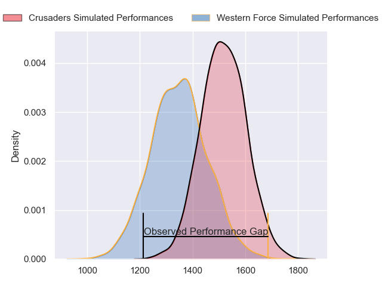
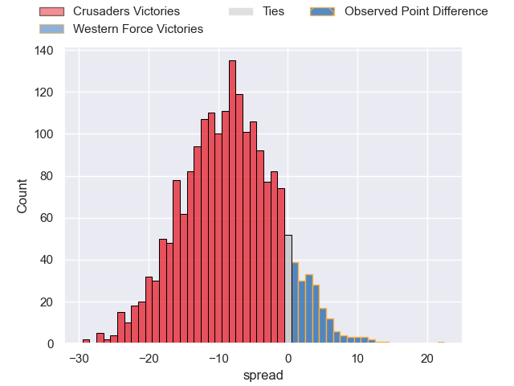
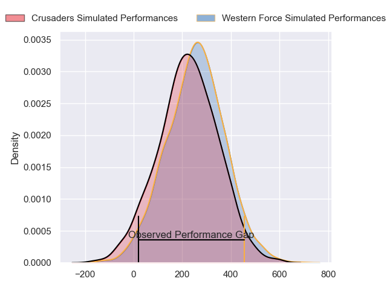
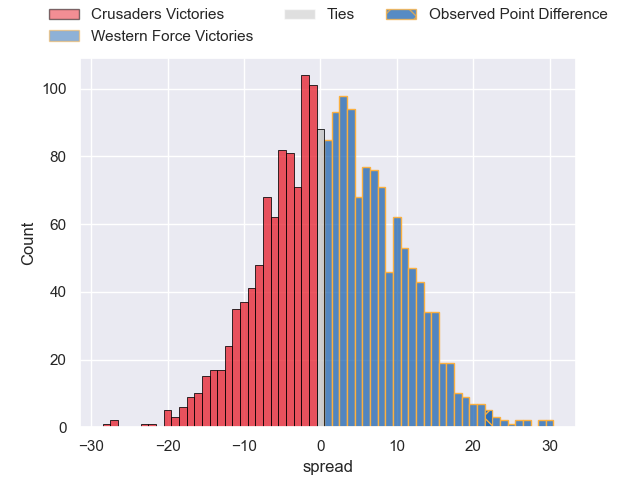

---  
layout: page  
title: Crusaders at Western Force; 15-37  
date: 2024-04-20 18:00:00 -0500  
categories: "Super Rugby Pacific 2024" match review  
---
# Crusaders at Western Force; 15-37

# Club Level Predictions

The first set of predictions treats a club as the smallest object, as the club develops its members, organizes a gameplan, and deploys its players as needed for each match. This club model has a prediction of 0.274, which translates to predicting Crusaders to win by 8.8.

Our Over/Under is 46.5 - and combined with the spread above, we have a predicted scoreline of 28 to 19

Each club has a rating and a rating deviation (similar to a Glicko rating), and expected performances can be generated. This allows for simulated matches and spreads like the ones below.
## Projected Performances - Club Model

## Projected Spreads - Club Model

## Projected Results - Club Model

# Player Level Predictions - Version 2

Treating teams instead as an entity made up of the currently active players, I have ratings for each player in an altogether different system. These can be combined to form team ratings once teamsheets are announced, weighting starters a bit higher than the reserves. After the match is played, players can be weighted by their minutes on the field, allowing for an accurate measure of the team's composition. With these compiled team ratings, we can make predictions, measure inaccuracy, and update the individual player ratings.
## Prediction without Player Minutes: Western Force by 2.6

Crusaders by 1.4 on a neutral pitch

## Projected Performances - Player Model

## Projected Spreads - Player Model

## Projected Results - Player Model

|   Away Minutes | Away Player          |   Away Percentile |   Number |   Home Percentile | Home Player           |   Home Minutes |
|---------------:|:---------------------|------------------:|---------:|------------------:|:----------------------|---------------:|
|             41 | Joe Moody            |             58.63 |        1 |             24.31 | Ryan Coxon            |             49 |
|             40 | Brodie McAlister     |             84.48 |        2 |             54.62 | Tom Horton            |             77 |
|             41 | Owen Franks          |             72.45 |        3 |              6.86 | Santiago Medrano      |             67 |
|             81 | Quinten Strange      |             78.71 |        4 |             95.1  | Sam Carter            |             81 |
|             70 | Jamie Hannah         |             31.1  |        5 |             90.79 | Tom Franklin          |             21 |
|             81 | Ethan Blackadder     |             95.94 |        6 |             68.45 | Will Harris           |             61 |
|             81 | Tom Christie         |             58.35 |        7 |             14.15 | Carlo Tizzano         |             81 |
|             61 | Christian Lio-Willie |             21.13 |        8 |             87.47 | Reed Prinsep          |             81 |
|             55 | Mitchell Drummond    |             83.79 |        9 |             99.16 | Nic White             |             61 |
|             81 | Riley Hohepa         |              6.41 |       10 |             52.05 | Ben Donaldson         |             81 |
|             81 | Macca Springer       |             23.31 |       11 |             76.8  | Chase Tiatia          |             61 |
|             20 | Dallas McLeod        |             60.19 |       12 |             80.46 | Hamish Stewart        |             81 |
|             73 | Levi Aumua           |             62.86 |       13 |             29.37 | Sam Spink             |             81 |
|             81 | Sevu Reece           |             78.6  |       14 |              6.53 | Bayley Kuenzle        |             81 |
|             81 | Chay Fihaki          |             12.53 |       15 |             52.63 | Kurtley Beale         |             81 |
|             41 | George Bell          |              8.64 |       16 |             94.7  | Ben Funnell           |              4 |
|             40 | George Bower         |              9.91 |       17 |             23.93 | Marley Pearce         |             32 |
|             40 | Fletcher Newell      |              1.81 |       18 |            nan    | Tiaan Tauakipulu      |             14 |
|             11 | Dom Gardiner         |             28.89 |       19 |             77.63 | Izack Rodda           |             60 |
|             20 | Cullen Grace         |             75.18 |       20 |              2.2  | Michael Wells         |             20 |
|             26 | Noah Hotham          |             64.63 |       21 |             42.32 | Issak Fines-Leleiwasa |             20 |
|             19 | Rivez Reihana        |             32.31 |       22 |              7.27 | Max Burey             |              0 |
|             50 | Ryan Crotty          |             97.57 |       23 |            nan    | Henry O'Donnell       |             20 |

