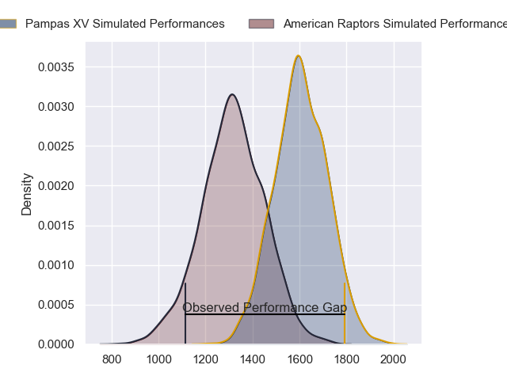
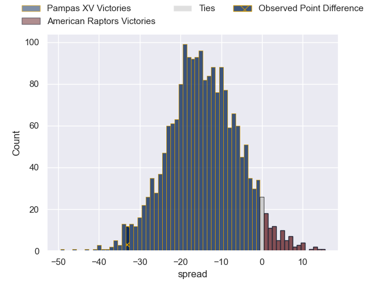
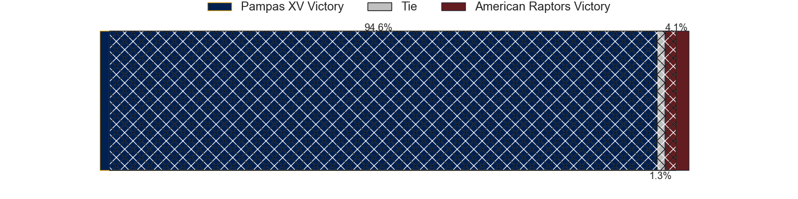
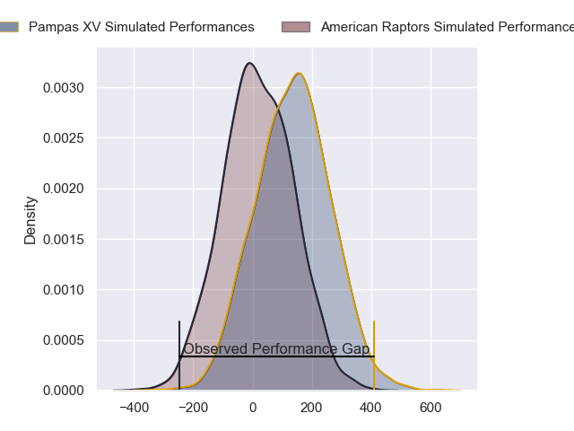
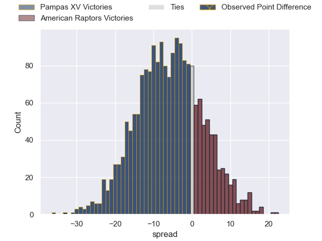
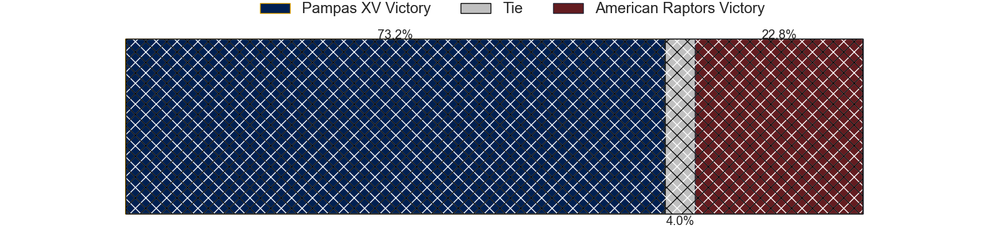

---  
layout: page  
title: Pampas XV at American Raptors; 47-14  
date: 2024-04-21 18:00:00 -0500  
categories: "Super Rugby Americas 2024" match review  
---
# Pampas XV at American Raptors; 47-14

# Club Level Predictions

The first set of predictions treats a club as the smallest object, as the club develops its members, organizes a gameplan, and deploys its players as needed for each match. This club model has a prediction of 0.172, which translates to predicting Pampas XV to win by 14.5.

Our Over/Under is 61.5 - and combined with the spread above, we have a predicted scoreline of 38 to 24

Each club has a rating and a rating deviation (similar to a Glicko rating), and expected performances can be generated. This allows for simulated matches and spreads like the ones below.
## Projected Performances - Club Model

## Projected Spreads - Club Model

## Projected Results - Club Model

# Player Level Predictions - Version 2

Treating teams instead as an entity made up of the currently active players, I have ratings for each player in an altogether different system. These can be combined to form team ratings once teamsheets are announced, weighting starters a bit higher than the reserves. After the match is played, players can be weighted by their minutes on the field, allowing for an accurate measure of the team's composition. With these compiled team ratings, we can make predictions, measure inaccuracy, and update the individual player ratings.
## Prediction without Player Minutes: Pampas XV by 6.5

Pampas XV by 8.8 on a neutral pitch

## Projected Performances - Player Model

## Projected Spreads - Player Model

## Projected Results - Player Model

|   Away Minutes | Away Player               |   Away Percentile |   Number |   Home Percentile | Home Player           |   Home Minutes |
|---------------:|:--------------------------|------------------:|---------:|------------------:|:----------------------|---------------:|
|             60 | Javier Corvalan           |             14.27 |        1 |              8.2  | Ma'ake Muti           |             65 |
|             30 | Ramiro Gurovich           |             39.36 |        2 |              7.03 | Diego Fortuny         |             80 |
|             50 | Javier Angel Coronel      |             57.86 |        3 |             28.83 | Facundo Pomponio      |             68 |
|             80 | Rodrigo Fernandez Criado  |             75.82 |        4 |              2.3  | Will Crawford         |             59 |
|             58 | Eliseo Fourcade           |              3.99 |        5 |             10.4  | Javon Camp-Villalovos |             61 |
|             80 | Manuel Bernstein          |             61.86 |        6 |             12.99 | Shawn Clark           |             80 |
|             80 | Eliseo Chiavassa          |             41.6  |        7 |             28.01 | Aidan Christians      |             50 |
|             58 | Tomas Bernasconi          |             48.63 |        8 |              0.25 | Diego Magno           |             80 |
|             58 | Simon Benitez Cruz        |             77.8  |        9 |              1.06 | Devereaux Ferris      |             55 |
|             80 | Joaquin de la Vega Mendia |             20.78 |       10 |             20    | Ignacio Mieres        |             68 |
|             80 | Jeronimo Ulloa            |             52.91 |       11 |             18.74 | Francisco Quinn       |             80 |
|             58 | Justo Piccardo            |             86.53 |       12 |             11.62 | Watson Filikitonga    |             65 |
|             80 | Juan Pablo Castro Collado |             83.56 |       13 |             67    | Thomas Morani         |             80 |
|             80 | Santiago Pernas           |             68.8  |       14 |             12.69 | Jake Hidalgo          |             80 |
|             67 | Marcos Elicagaray         |             68.45 |       15 |             47.84 | Rufus McLean          |             80 |
|             50 | Ignacio Bottazini         |             48.39 |       16 |             27.06 | Alexander Vainikolo   |             30 |
|             22 | Bruno Heit                |             44.25 |       17 |             23.26 | John LeFevre          |             25 |
|             22 | Santiago Montagner        |             86.89 |       18 |             53.87 | Tommy Clark           |             21 |
|             22 | Mateo Lorenzo             |             40.15 |       19 |             34.74 | Jackson Zabierek      |             19 |
|             22 | Ignacio Inchauspe         |             58.56 |       20 |             18.05 | Aki Pulu              |             15 |
|             20 | Renzo Zanella             |            nan    |       21 |            nan    | Clay Markoff          |             15 |
|             13 | Bernabé Lopez Fleming     |             78.4  |       22 |             25.45 | Patrick Madden        |             12 |
|             30 | Estanislao Carullo        |             86.31 |       23 |            nan    | Koby Baker            |             12 |

