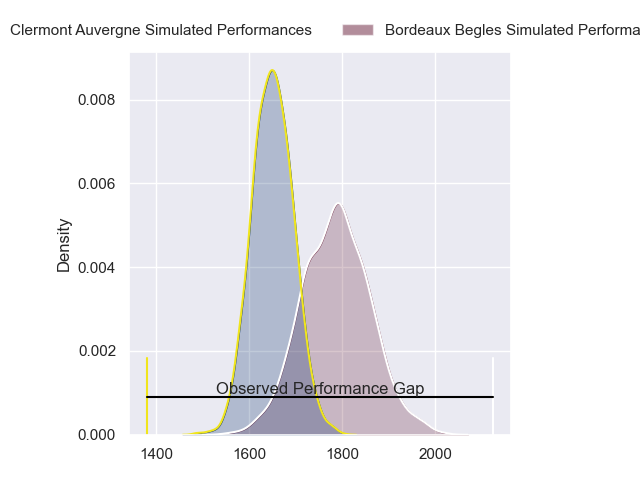
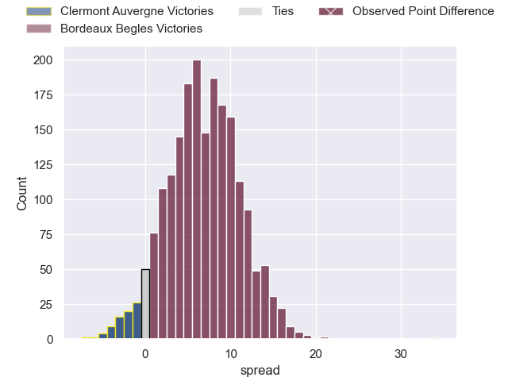
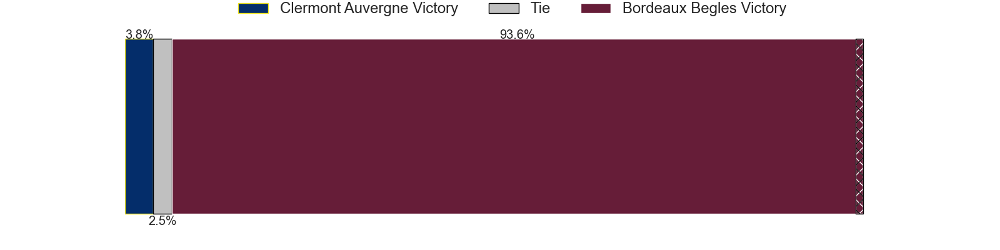
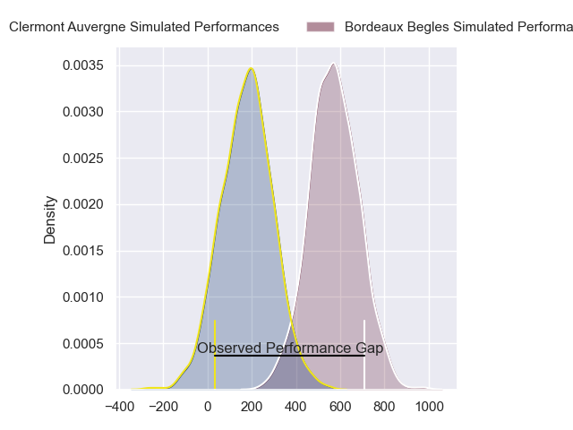
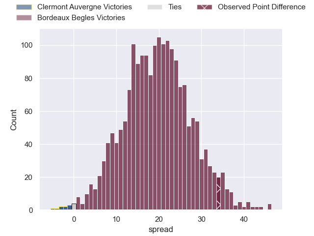
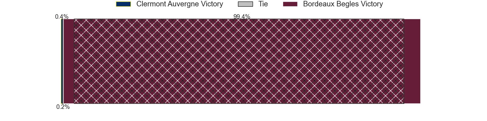

---  
layout: page  
title: Clermont Auvergne at Bordeaux Begles; 7-41  
date: 2024-04-21 18:00:00 -0500  
categories: "Top 14 Orange 2023" match review  
---
# Clermont Auvergne at Bordeaux Begles; 7-41

# Club Level Predictions

The first set of predictions treats a club as the smallest object, as the club develops its members, organizes a gameplan, and deploys its players as needed for each match. This club model has a prediction of 0.684, which translates to predicting Bordeaux Begles to win by 6.8.

Our Over/Under is 42.5 - and combined with the spread above, we have a predicted scoreline of 18 to 25

Each club has a rating and a rating deviation (similar to a Glicko rating), and expected performances can be generated. This allows for simulated matches and spreads like the ones below.
## Projected Performances - Club Model

## Projected Spreads - Club Model

## Projected Results - Club Model

# Player Level Predictions - Version 2

Treating teams instead as an entity made up of the currently active players, I have ratings for each player in an altogether different system. These can be combined to form team ratings once teamsheets are announced, weighting starters a bit higher than the reserves. After the match is played, players can be weighted by their minutes on the field, allowing for an accurate measure of the team's composition. With these compiled team ratings, we can make predictions, measure inaccuracy, and update the individual player ratings.
## Prediction without Player Minutes: Bordeaux Begles by 21.5

Bordeaux Begles by 14.2 on a neutral pitch

## Projected Performances - Player Model

## Projected Spreads - Player Model

## Projected Results - Player Model

|   Away Minutes | Away Player        |   Away Percentile |   Number |   Home Percentile | Home Player               |   Home Minutes |
|---------------:|:-------------------|------------------:|---------:|------------------:|:--------------------------|---------------:|
|             21 | Daniel Bibi Biziwu |              9.74 |        1 |             90.36 | Ugo Boniface              |             57 |
|             55 | Etienne Fourcade   |             45.98 |        2 |             14.66 | Romain Latterrade         |             50 |
|             50 | Rabah Slimani      |             78.98 |        3 |             40.98 | Toma'akino Taufa          |             53 |
|             80 | Paul Jedrasiak     |             11    |        4 |             88.39 | Guido Petti               |             57 |
|             71 | Rob Simmons        |             93.23 |        5 |             98.67 | Adam Coleman              |             75 |
|             54 | Killian Tixeront   |             61.98 |        6 |             76.16 | Bastien Vergnes Taillefer |             80 |
|             54 | Alexandre Fischer  |             69.85 |        7 |             77.95 | Mahamadou Diaby           |             80 |
|             71 | Pita Gus Sowakula  |             80.05 |        8 |             67.08 | Antoine Miquel            |             30 |
|             57 | Baptiste Jauneau   |             37    |        9 |             99.37 | Maxime Lucu               |             80 |
|             55 | Anthony Belleau    |             91.69 |       10 |             96.62 | Matthieu Jalibert         |             62 |
|             39 | Alivereti Raka     |             22.29 |       11 |             92.11 | Madosh Tambwe             |             80 |
|             80 | Julien Heriteau    |             49.81 |       12 |             54.26 | Ben Tapuai                |             80 |
|             80 | Leon Darricarrere  |             61.8  |       13 |             79.98 | Nicolas Depoortere        |             62 |
|             71 | Joris Jurand       |             70.51 |       14 |             95.66 | Damian Penaud             |             80 |
|             80 | Alex Newsome       |             73.54 |       15 |             97.46 | Romain Buros              |             54 |
|             25 | Yohan Beheregaray  |             32.53 |       16 |             61.04 | Maxime Lamothe            |             30 |
|             59 | Giorgi Beria       |             33.27 |       17 |             87.27 | Lekso Kaulashvili         |             23 |
|             35 | Anthime Hemery     |             73.04 |       18 |             91.66 | Cyril Cazeaux             |             28 |
|             35 | Marcos Kremer      |             78.9  |       19 |             85.46 | Pete Samu                 |             50 |
|             23 | Sebastien Bezy     |             83.93 |       20 |              2.96 | Paul Abadie               |             18 |
|             25 | Theo Giral         |            nan    |       21 |             10.63 | Pablo Uberti              |             18 |
|             50 | Yerim Fall         |             30.17 |       22 |             78.51 | Louis Bielle-Biarrey      |             26 |
|             30 | Cristian Ojovan    |             72.71 |       23 |             95.85 | Ben Tameifuna             |             27 |

