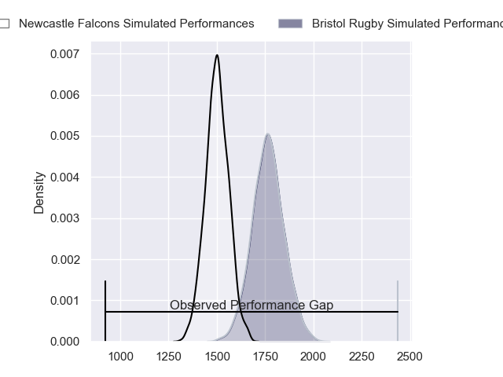
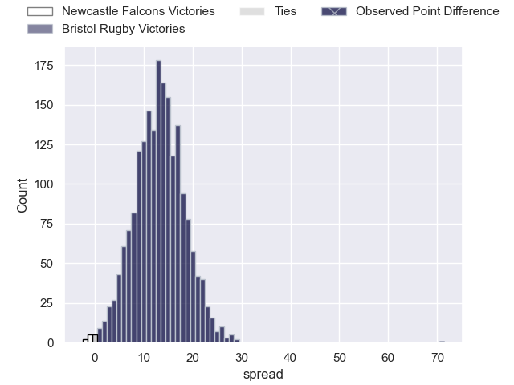
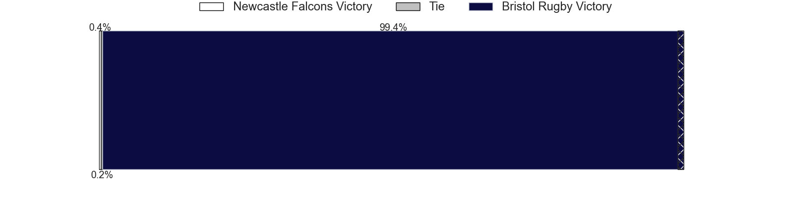
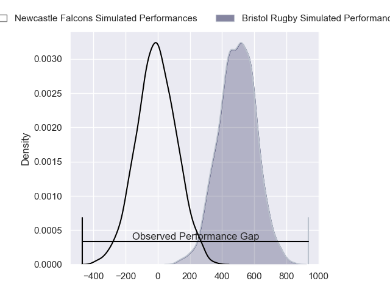
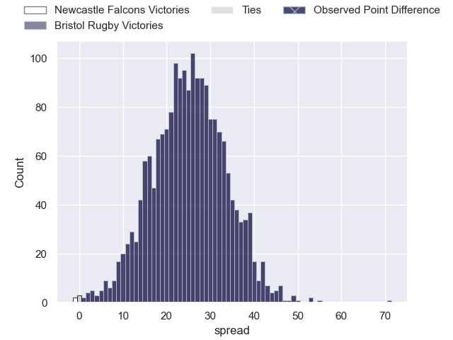
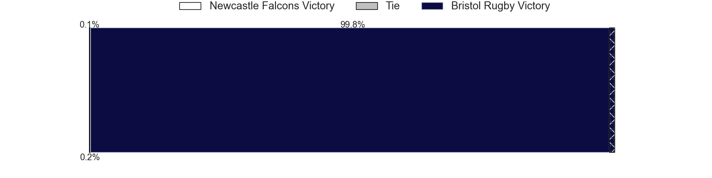

---  
layout: page  
title: Newcastle Falcons at Bristol Rugby; 14-85  
date: 2024-04-21 18:00:00 -0500  
categories: "Gallagher Premiership 2023" match review  
---
# Newcastle Falcons at Bristol Rugby; 14-85

# Club Level Predictions

The first set of predictions treats a club as the smallest object, as the club develops its members, organizes a gameplan, and deploys its players as needed for each match. This club model has a prediction of 0.817, which translates to predicting Bristol Rugby to win by 13.2.

Our Over/Under is 51.5 - and combined with the spread above, we have a predicted scoreline of 19 to 33

Each club has a rating and a rating deviation (similar to a Glicko rating), and expected performances can be generated. This allows for simulated matches and spreads like the ones below.
## Projected Performances - Club Model

## Projected Spreads - Club Model

## Projected Results - Club Model

# Player Level Predictions - Version 2

Treating teams instead as an entity made up of the currently active players, I have ratings for each player in an altogether different system. These can be combined to form team ratings once teamsheets are announced, weighting starters a bit higher than the reserves. After the match is played, players can be weighted by their minutes on the field, allowing for an accurate measure of the team's composition. With these compiled team ratings, we can make predictions, measure inaccuracy, and update the individual player ratings.
## Prediction without Player Minutes: Bristol Rugby by 30.3

Bristol Rugby by 25.3 on a neutral pitch

## Projected Performances - Player Model

## Projected Spreads - Player Model

## Projected Results - Player Model

|   Away Minutes | Away Player         |   Away Percentile |   Number |   Home Percentile | Home Player                |   Home Minutes |
|---------------:|:--------------------|------------------:|---------:|------------------:|:---------------------------|---------------:|
|             61 | Adam Brocklebank    |              1.06 |        1 |             77.72 | Ellis Genge                |             48 |
|             53 | Jamie Blamire       |              3.01 |        2 |             72.09 | Gabriel Oghre              |             48 |
|             53 | Richard Palframan   |             37.32 |        3 |             92.48 | Kyle Sinckler              |             48 |
|             62 | Tim Cardall         |             31.08 |        4 |             91.78 | James Dun                  |             80 |
|             80 | Sebastian de Chaves |              5.68 |        5 |             47.04 | Josh Caulfield             |             80 |
|             80 | Philip van der Walt |             15.84 |        6 |             99.28 | Steven Luatua              |             48 |
|             80 | Sam Cross           |             30.27 |        7 |             88.92 | Fitz Harding               |             62 |
|             53 | Callum Chick        |              2.24 |        8 |             54.86 | Magnus Bradbury            |             80 |
|             53 | Sam Stuart          |              1.69 |        9 |             92.6  | Harry Randall              |             50 |
|             80 | Brett Connon        |              3.64 |       10 |             96.88 | AJ MacGinty                |             48 |
|             48 | Iwan Stephens       |             11.77 |       11 |             93.83 | Gabriel Ibitoye            |             80 |
|             31 | Tom Penny           |             70.58 |       12 |             81.83 | James Williams             |             80 |
|             80 | Oliver Spencer      |             35.35 |       13 |             92.46 | Benhard Janse van Rensburg |             80 |
|             80 | Adam Radwan         |             38.97 |       14 |             71.66 | Ratu Naulago               |             59 |
|             80 | Ben Redshaw         |             37.03 |       15 |             56.23 | Max Malins                 |             80 |
|             27 | Bryan Byrne         |             69.48 |       16 |             22.89 | Will Capon                 |             32 |
|             19 | Mark Dormer         |            nan    |       17 |             84.96 | Jake Woolmore              |             32 |
|             27 | Eduardo Bello       |              1.74 |       18 |             49.37 | Max Lahiff                 |             32 |
|             18 | John Kelly          |            nan    |       19 |            nan    | Joe Owen                   |             32 |
|             27 | Freddie Lockwood    |             36.23 |       20 |             57.33 | Jake Heenan                |             18 |
|             27 | Max Pepper          |            nan    |       21 |             86.89 | Kieran Marmion             |             30 |
|             49 | Rory Jennings       |             56.12 |       22 |             92.34 | Virimi Vakatawa            |             32 |
|             32 | Matias Moroni       |             99.26 |       23 |             57.25 | Richard Lane               |             21 |

