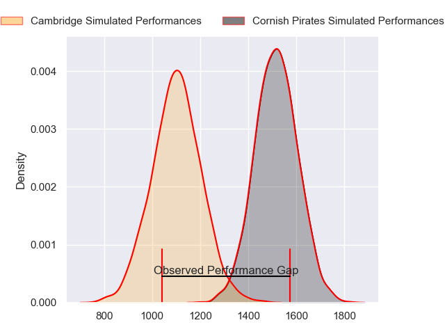
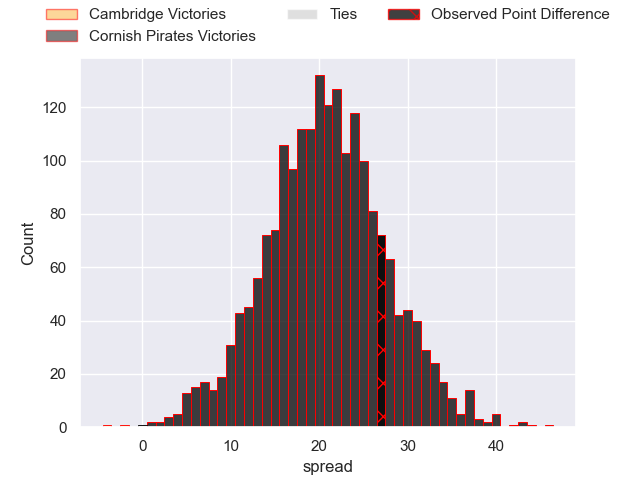
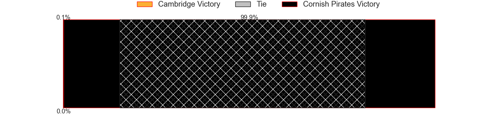
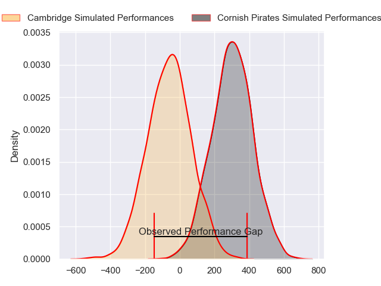
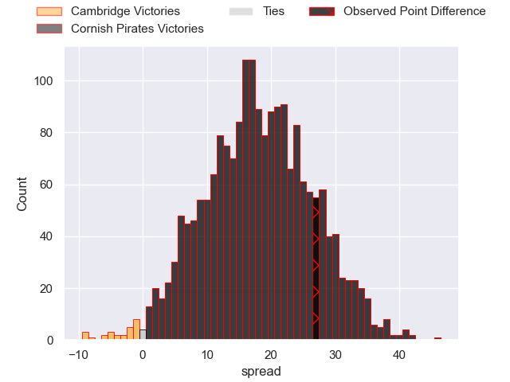
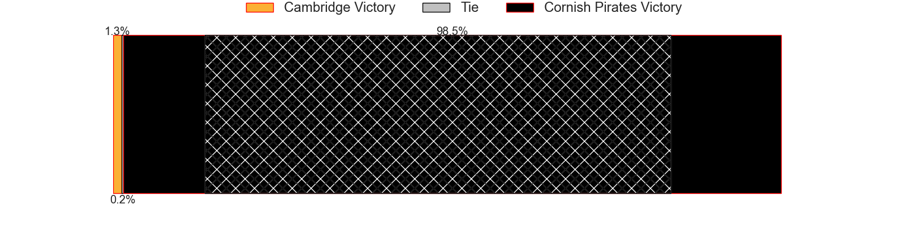

---  
layout: page  
title: Cambridge at Cornish Pirates; 18-45  
date: 2024-04-21 18:00:00 -0500  
categories: "RFU Championship 2023" match review  
---
# Cambridge at Cornish Pirates; 18-45

# Club Level Predictions

The first set of predictions treats a club as the smallest object, as the club develops its members, organizes a gameplan, and deploys its players as needed for each match. This club model has a prediction of 0.905, which translates to predicting Cornish Pirates to win by 20.7.

Our Over/Under is 63.5 - and combined with the spread above, we have a predicted scoreline of 22 to 42

Each club has a rating and a rating deviation (similar to a Glicko rating), and expected performances can be generated. This allows for simulated matches and spreads like the ones below.
## Projected Performances - Club Model

## Projected Spreads - Club Model

## Projected Results - Club Model

# Player Level Predictions - Version 2

Treating teams instead as an entity made up of the currently active players, I have ratings for each player in an altogether different system. These can be combined to form team ratings once teamsheets are announced, weighting starters a bit higher than the reserves. After the match is played, players can be weighted by their minutes on the field, allowing for an accurate measure of the team's composition. With these compiled team ratings, we can make predictions, measure inaccuracy, and update the individual player ratings.
## Prediction without Player Minutes: Cornish Pirates by 19.8

Cornish Pirates by 16.3 on a neutral pitch

## Projected Performances - Player Model

## Projected Spreads - Player Model

## Projected Results - Player Model

|   Away Minutes | Away Player          |   Away Percentile |   Number |   Home Percentile | Home Player          |   Home Minutes |
|---------------:|:---------------------|------------------:|---------:|------------------:|:---------------------|---------------:|
|             50 | Jake Elwood          |             10.03 |        1 |             86.69 | Lefty Zigiriadis     |             58 |
|             59 | Benjamin Brownlie    |             27.71 |        2 |             51    | Harry Hocking        |             28 |
|             50 | Billy Walker         |              5.79 |        3 |             74.25 | Finlay Richardson    |             53 |
|             80 | George Bretag-Norris |             17.41 |        4 |             82.22 | Hugh Bokenham        |             60 |
|             80 | Gareth Baxter        |             16.81 |        5 |             84.04 | Steele Robert Barker |             80 |
|             78 | Ben Adams            |              5.01 |        6 |             51.61 | Alex Everett         |             80 |
|             64 | Jared Cardew         |              4.53 |        7 |             85.58 | Will Gibson          |             67 |
|             25 | Nahum Merigan        |             28.68 |        8 |             81.8  | John Stevens         |             80 |
|             80 | Kieran Duffin        |             15.01 |        9 |             67.44 | Ruaridh Dawson       |             50 |
|             80 | Steffan James        |             12.47 |       10 |             74.03 | Tom Pittman          |             80 |
|             80 | Elias Caven          |              5.49 |       11 |             52.8  | Matthew McNab        |             80 |
|             60 | Matt Williams        |              4.08 |       12 |             69.59 | Joe Elderkin         |             80 |
|             80 | Sam Hanks            |              2.35 |       13 |             76.14 | Ioan Evans           |             44 |
|             80 | Kwaku Asiedu         |             18.06 |       14 |             63.77 | Arthur Relton        |             80 |
|             78 | Joseph Tarrant       |             15.52 |       15 |             64.38 | Kyle Moyle           |             70 |
|             30 | Huw Owen             |             60.27 |       16 |             52.07 | Jake Morris          |             22 |
|             21 | Archie Vanes         |             10.04 |       17 |            nan    | Iestyn Harris        |             52 |
|             30 | Matt Collins         |             45.23 |       18 |             79.07 | Matt Johnson         |             27 |
|             16 | Noah Sloot           |            nan    |       19 |             56.59 | Josh King            |             20 |
|              2 | Morgan Veness        |              9.24 |       20 |             62.79 | Alex Schwarz         |             30 |
|             55 | Anthony Maka         |             31.92 |       21 |            nan    | Hallam Chapman       |             13 |
|             20 | Tom Hoppe            |             31.89 |       22 |             75.66 | Robin Wedlake        |             36 |
|              2 | Lawrence Rayner      |            nan    |       23 |             67.53 | Bruce Houston        |             10 |

