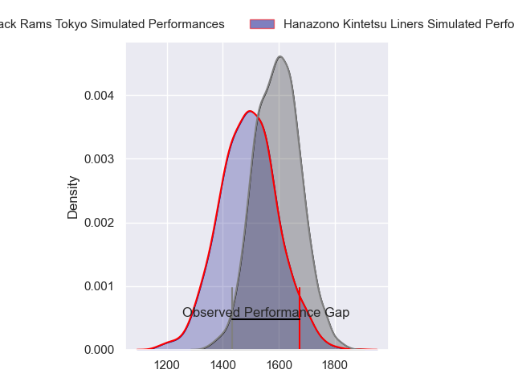
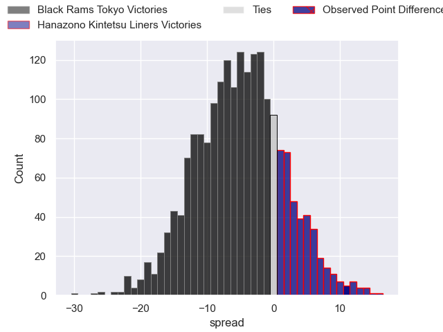
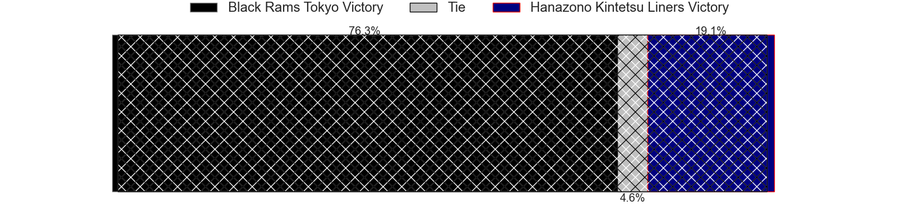
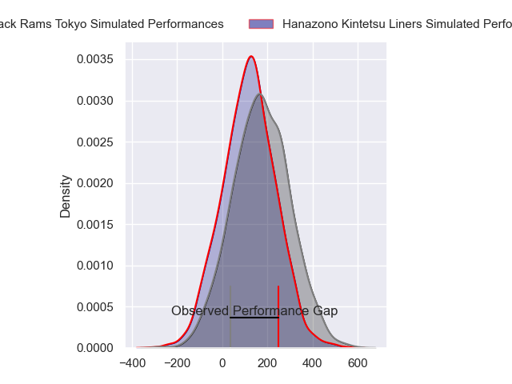
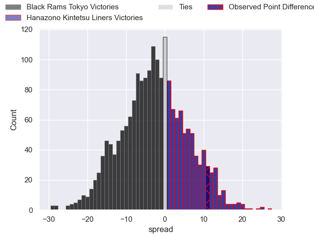
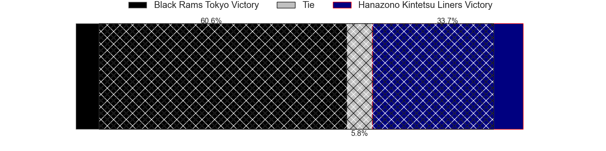

---  
layout: page  
title: Black Rams Tokyo at Hanazono Kintetsu Liners; 23-34  
date: 2024-04-21 18:00:00 -0500  
categories: "Japan Rugby League One 2023" match review  
---
# Black Rams Tokyo at Hanazono Kintetsu Liners; 23-34

# Club Level Predictions

The first set of predictions treats a club as the smallest object, as the club develops its members, organizes a gameplan, and deploys its players as needed for each match. This club model has a prediction of 0.36, which translates to predicting Black Rams Tokyo to win by 5.2.

Our Over/Under is 54.5 - and combined with the spread above, we have a predicted scoreline of 30 to 25

Each club has a rating and a rating deviation (similar to a Glicko rating), and expected performances can be generated. This allows for simulated matches and spreads like the ones below.
## Projected Performances - Club Model

## Projected Spreads - Club Model

## Projected Results - Club Model

# Player Level Predictions - Version 2

Treating teams instead as an entity made up of the currently active players, I have ratings for each player in an altogether different system. These can be combined to form team ratings once teamsheets are announced, weighting starters a bit higher than the reserves. After the match is played, players can be weighted by their minutes on the field, allowing for an accurate measure of the team's composition. With these compiled team ratings, we can make predictions, measure inaccuracy, and update the individual player ratings.
## Prediction without Player Minutes: Black Rams Tokyo by 1.8

Black Rams Tokyo by 5.3 on a neutral pitch

## Projected Performances - Player Model

## Projected Spreads - Player Model

## Projected Results - Player Model

|   Away Minutes | Away Player       |   Away Percentile |   Number |   Home Percentile | Home Player       |   Home Minutes |
|---------------:|:------------------|------------------:|---------:|------------------:|:------------------|---------------:|
|             62 | Kazuma Nishi      |             42.82 |        1 |              8.39 | Kenta Tanaka      |             62 |
|             80 | Hinata Takei      |             21.29 |        2 |              8.43 | Keiichi Kaneko    |             62 |
|             62 | Shohei Oyama      |             18.23 |        3 |             18.03 | Kota Mitake       |             62 |
|             62 | Shu Yamamoto      |             35.55 |        4 |             92.62 | Ben Toolis        |             80 |
|             80 | Mike Stolberg     |              2.18 |        5 |             68.68 | Sanaila Waqa      |             56 |
|             35 | Brodi McCurran    |             61.5  |        6 |              4.29 | Patrick Tafa      |             51 |
|             71 | Shuhei Matsuhashi |             60.67 |        7 |             19.55 | Shohei Nonaka     |             80 |
|             59 | Nathan Hughes     |             82.79 |        8 |             36.41 | Jose Seru         |             80 |
|             71 | Takanobu Minami   |             13.95 |        9 |             48.84 | Kensyo Kawamura   |             67 |
|             80 | Ichigo Nakakusu   |             40.78 |       10 |             98.44 | Quade Cooper      |             56 |
|             62 | Semisi Tupou      |             46.17 |       11 |             83.09 | Takahiro Hayashi  |             80 |
|             80 | Matt McGahan      |             77.5  |       12 |             78.37 | Patrick Stehlin   |             31 |
|             80 | Yuki Ikeda        |             48.7  |       13 |             62.42 | Tom Hendrickson   |             80 |
|             80 | Daisuke Nishikawa |             25.49 |       14 |              2.74 | Joshua Nohra      |             80 |
|             80 | Isaac Lucas       |             53.18 |       15 |             44.02 | Yoshizumi Takeda  |             80 |
|             45 | Otoya Kihara      |             32.17 |       16 |             14.22 | Haruki Kanazawa   |             49 |
|             21 | Samuel Waqabaca   |             33.17 |       17 |              0.72 | Takahito Sugahara |             29 |
|             18 | Kosei Nakamura    |            nan    |       18 |              7.38 | Isamu Matsuoka    |             24 |
|             18 | Paddy Ryan        |             73.77 |       19 |            nan    | Koji Okamura      |             24 |
|             18 | Pohiva Lotoahea   |             84.16 |       20 |              4.53 | Shun Sasaki       |             18 |
|             18 | Viliami Lolohea   |             11.12 |       21 |              5.98 | Lata Tangimana    |             18 |
|              9 | Masaaki Onishi    |            nan    |       22 |             24.9  | Andrew Makalio    |             18 |
|              9 | Toshiya Takahashi |             64.27 |       23 |             21.78 | Tomoya Nakamura   |             13 |

