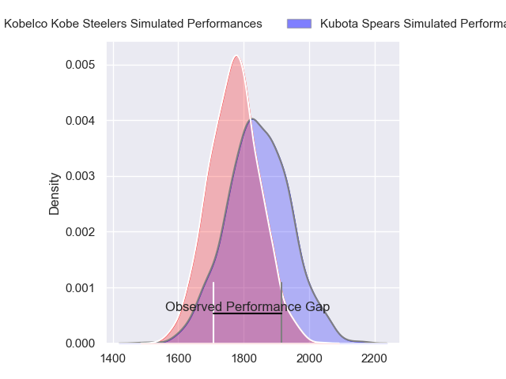
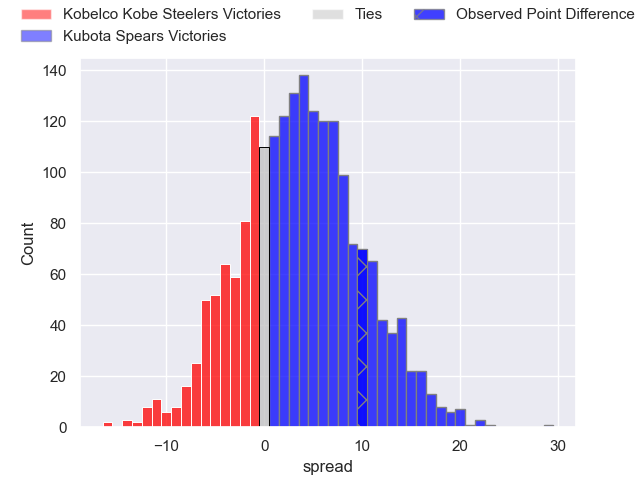
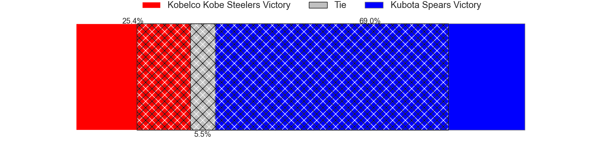
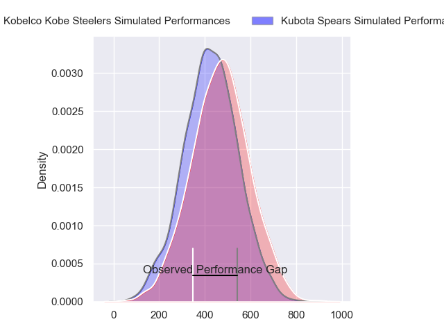
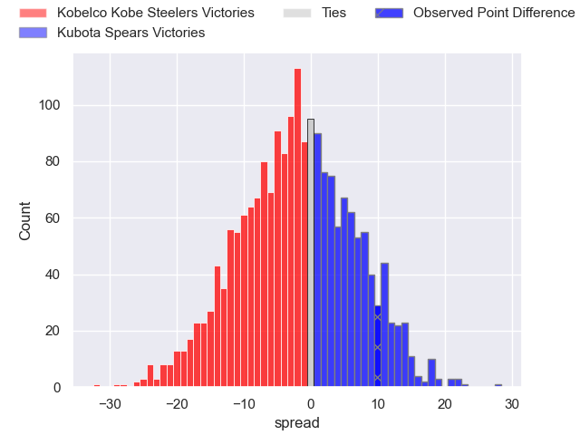
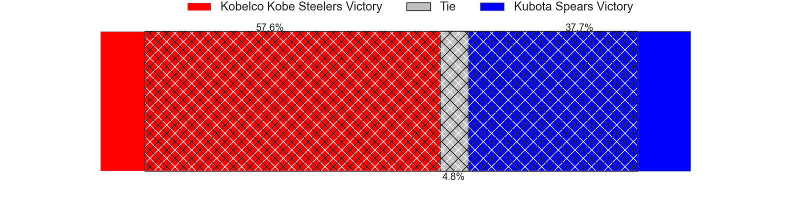

---  
layout: page  
title: Kobelco Kobe Steelers at Kubota Spears; 29-39  
date: 2024-04-21 18:00:00 -0500  
categories: "Japan Rugby League One 2023" match review  
---
# Kobelco Kobe Steelers at Kubota Spears; 29-39

# Club Level Predictions

The first set of predictions treats a club as the smallest object, as the club develops its members, organizes a gameplan, and deploys its players as needed for each match. This club model has a prediction of 0.598, which translates to predicting Kubota Spears to win by 3.6.

Our Over/Under is 65.5 - and combined with the spread above, we have a predicted scoreline of 31 to 35

Each club has a rating and a rating deviation (similar to a Glicko rating), and expected performances can be generated. This allows for simulated matches and spreads like the ones below.
## Projected Performances - Club Model

## Projected Spreads - Club Model

## Projected Results - Club Model

# Player Level Predictions - Version 2

Treating teams instead as an entity made up of the currently active players, I have ratings for each player in an altogether different system. These can be combined to form team ratings once teamsheets are announced, weighting starters a bit higher than the reserves. After the match is played, players can be weighted by their minutes on the field, allowing for an accurate measure of the team's composition. With these compiled team ratings, we can make predictions, measure inaccuracy, and update the individual player ratings.
## Prediction without Player Minutes: Kubota Spears by 4.9

Kubota Spears by 1.8 on a neutral pitch

## Projected Performances - Player Model

## Projected Spreads - Player Model

## Projected Results - Player Model

|   Away Minutes | Away Player              |   Away Percentile |   Number |   Home Percentile | Home Player         |   Home Minutes |
|---------------:|:-------------------------|------------------:|---------:|------------------:|:--------------------|---------------:|
|             60 | Shigure Takao            |             58.44 |        1 |             86.79 | Kota Kaishi         |             66 |
|             74 | Kenta Matsuoka           |             61.45 |        2 |             99.8  | Dane Coles          |             16 |
|             47 | Koo Ji-won               |              3.28 |        3 |             77.05 | Opeti Helu          |             71 |
|             80 | Gerard Cowley-Tuioti     |             77.27 |        4 |             87.55 | Uwe Helu            |             36 |
|             80 | Brodie Retallick         |             99.64 |        5 |             98.19 | Ruan Botha          |             80 |
|             40 | Amanaki Saumaki          |             63.29 |        6 |             88.08 | Lappies Labuschagne |             46 |
|             26 | Hikaru Hashimoto         |             71.04 |        7 |             82    | Takeo Suenaga       |             80 |
|             80 | Tiennan Costley          |             63.84 |        8 |             83.29 | Faulua Makisi       |             80 |
|             65 | Atsushi Hiwasa           |             87.1  |        9 |             41.23 | Shinobu Fujiwara    |             80 |
|             80 | Bryn Gatland             |             91.95 |       10 |             98.96 | Bernard Foley       |             71 |
|             80 | Kanta Matsunaga          |             73.37 |       11 |             52    | Hiroyuki Yamasaki   |             80 |
|             40 | Michael Little           |             53.03 |       12 |             66.5  | Harumichi Tatekawa  |             80 |
|             80 | Timothy Lafaele          |             41.78 |       13 |             78.74 | Sione Teaupa        |             69 |
|             74 | Rakuhei Yamashita        |             92.46 |       14 |             85.37 | Koga Nezuka         |             80 |
|             80 | Seungsin Lee             |              9.67 |       15 |             99.24 | Liam Williams       |             74 |
|             54 | Waisake Raratubua        |             79.08 |       16 |            nan    | Hayate Era          |             64 |
|             40 | Ryohei Yamanaka          |             69.72 |       17 |              3.26 | JD Schickerling     |             44 |
|             40 | Ardie Savea              |             99.64 |       18 |             68.77 | Finau Tupa          |             34 |
|             33 | Hiroshi Yamashita        |             94.89 |       19 |             51.21 | Yota Kaminori       |             14 |
|             20 | Isileli Nakajima Vakauta |             85.73 |       20 |            nan    | Keijiro Tamefusa    |              9 |
|             15 | Kentaro Obata            |            nan    |       21 |             71.31 | Halatoa Vailea      |             11 |
|              6 | Hiroaki Ushihara         |            nan    |       22 |             44.42 | Tomoki Kishioka     |              9 |
|              6 | Junta Hamano             |             14.97 |       23 |             18.07 | Yuhei Shimada       |              6 |

