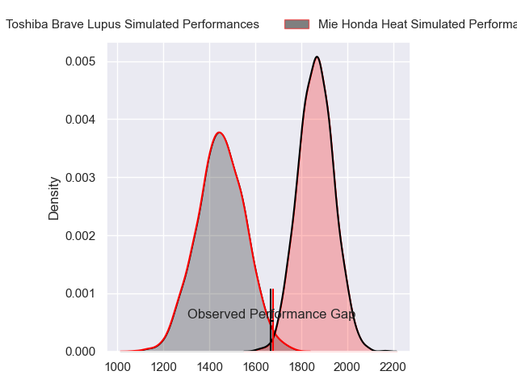
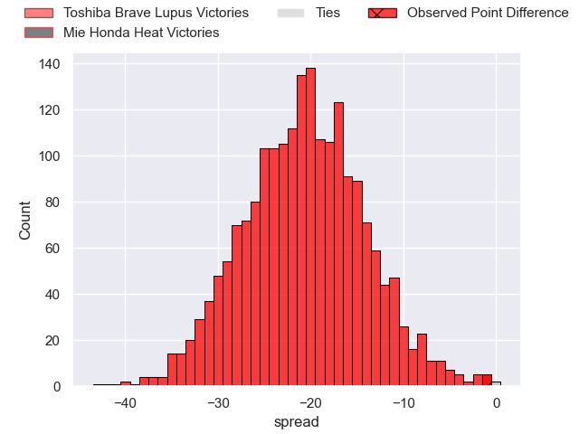
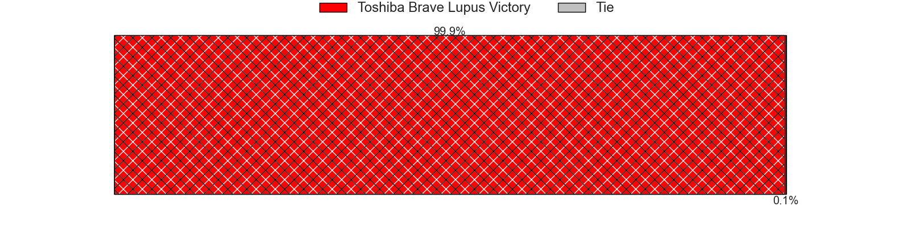
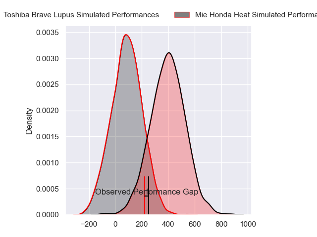
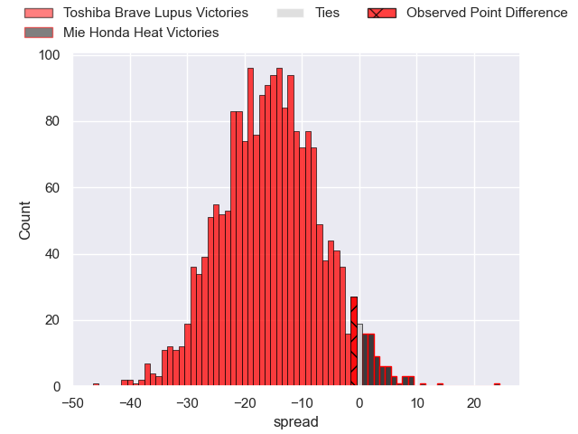
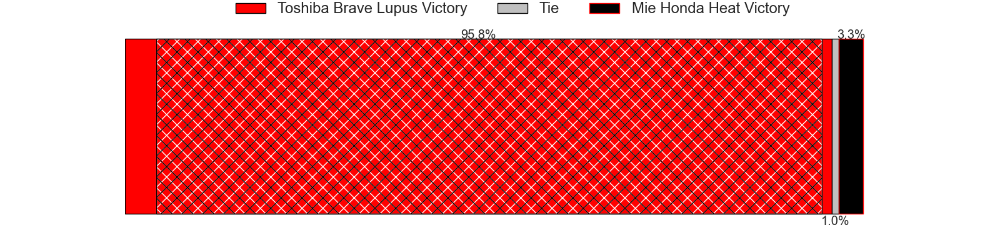

---  
layout: page  
title: Toshiba Brave Lupus at Mie Honda Heat; 8-7  
date: 2024-04-21 18:00:00 -0500  
categories: "Japan Rugby League One 2023" match review  
---
# Toshiba Brave Lupus at Mie Honda Heat; 8-7

# Club Level Predictions

The first set of predictions treats a club as the smallest object, as the club develops its members, organizes a gameplan, and deploys its players as needed for each match. This club model has a prediction of 0.09, which translates to predicting Toshiba Brave Lupus to win by 20.8.

Our Over/Under is 70.5 - and combined with the spread above, we have a predicted scoreline of 46 to 25

Each club has a rating and a rating deviation (similar to a Glicko rating), and expected performances can be generated. This allows for simulated matches and spreads like the ones below.
## Projected Performances - Club Model

## Projected Spreads - Club Model

## Projected Results - Club Model

# Player Level Predictions - Version 2

Treating teams instead as an entity made up of the currently active players, I have ratings for each player in an altogether different system. These can be combined to form team ratings once teamsheets are announced, weighting starters a bit higher than the reserves. After the match is played, players can be weighted by their minutes on the field, allowing for an accurate measure of the team's composition. With these compiled team ratings, we can make predictions, measure inaccuracy, and update the individual player ratings.
## Prediction without Player Minutes: Toshiba Brave Lupus by 14.0

Toshiba Brave Lupus by 17.0 on a neutral pitch

## Projected Performances - Player Model

## Projected Spreads - Player Model

## Projected Results - Player Model

|   Away Minutes | Away Player       |   Away Percentile |   Number |   Home Percentile | Home Player         |   Home Minutes |
|---------------:|:------------------|------------------:|---------:|------------------:|:--------------------|---------------:|
|             63 | Sena Kimura       |             78.3  |        1 |              3.95 | Tatsuhiko Tsurukawa |             54 |
|             54 | Daigo Hashimoto   |             52.01 |        2 |              6.22 | Lee Seung Hyok      |             54 |
|             58 | Taufa Latu        |             50.24 |        3 |             24.69 | Katsuyuki Hoshino   |             54 |
|             66 | PJ Steenkamp      |             11.61 |        4 |             51.75 | Connor Wihongi      |             49 |
|             80 | Jacob Pierce      |             97.7  |        5 |             92.02 | Franco Mostert      |             80 |
|             80 | Shin Ito          |             70.68 |        6 |              5.6  | Ryota Kobayashi     |             80 |
|             80 | Takeshi Sasaki    |             78.19 |        7 |              3.22 | Ryo Furuta          |             40 |
|             44 | Asaeli Lausii     |             34.16 |        8 |            100    | Pablo Matera        |             40 |
|             80 | Kohei Takahashi   |             59.41 |        9 |             49.68 | Takuro Hojo         |             79 |
|             80 | Hayata Nakao      |             64.16 |       10 |             28.31 | Gwangtee Oh         |             80 |
|             80 | Futoshi Mori      |             34.74 |       11 |             32.69 | Kanta Watanabe      |             80 |
|             59 | Taichi Mano       |             68.36 |       12 |              6.3  | Fraser Quirk        |             80 |
|             80 | Seta Tamanivalu   |             94.19 |       13 |             14.83 | Dawid Kellerman     |             54 |
|             80 | Jone Naikabula    |             72.34 |       14 |             24.8  | Soki Watanabe       |             80 |
|             80 | Michael Collins   |             92.88 |       15 |             84.73 | Tom Banks           |             80 |
|             36 | Michael Leitch    |             95.76 |       16 |             47.2  | Kosuke Hattori      |             40 |
|             26 | Mamoru Harada     |             81.93 |       17 |             20.95 | Waimana Kapa        |             40 |
|             22 | Rikyu Yamakawa    |            nan    |       18 |             24.3  | Yoji Akiyama        |             31 |
|             17 | Masataka Mikami   |             79.17 |       19 |            nan    | Koki Hida           |             26 |
|             21 | Nicholas McCurran |             78.49 |       20 |            nan    | Kanato Hirano       |             26 |
|             14 | Hiroki Yamamoto   |            nan    |       21 |             21.6  | Matthys Basson      |             26 |
|            nan | nan               |            nan    |       22 |            nan    | Taichi Takenaka     |             26 |
|            nan | nan               |            nan    |       23 |            nan    | Yuta Matsura        |              1 |

