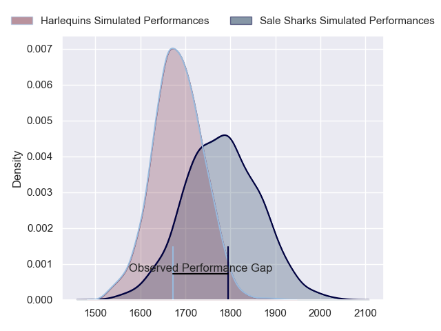
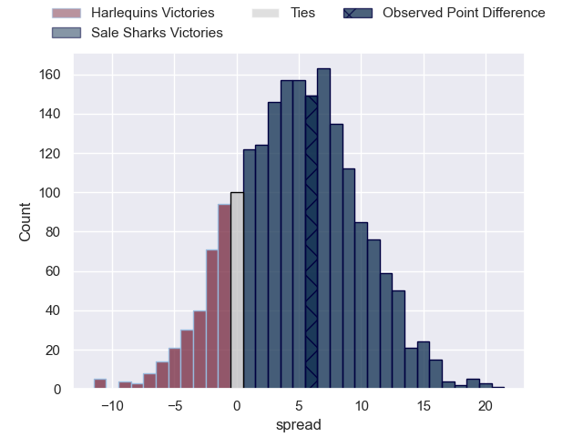
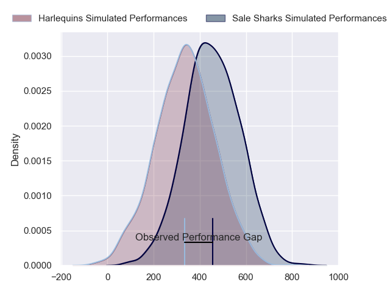
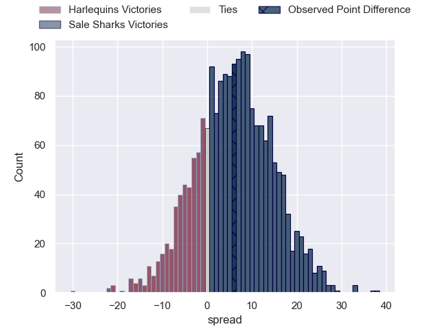

---  
layout: page  
title: Harlequins at Sale Sharks; 31-37  
date: 2024-04-21 18:00:00 -0500  
categories: "Gallagher Premiership 2023" match review  
---
# Harlequins at Sale Sharks; 31-37

# Club Level Predictions

The first set of predictions treats a club as the smallest object, as the club develops its members, organizes a gameplan, and deploys its players as needed for each match. This club model has a prediction of 0.628, which translates to predicting Sale Sharks to win by 4.6.

Our Over/Under is 44.5 - and combined with the spread above, we have a predicted scoreline of 20 to 25

Each club has a rating and a rating deviation (similar to a Glicko rating), and expected performances can be generated. This allows for simulated matches and spreads like the ones below.
## Projected Performances - Club Model

## Projected Spreads - Club Model

## Projected Results - Club Model

# Player Level Predictions - Version 2

Treating teams instead as an entity made up of the currently active players, I have ratings for each player in an altogether different system. These can be combined to form team ratings once teamsheets are announced, weighting starters a bit higher than the reserves. After the match is played, players can be weighted by their minutes on the field, allowing for an accurate measure of the team's composition. With these compiled team ratings, we can make predictions, measure inaccuracy, and update the individual player ratings.
## Prediction without Player Minutes: Sale Sharks by 6.2

Harlequins by 1.5 on a neutral pitch

## Projected Performances - Player Model

## Projected Spreads - Player Model

## Projected Results - Player Model

|   Away Minutes | Away Player               |   Away Percentile |   Number |   Home Percentile | Home Player       |   Home Minutes |
|---------------:|:--------------------------|------------------:|---------:|------------------:|:------------------|---------------:|
|             50 | Joe Marler                |             97.71 |        1 |             90.56 | Bevan Rodd        |             60 |
|             50 | Sam Riley                 |             62.28 |        2 |             85.07 | Luke Cowan-Dickie |             60 |
|             50 | Dillon Lewis              |             94.18 |        3 |             10.68 | James Harper      |             52 |
|             80 | Irne Herbst               |             73.33 |        4 |             84.69 | Cobus Wiese       |             80 |
|             60 | Stephan Lewies            |             83.01 |        5 |             76.44 | Josh Beaumont     |             80 |
|             73 | Chandler Cunningham-South |             75.87 |        6 |             30.74 | Ben Curry         |             54 |
|             80 | Will Evans                |             72.62 |        7 |             11.02 | Sam Dugdale       |             80 |
|             80 | Alex Dombrandt            |             86.98 |        8 |             99.02 | Jean-Luc du Preez |             77 |
|             52 | Will Porter               |             30.32 |        9 |             20    | Gus Warr          |             44 |
|             80 | Marcus Smith              |             84.87 |       10 |             93.85 | George Ford       |             80 |
|             80 | Cadan Murley              |             37.39 |       11 |             69.37 | Arron Reed        |             80 |
|             80 | Andre Esterhuizen         |             97.69 |       12 |             97.33 | Manu Tuilagi      |             80 |
|             65 | Oscar Beard               |             68.2  |       13 |             43.08 | Robert du Preez   |             80 |
|             69 | Louis Lynagh              |             84.35 |       14 |             56.53 | Tom Roebuck       |             58 |
|             80 | Tyrone Green              |             77.69 |       15 |              7.02 | Joe Carpenter     |             80 |
|             30 | Jack Walker               |             20.83 |       16 |             13.75 | Tommy Taylor      |             20 |
|             30 | Fin Baxter                |             31.74 |       17 |             90.66 | Simon McIntyre    |             20 |
|             30 | Simon Kerrod              |             27.26 |       18 |            nan    | WillGriff John    |             28 |
|             20 | George Hammond            |             16.87 |       19 |             23.09 | Ben Bamber        |             26 |
|              7 | Tom Lawday                |            nan    |       20 |             23.92 | Hyron Andrews     |              3 |
|             28 | Danny Care                |             99.79 |       21 |             58.11 | Raffi Quirke      |             36 |
|             11 | Jarrod Evans              |             84.1  |       22 |             82.04 | Sam James         |              0 |
|             15 | Luke Northmore            |             78.16 |       23 |             92.23 | Tom O'Flaherty    |             22 |

