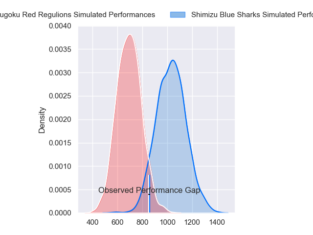
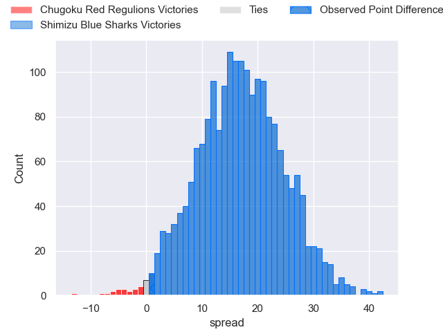
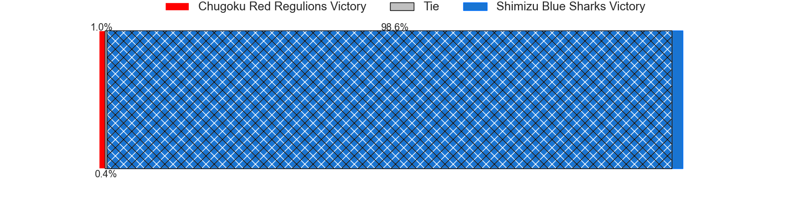
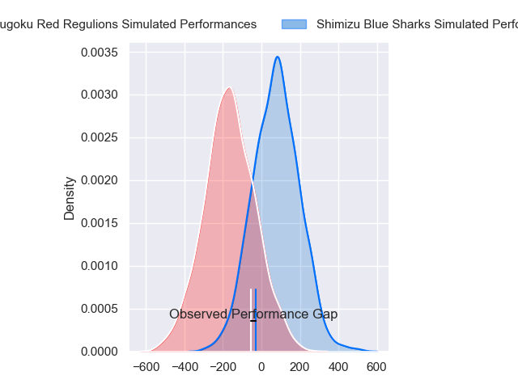
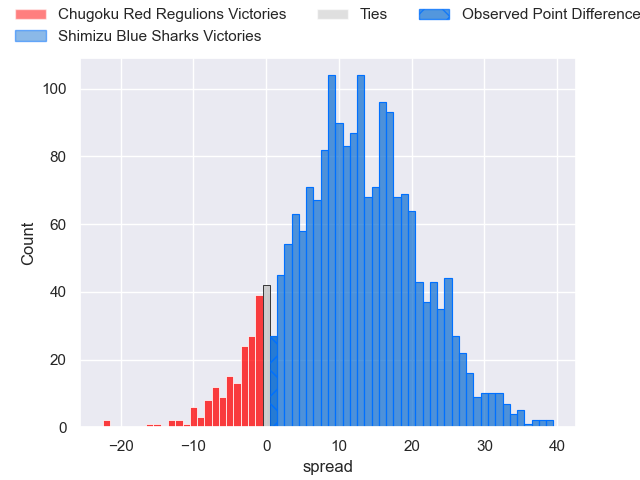
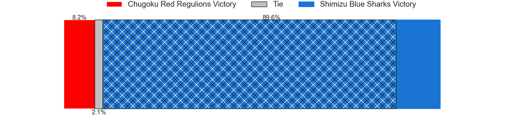

---  
layout: page  
title: Chugoku Red Regulions at Shimizu Blue Sharks; 20-21  
date: 2024-04-21 18:00:00 -0500  
categories: "Japan Rugby League One D3 2023" match review  
---
# Chugoku Red Regulions at Shimizu Blue Sharks; 20-21

# Club Level Predictions

The first set of predictions treats a club as the smallest object, as the club develops its members, organizes a gameplan, and deploys its players as needed for each match. This club model has a prediction of 0.868, which translates to predicting Shimizu Blue Sharks to win by 17.1.

Our Over/Under is 63.5 - and combined with the spread above, we have a predicted scoreline of 23 to 40

Each club has a rating and a rating deviation (similar to a Glicko rating), and expected performances can be generated. This allows for simulated matches and spreads like the ones below.
## Projected Performances - Club Model

## Projected Spreads - Club Model

## Projected Results - Club Model

# Player Level Predictions - Version 2

Treating teams instead as an entity made up of the currently active players, I have ratings for each player in an altogether different system. These can be combined to form team ratings once teamsheets are announced, weighting starters a bit higher than the reserves. After the match is played, players can be weighted by their minutes on the field, allowing for an accurate measure of the team's composition. With these compiled team ratings, we can make predictions, measure inaccuracy, and update the individual player ratings.
## Prediction without Player Minutes: Shimizu Blue Sharks by 12.6

Shimizu Blue Sharks by 10.1 on a neutral pitch

## Projected Performances - Player Model

## Projected Spreads - Player Model

## Projected Results - Player Model

|   Away Minutes | Away Player          |   Away Percentile |   Number |   Home Percentile | Home Player       |   Home Minutes |
|---------------:|:---------------------|------------------:|---------:|------------------:|:------------------|---------------:|
|             80 | Kojiro Arito         |              8.49 |        1 |             25.55 | Takeo Yoshikawa   |             65 |
|             72 | Kentaro Iwanaga      |              5.62 |        2 |             14.26 | Kaito Tamori      |             59 |
|             80 | Kento Miyata         |             41.37 |        3 |             25.94 | Shinya Nara       |             50 |
|             80 | Taro Nishikawa       |              0.24 |        4 |              9.07 | Ryota Sakino      |             80 |
|             72 | Kouta Moriyama       |              1.21 |        5 |             35.91 | Koyo Adachi       |             80 |
|             80 | Shintaro Matsuda     |             16.81 |        6 |             24.08 | Usa Baleilautoka  |             50 |
|             80 | Ed Quirk             |              0.6  |        7 |             40.17 | Riki Tanaka       |             70 |
|             40 | Shun Kawaguchi       |              2    |        8 |             10.97 | Ryo Sato          |             80 |
|             72 | Rintaro Kawashima    |             17.12 |        9 |             39.11 | Tatsuya Kanetsuki |             70 |
|             80 | Miyazaki Hayato      |             52.99 |       10 |             37.66 | Masaya Yamada     |             59 |
|             80 | Kennta Kitayama      |             52.46 |       11 |             12.34 | Shuhei Sasaki     |             80 |
|             80 | Hashizo Yoshida      |             11    |       12 |             54.76 | Siale Piutau      |             80 |
|             78 | Masaaki Morita       |              2.22 |       13 |             21.01 | Takuya Kanemura   |             70 |
|             80 | Kentaro Fujii        |             16.23 |       14 |             19.77 | Eika Miyazaki     |             80 |
|             65 | Yuto Matsuoka        |              8.65 |       15 |              3.56 | Tatsuhiro Ozaki   |             80 |
|             40 | Tomonari Aoki        |             19.11 |       16 |            nan    | Takaaki Okuma     |             30 |
|             15 | Hirofumi Higashikawa |             20.34 |       17 |            nan    | Daisuke Yamato    |             30 |
|              8 | Yuuki Asai           |              6.43 |       18 |             13.25 | Soichiro Kuwata   |             21 |
|              8 | Kengo Ishiwatari     |             34.33 |       19 |             45.58 | Yasuyuki Yamamoto |             21 |
|              8 | Shohei Tsukamoto     |              2.33 |       20 |            nan    | Daiki Shimura     |             15 |
|              2 | Azuma Syougo         |             32.26 |       21 |             81.38 | Sam Chongkit      |             10 |
|            nan | nan                  |            nan    |       22 |            nan    | Reijiro Usui      |             10 |
|            nan | nan                  |            nan    |       23 |            nan    | Toru Morita       |             10 |

