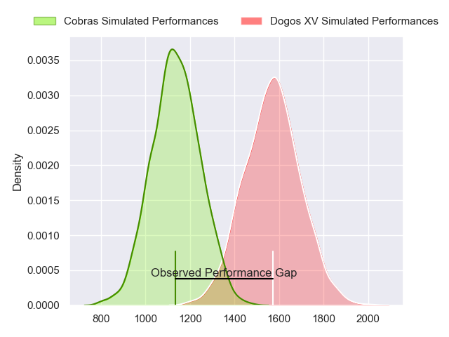
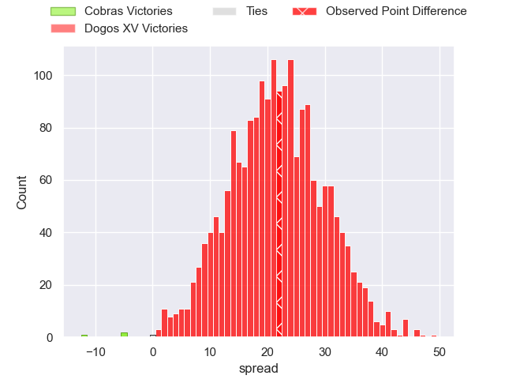
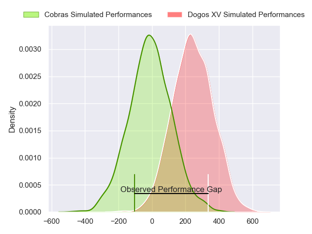
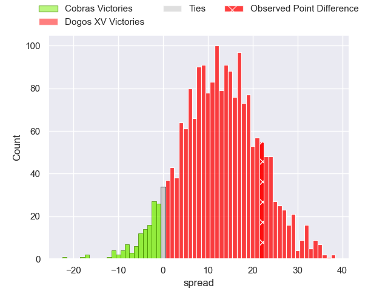

---  
layout: page  
title: Cobras at Dogos XV; 9-31  
date: 2024-04-22 18:00:00 -0500  
categories: "Super Rugby Americas 2024" match review  
---
# Cobras at Dogos XV; 9-31

# Club Level Predictions

The first set of predictions treats a club as the smallest object, as the club develops its members, organizes a gameplan, and deploys its players as needed for each match. This club model has a prediction of 0.914, which translates to predicting Dogos XV to win by 21.7.

Our Over/Under is 57.5 - and combined with the spread above, we have a predicted scoreline of 18 to 40

Each club has a rating and a rating deviation (similar to a Glicko rating), and expected performances can be generated. This allows for simulated matches and spreads like the ones below.
## Projected Performances - Club Model

## Projected Spreads - Club Model

## Projected Results - Club Model

# Player Level Predictions - Version 2

Treating teams instead as an entity made up of the currently active players, I have ratings for each player in an altogether different system. These can be combined to form team ratings once teamsheets are announced, weighting starters a bit higher than the reserves. After the match is played, players can be weighted by their minutes on the field, allowing for an accurate measure of the team's composition. With these compiled team ratings, we can make predictions, measure inaccuracy, and update the individual player ratings.
## Prediction without Player Minutes: Dogos XV by 12.8

Dogos XV by 10.5 on a neutral pitch

## Projected Performances - Player Model

## Projected Spreads - Player Model

## Projected Results - Player Model

|   Away Minutes | Away Player               |   Away Percentile |   Number |   Home Percentile | Home Player                 |   Home Minutes |
|---------------:|:--------------------------|------------------:|---------:|------------------:|:----------------------------|---------------:|
|             58 | Luciano Gabellieri        |             66.73 |        1 |             82.16 | Boris Wenger                |             66 |
|             40 | Henrique Ribeiro Ferreira |             19.68 |        2 |             40.16 | Tomas Bartolini             |             80 |
|             40 | Francisco Moreno          |             73.67 |        3 |             58.73 | Pedro Delgado               |             59 |
|             75 | Franco Carrera            |             68.8  |        4 |             77.03 | Lautaro Simes               |             75 |
|             57 | Gabriel Oliveira          |             22.25 |        5 |             96.49 | Franco Molina               |             80 |
|             67 | Adrio Melo                |             55.42 |        6 |             54.59 | Aitor Bildosola             |             57 |
|             80 | Cleber Dias               |              5.84 |        7 |             55.66 | Lorenzo Colidio             |             64 |
|             80 | Andre Arruda              |              8.98 |        8 |             61.85 | Valentin Cabral             |             80 |
|             80 | Felipe Goncalves Cunha    |             53.28 |        9 |             74.63 | Agustin Moyano              |             57 |
|             67 | Lucas Tranquez            |              3.38 |       10 |             67.01 | Julian Ignacio Hernandez    |             62 |
|             80 | Widson Nascimento         |             38.06 |       11 |             60.23 | Nahuel Romero               |             80 |
|             80 | Robert Tenorio            |             10.26 |       12 |             58.34 | Leonardo Gea Salim          |             57 |
|             23 | Carlo Mignot              |             53.89 |       13 |             60.07 | Felipe Mallia               |             80 |
|             80 | Victor Souza              |             33.71 |       14 |             69.83 | Mateo Soler                 |             80 |
|             80 | Agustin Llano             |             58.78 |       15 |             49.87 | Agustin De Vertiz           |             80 |
|             40 | Endy Willian              |             11.45 |       16 |            nan    | Nicolas Viola               |             23 |
|             40 | Levy Marinho              |             26.81 |       17 |             87.64 | Agustin Segura              |             23 |
|             57 | Daniel Lima               |              4.58 |       18 |            nan    | Facundo Garcia Hamilton     |             23 |
|             22 | Nicolas Alkmin            |            nan    |       19 |             80.62 | Octavio Filippa             |             21 |
|             13 | Rafael Teixeira           |             55.3  |       20 |             49.09 | Juan Baronio                |             18 |
|             13 | Joao Amaral               |             61.3  |       21 |             74.14 | Felipe Villagran            |             16 |
|              5 | Helder Brian Souza Lucio  |            nan    |       22 |            nan    | Juan Aguirre                |             14 |
|             23 | Gabriel Paganini          |              2.42 |       23 |            nan    | Santos Maria Juarez Estrada |              5 |

