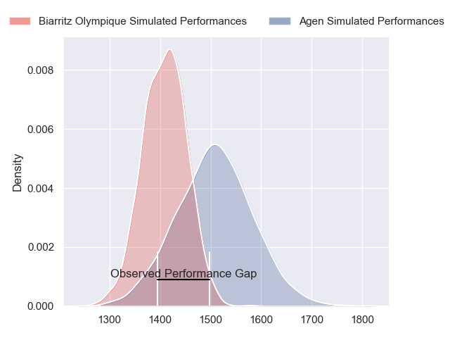
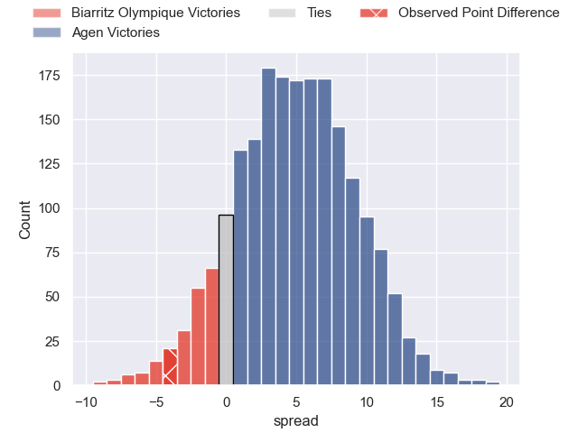
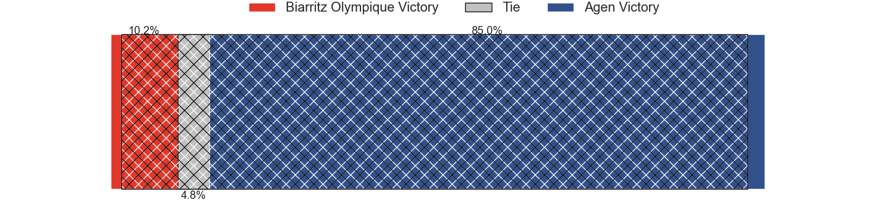
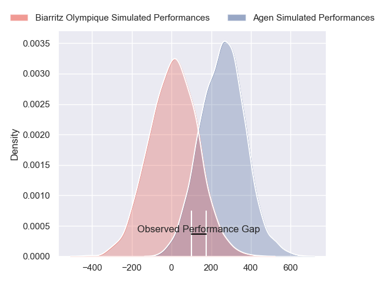
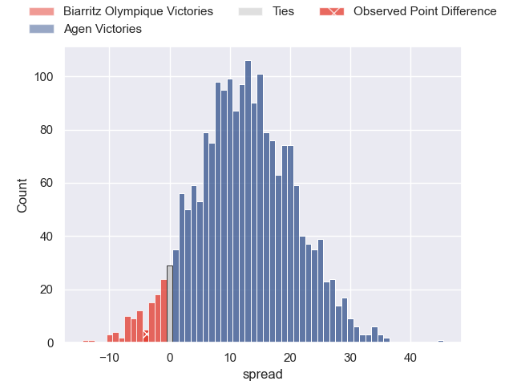
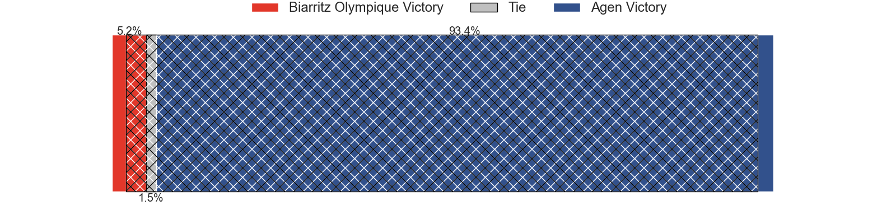

---  
layout: page  
title: Biarritz Olympique at Agen; 30-26  
date: 2024-04-25 18:00:00 -0500  
categories: "Pro D2 2023" match review  
---
# Biarritz Olympique at Agen; 30-26

# Club Level Predictions

The first set of predictions treats a club as the smallest object, as the club develops its members, organizes a gameplan, and deploys its players as needed for each match. This club model has a prediction of 0.64, which translates to predicting Agen to win by 5.0.

Our Over/Under is 50.5 - and combined with the spread above, we have a predicted scoreline of 23 to 28

Each club has a rating and a rating deviation (similar to a Glicko rating), and expected performances can be generated. This allows for simulated matches and spreads like the ones below.
## Projected Performances - Club Model

## Projected Spreads - Club Model

## Projected Results - Club Model

# Player Level Predictions - Version 2

Treating teams instead as an entity made up of the currently active players, I have ratings for each player in an altogether different system. These can be combined to form team ratings once teamsheets are announced, weighting starters a bit higher than the reserves. After the match is played, players can be weighted by their minutes on the field, allowing for an accurate measure of the team's composition. With these compiled team ratings, we can make predictions, measure inaccuracy, and update the individual player ratings.
## Prediction without Player Minutes: Agen by 13.5

Agen by 5.4 on a neutral pitch

## Projected Performances - Player Model

## Projected Spreads - Player Model

## Projected Results - Player Model

|   Away Minutes | Away Player        |   Away Percentile |   Number |   Home Percentile | Home Player                   |   Home Minutes |
|---------------:|:-------------------|------------------:|---------:|------------------:|:------------------------------|---------------:|
|             41 | Killian Taofifenua |             50.92 |        1 |              9.93 | Florent Guion                 |             47 |
|             73 | Luteru Tolai       |             61.65 |        2 |             35.34 | Clement Martinez              |             47 |
|             34 | Giorgi Nutsubidze  |              4.34 |        3 |             46.96 | Alex Burin                    |             47 |
|             65 | Johnny Dyer        |              3.51 |        4 |              2.54 | Evan Olmstead                 |             55 |
|             50 | Adrian Motoc       |              3.87 |        5 |             81.98 | William Demotte               |             80 |
|             80 | Charlie Francoz    |              8.22 |        6 |             13.11 | Julien Lebian                 |             80 |
|             80 | Simon Augry        |             54.23 |        7 |             72.47 | Arnaud Duputs                 |             80 |
|             80 | Temo Matiu         |             32.67 |        8 |             27.68 | Matthieu Bonnet               |             47 |
|             73 | Pierre Pages       |             35.94 |        9 |             15.86 | Dorian Bellot                 |             76 |
|             80 | Billy Searle       |             11.43 |       10 |             21.82 | Ben Volavola                  |             80 |
|             41 | Steeve Barry       |             21.14 |       11 |             29.94 | Iban Etcheverry               |             59 |
|             61 | Ilian Perraux      |             71.94 |       12 |             52.04 | Clement Garrigues             |             80 |
|             80 | Vincent Martin     |             21.26 |       13 |             46.23 | Theo Belan                    |             47 |
|             80 | Zach Kibirige      |             17.14 |       14 |              6.17 | Inoke Nalaga Kurukuruvakatini |             80 |
|             80 | Gervais Cordin     |             49.62 |       15 |             57    | Thomas Vincent                |             80 |
|             46 | Mohamed Haouas     |             77.82 |       16 |             39.34 | Beau Farrance                 |             33 |
|             39 | Zakaria El Fakir   |             14.95 |       17 |             68.85 | Peyo Muscarditz               |             33 |
|             39 | Yann David         |             67.99 |       18 |             13.72 | Martin Devergie               |             33 |
|             30 | Charlie Matthews   |             69.41 |       19 |             12.45 | Pierre Jouvin                 |             33 |
|             19 | Francois Vergnaud  |              6.06 |       20 |             63.36 | Hans Lombard-Buret            |             33 |
|             15 | Nafi Ma'afu        |             64.69 |       21 |             39.78 | Corentin Vernet               |             25 |
|              7 | Antoine Domercq    |             34.88 |       22 |              1.94 | Loris Tolot                   |             21 |
|              7 | Brendan Lebrun     |             59.44 |       23 |             22.08 | Emile Dayral                  |              4 |

