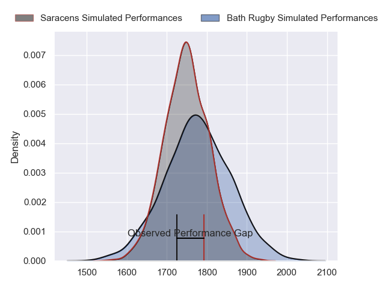
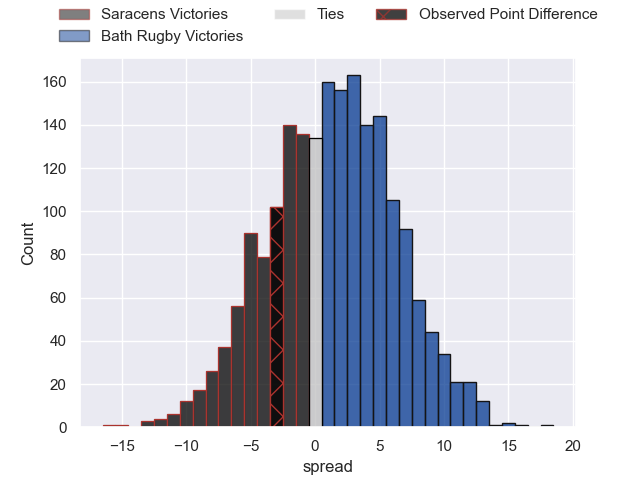
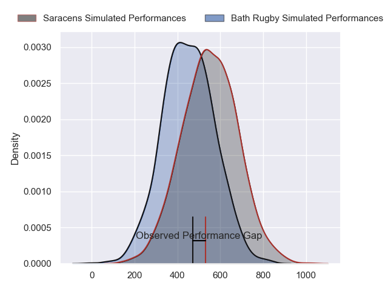
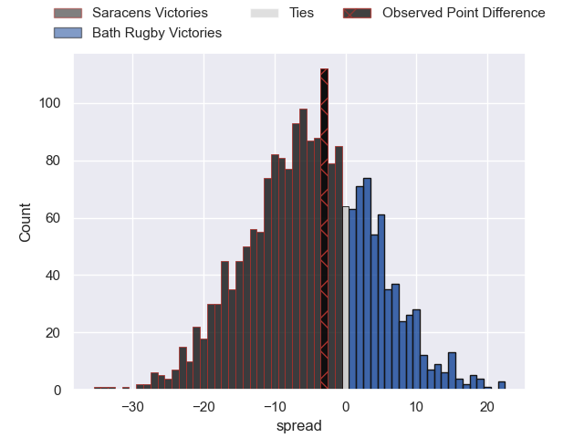
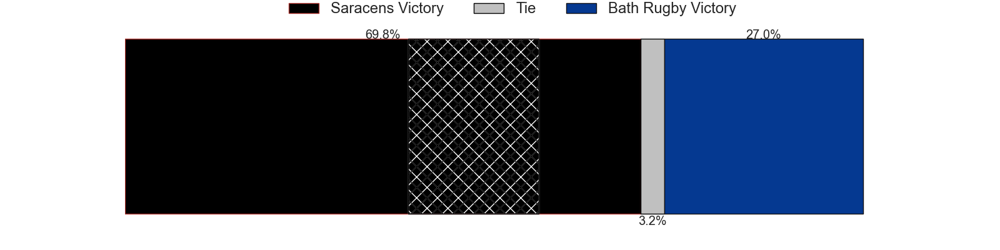

---  
layout: page  
title: Saracens at Bath Rugby; 15-12  
date: 2024-04-26 18:00:00 -0500  
categories: "Gallagher Premiership 2023" match review  
---
# Saracens at Bath Rugby; 15-12

# Club Level Predictions

The first set of predictions treats a club as the smallest object, as the club develops its members, organizes a gameplan, and deploys its players as needed for each match. This club model has a prediction of 0.534, which translates to predicting Bath Rugby to win by 1.2.

Our Over/Under is 42.5 - and combined with the spread above, we have a predicted scoreline of 21 to 22

Each club has a rating and a rating deviation (similar to a Glicko rating), and expected performances can be generated. This allows for simulated matches and spreads like the ones below.
## Projected Performances - Club Model

## Projected Spreads - Club Model

## Projected Results - Club Model

# Player Level Predictions - Version 2

Treating teams instead as an entity made up of the currently active players, I have ratings for each player in an altogether different system. These can be combined to form team ratings once teamsheets are announced, weighting starters a bit higher than the reserves. After the match is played, players can be weighted by their minutes on the field, allowing for an accurate measure of the team's composition. With these compiled team ratings, we can make predictions, measure inaccuracy, and update the individual player ratings.
## Prediction without Player Minutes: Saracens by 3.0

Saracens by 10.9 on a neutral pitch

## Projected Performances - Player Model

## Projected Spreads - Player Model

## Projected Results - Player Model

|   Away Minutes | Away Player          |   Away Percentile |   Number |   Home Percentile | Home Player        |   Home Minutes |
|---------------:|:---------------------|------------------:|---------:|------------------:|:-------------------|---------------:|
|             44 | Eroni Mawi           |             76.28 |        1 |             87.75 | Beno Obano         |             50 |
|             62 | Jamie George         |             97.79 |        2 |             40.56 | Niall Annett       |             50 |
|             50 | Christian Judge      |             75.31 |        3 |             41.27 | Will Stuart        |             50 |
|             80 | Maro Itoje           |             93.83 |        4 |             93.59 | Quinn Roux         |             62 |
|             68 | Nick Isiekwe         |             86.7  |        5 |             57.19 | Charlie Ewels      |             80 |
|             80 | Juan Martin Gonzalez |             91.78 |        6 |             80.33 | Ted Hill           |             80 |
|             80 | Ben Earl             |             96.07 |        7 |             88.8  | Sam Underhill      |             69 |
|             57 | Tom Willis           |             19.2  |        8 |             70.57 | Alfie Barbeary     |             62 |
|             66 | Aled Davies          |             73.78 |        9 |             78.01 | Ben Spencer        |             80 |
|             80 | Owen Farrell         |             99.22 |       10 |             31.69 | Orlando Bailey     |             72 |
|             80 | Tom Parton           |             89.94 |       11 |             11.31 | Will Muir          |             80 |
|             80 | Nick Tompkins        |             97.03 |       12 |             82.57 | Max Ojomoh         |             62 |
|             80 | Lucio Cinti          |             47.71 |       13 |             84.18 | Ollie Lawrence     |             80 |
|             80 | Rotimi Segun         |             29.14 |       14 |             91.09 | Joe Cokanasiga     |             80 |
|             80 | Elliot Daly          |             79.64 |       15 |             95.93 | Matt Gallagher     |             80 |
|             36 | Mako Vunipola        |             99.61 |       16 |             93.25 | Thomas du Toit     |             30 |
|             18 | Theo Dan             |             46.59 |       17 |             95.98 | Tom Dunn           |             30 |
|             30 | Marco Riccioni       |             29.03 |       18 |            nan    | Archie Griffin     |             30 |
|             12 | Hugh Tizard          |             46.8  |       19 |             13.18 | Jacques du Plessis |             18 |
|             23 | Billy Vunipola       |             97.76 |       20 |             15.26 | Josh Bayliss       |             11 |
|             14 | Ivan van Zyl         |             71.88 |       21 |             33.42 | Jaco Coetzee       |             18 |
|            nan | nan                  |            nan    |       22 |             65.96 | Louis Schreuder    |              8 |
|            nan | nan                  |            nan    |       23 |             48.95 | Cameron Redpath    |             18 |

