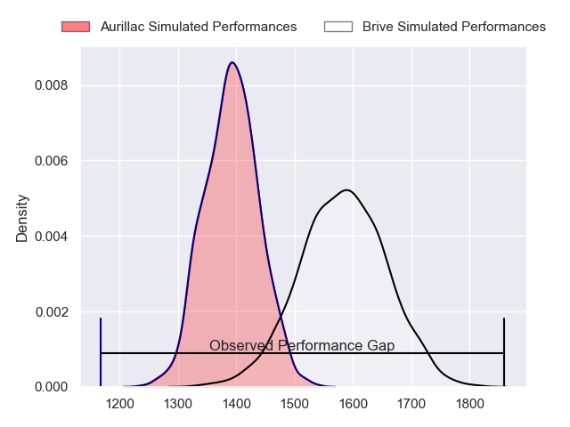
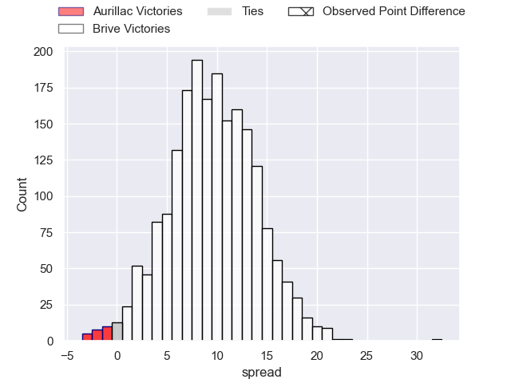
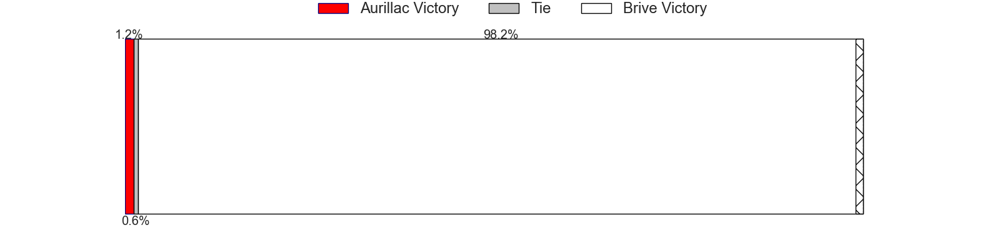
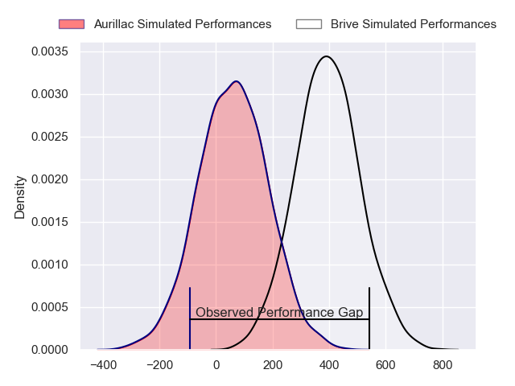
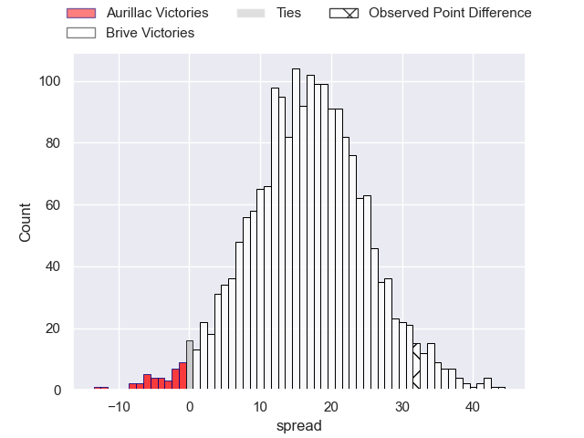
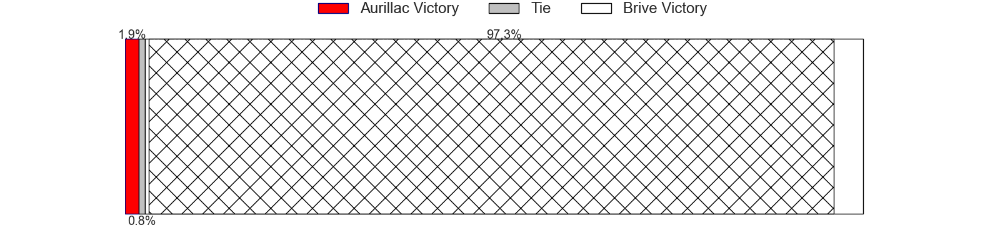

---  
layout: page  
title: Aurillac at Brive; 13-45  
date: 2024-04-26 18:00:00 -0500  
categories: "Pro D2 2023" match review  
---
# Aurillac at Brive; 13-45

# Club Level Predictions

The first set of predictions treats a club as the smallest object, as the club develops its members, organizes a gameplan, and deploys its players as needed for each match. This club model has a prediction of 0.75, which translates to predicting Brive to win by 9.6.

Our Over/Under is 44.5 - and combined with the spread above, we have a predicted scoreline of 18 to 27

Each club has a rating and a rating deviation (similar to a Glicko rating), and expected performances can be generated. This allows for simulated matches and spreads like the ones below.
## Projected Performances - Club Model

## Projected Spreads - Club Model

## Projected Results - Club Model

# Player Level Predictions - Version 2

Treating teams instead as an entity made up of the currently active players, I have ratings for each player in an altogether different system. These can be combined to form team ratings once teamsheets are announced, weighting starters a bit higher than the reserves. After the match is played, players can be weighted by their minutes on the field, allowing for an accurate measure of the team's composition. With these compiled team ratings, we can make predictions, measure inaccuracy, and update the individual player ratings.
## Prediction without Player Minutes: Brive by 19.5

Brive by 11.7 on a neutral pitch

## Projected Performances - Player Model

## Projected Spreads - Player Model

## Projected Results - Player Model

|   Away Minutes | Away Player        |   Away Percentile |   Number |   Home Percentile | Home Player               |   Home Minutes |
|---------------:|:-------------------|------------------:|---------:|------------------:|:--------------------------|---------------:|
|             45 | Robert Rodgers     |             10.68 |        1 |             14.1  | Daniel Brennan            |             53 |
|             45 | Luka Nioradze      |             14.31 |        2 |             37.63 | Lucas da Silva            |             53 |
|             51 | Tim Daniel-Meissen |             30.95 |        3 |             75.61 | Vakh Abdaladze            |             53 |
|             80 | Eoghan Masterson   |             78.76 |        4 |             60.07 | Renger Van Eerten         |             80 |
|             80 | Cam Dodson         |             78.03 |        5 |             66.5  | Tevita Ratuva             |             53 |
|             62 | Hugo Huurman       |             66.67 |        6 |             77.9  | Retief Marais             |             80 |
|             80 | Didier Tison       |             39.31 |        7 |             94.27 | Said Hireche              |             55 |
|             45 | Latuka Maituku     |              8.44 |        8 |             88.24 | Ross Moriarty             |             53 |
|             53 | David Delarue      |             26.17 |        9 |             50.64 | Leo Carbonneau            |             80 |
|             80 | Antoine Aucagne    |             34.2  |       10 |             89.56 | Stuart Olding             |             65 |
|             80 | AJ Coertzen        |             71.11 |       11 |             78.71 | Arthur Bonneval           |             80 |
|             80 | Ofa Manuofetoa     |             70.86 |       12 |             87.55 | Sam Johnson               |             80 |
|             45 | Hugo Bastard       |             40.47 |       13 |             41.22 | Sammy Arnold              |             80 |
|             80 | Juun Pieters       |             66.32 |       14 |             67.95 | Mathis Ferté              |             61 |
|             80 | Marc Palmier       |             17.34 |       15 |             42.21 | Nic Krone                 |             80 |
|             35 | Alexandre Plantier |             65.23 |       16 |             68.76 | Wesley Tapueluelu         |             27 |
|             35 | Ronan Loughnane    |             37.42 |       17 |             41.92 | Benjamin Boudou           |             27 |
|             35 | Aleksandre Burduli |            nan    |       18 |             48.85 | Taniela Sadrugu           |             27 |
|             35 | Christa Powell     |              9.09 |       19 |             75.12 | Asier Usarraga            |             27 |
|             29 | Thomas Cretu       |             32.91 |       20 |             16.55 | Francisco Coria Marchetti |             27 |
|             27 | Mikheil Alania     |             25.53 |       21 |             46.83 | Sasha Gue                 |             25 |
|             18 | Théo Cambon        |             10.75 |       22 |            nan    | Wesley Douglas            |             19 |
|            nan | nan                |            nan    |       23 |             40.47 | Tom Raffy                 |             15 |

