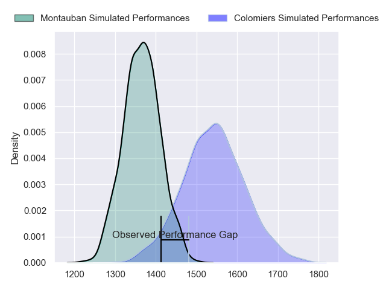
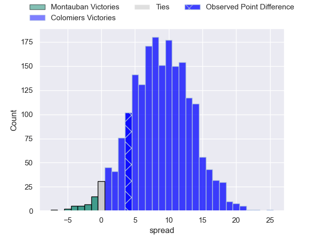
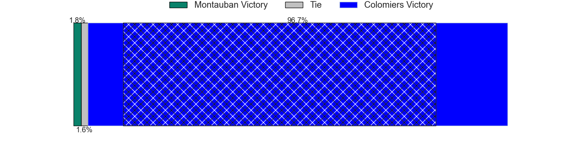
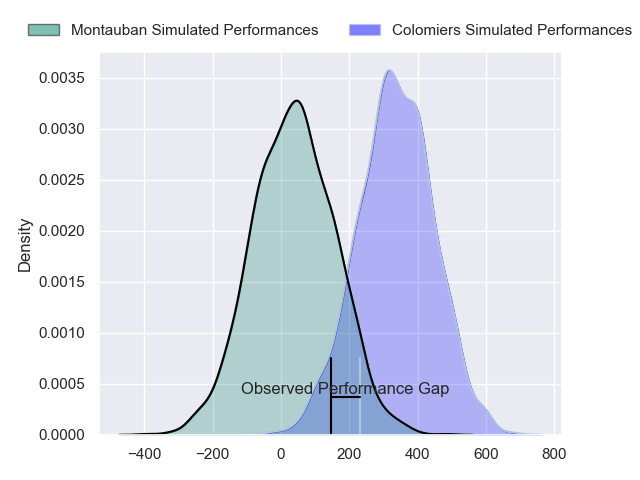
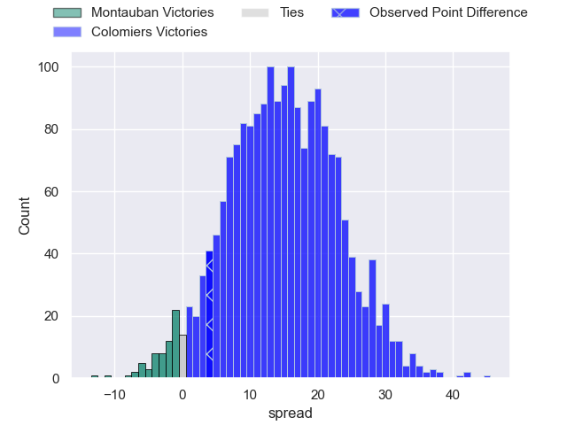
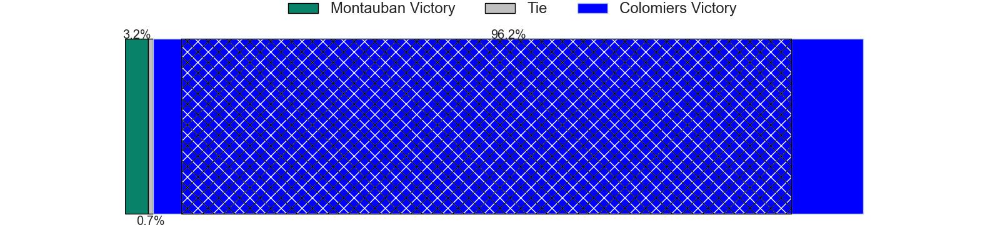

---  
layout: page  
title: Montauban at Colomiers; 20-24  
date: 2024-04-26 18:00:00 -0500  
categories: "Pro D2 2023" match review  
---
# Montauban at Colomiers; 20-24

# Club Level Predictions

The first set of predictions treats a club as the smallest object, as the club develops its members, organizes a gameplan, and deploys its players as needed for each match. This club model has a prediction of 0.733, which translates to predicting Colomiers to win by 8.9.

Our Over/Under is 42.5 - and combined with the spread above, we have a predicted scoreline of 17 to 26

Each club has a rating and a rating deviation (similar to a Glicko rating), and expected performances can be generated. This allows for simulated matches and spreads like the ones below.
## Projected Performances - Club Model

## Projected Spreads - Club Model

## Projected Results - Club Model

# Player Level Predictions - Version 2

Treating teams instead as an entity made up of the currently active players, I have ratings for each player in an altogether different system. These can be combined to form team ratings once teamsheets are announced, weighting starters a bit higher than the reserves. After the match is played, players can be weighted by their minutes on the field, allowing for an accurate measure of the team's composition. With these compiled team ratings, we can make predictions, measure inaccuracy, and update the individual player ratings.
## Prediction without Player Minutes: Colomiers by 16.1

Colomiers by 8.3 on a neutral pitch

## Projected Performances - Player Model

## Projected Spreads - Player Model

## Projected Results - Player Model

|   Away Minutes | Away Player       |   Away Percentile |   Number |   Home Percentile | Home Player           |   Home Minutes |
|---------------:|:------------------|------------------:|---------:|------------------:|:----------------------|---------------:|
|             46 | Lucas Seyrolle    |             13.32 |        1 |             22.53 | Thomas Dubois         |             41 |
|             46 | Kevin Firmin      |              5.93 |        2 |             32.31 | Toma Kolokilagi       |             41 |
|             46 | Tietie Tuimauga   |             57.98 |        3 |             58.37 | Hugo Pirlet           |             41 |
|             80 | Karl Wilkins      |             15.53 |        4 |             55.22 | Jean Thomas           |             80 |
|             51 | Kevin Gimeno      |              5.34 |        5 |              8.37 | Jack Whetton          |             57 |
|             80 | Kyllian Ringuet   |             30.47 |        6 |             64.76 | Joseva Tamani         |             54 |
|             51 | Stéphane Munoz    |             37.4  |        7 |             84.35 | Aldric Lescure        |             80 |
|             51 | Otar Giorgadze    |             55.5  |        8 |             68.03 | Romain Bezian         |             80 |
|             51 | Shaun Venter      |              4.89 |        9 |             48.3  | Ugo Seguela           |             80 |
|             80 | Tedo Abzhandadze  |             56.92 |       10 |              0.52 | Brett Herron          |             80 |
|             80 | Stephane Ahmed    |             87.49 |       11 |             94.15 | Rodrigo Marta         |             80 |
|             62 | Dan Goggin        |             76.59 |       12 |             26.9  | Fabien Perrin         |             80 |
|             80 | Yvan Reilhac      |             33.5  |       13 |             17.19 | Martin Dulon          |             54 |
|             80 | Josua Vici        |             21.29 |       14 |             43.27 | Paul Pimienta         |             20 |
|             80 | Simeon Soenen     |             38.44 |       15 |             42.46 | Thomas Girard         |             27 |
|             34 | Nicolas Agnesi    |            nan    |       16 |             48.99 | Max Auriac            |             60 |
|             34 | German Kessler    |             26.18 |       17 |             57.45 | Mathis Galthié        |             53 |
|             34 | Victor Delmas     |             41.33 |       18 |             50.3  | Pierre-Samuel Pacheco |             39 |
|             29 | Noa Kanika        |             46.12 |       19 |             84.82 | Michael Simutoga      |             39 |
|             29 | Dimitri Vaotoa    |             23.67 |       20 |             22.29 | Andrew Ready          |             39 |
|             29 | Corentin Coularis |             22.76 |       21 |             59.34 | Jorick Dastugue       |             26 |
|             29 | Alexis Bernadet   |             48.09 |       22 |             43.25 | Jeremy Bechu          |             26 |
|             18 | Simon Renda       |             49.81 |       23 |             46.72 | Louis Descoux         |             23 |

