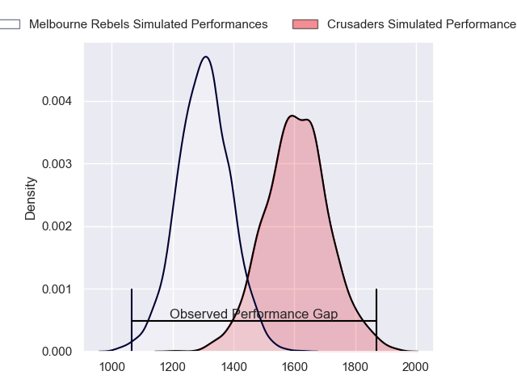
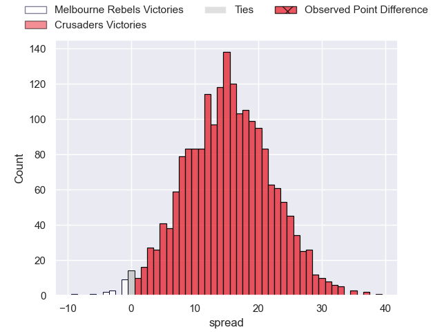
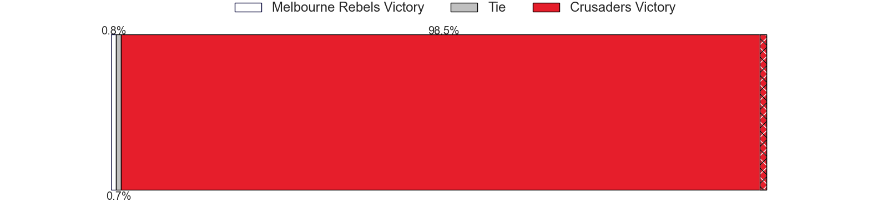
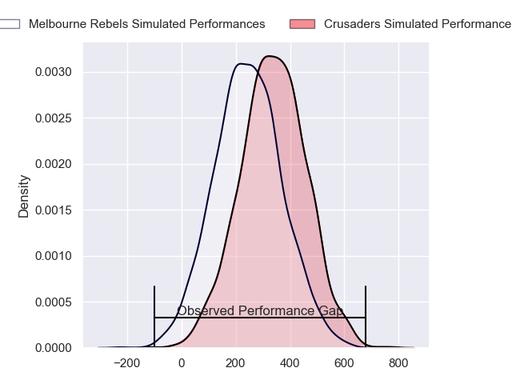
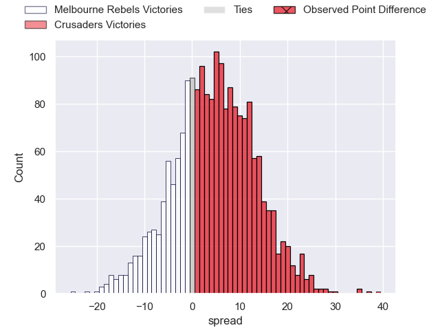
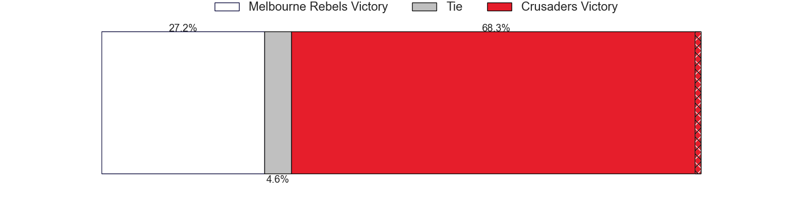

---  
layout: page  
title: Melbourne Rebels at Crusaders; 0-39  
date: 2024-04-26 18:00:00 -0500  
categories: "Super Rugby Pacific 2024" match review  
---
# Melbourne Rebels at Crusaders; 0-39

# Club Level Predictions

The first set of predictions treats a club as the smallest object, as the club develops its members, organizes a gameplan, and deploys its players as needed for each match. This club model has a prediction of 0.844, which translates to predicting Crusaders to win by 15.2.

Our Over/Under is 58.5 - and combined with the spread above, we have a predicted scoreline of 22 to 37

Each club has a rating and a rating deviation (similar to a Glicko rating), and expected performances can be generated. This allows for simulated matches and spreads like the ones below.
## Projected Performances - Club Model

## Projected Spreads - Club Model

## Projected Results - Club Model

# Player Level Predictions - Version 2

Treating teams instead as an entity made up of the currently active players, I have ratings for each player in an altogether different system. These can be combined to form team ratings once teamsheets are announced, weighting starters a bit higher than the reserves. After the match is played, players can be weighted by their minutes on the field, allowing for an accurate measure of the team's composition. With these compiled team ratings, we can make predictions, measure inaccuracy, and update the individual player ratings.
## Prediction without Player Minutes: Crusaders by 5.4

Crusaders by 1.1 on a neutral pitch

## Projected Performances - Player Model

## Projected Spreads - Player Model

## Projected Results - Player Model

|   Away Minutes | Away Player         |   Away Percentile |   Number |   Home Percentile | Home Player          |   Home Minutes |
|---------------:|:--------------------|------------------:|---------:|------------------:|:---------------------|---------------:|
|             31 | Matt Gibbon         |             85.25 |        1 |             11.67 | George Bower         |             62 |
|             31 | Alex Mafi           |             59.84 |        2 |             86.95 | Brodie McAlister     |             53 |
|             31 | Sam Talakai         |             42.91 |        3 |              1.93 | Fletcher Newell      |             62 |
|             56 | Tuaina Taii Tualima |             75.7  |        4 |             94.32 | Scott Barrett        |             66 |
|             80 | Josh Canham         |             64.45 |        5 |             84.76 | Quinten Strange      |             80 |
|             80 | Josh Kemeny         |             20.02 |        6 |             81.29 | Cullen Grace         |             80 |
|             45 | Maciu Nabolakasi    |             60.79 |        7 |             97.38 | Ethan Blackadder     |             80 |
|             80 | Vaiolini Ekuasi     |             28.93 |        8 |             25.69 | Christian Lio-Willie |             51 |
|             64 | Ryan Louwrens       |             95.98 |        9 |             87.74 | Mitchell Drummond    |             56 |
|             72 | Carter Gordon       |             66.23 |       10 |             50.39 | Rivez Reihana        |             80 |
|             80 | Darby Lancaster     |             65.71 |       11 |             25.03 | Heremaia Murray      |             64 |
|             80 | David Feliuai       |             55.38 |       12 |             66.13 | Dallas McLeod        |             51 |
|             80 | Filipo Daugunu      |             93.2  |       13 |             70.21 | Levi Aumua           |             80 |
|             56 | Lachie Anderson     |             37.71 |       14 |             82.4  | Sevu Reece           |             80 |
|             80 | Andrew Kellaway     |             75.57 |       15 |             80.41 | Johnny McNicholl     |             80 |
|             49 | Isaac Aedo Kailea   |             45.32 |       16 |             58.63 | Joe Moody            |             18 |
|             49 | Jordan Uelese       |             58.43 |       17 |              9.04 | George Bell          |             27 |
|             49 | Taniela Tupou       |             97.11 |       18 |             72.32 | Owen Franks          |             18 |
|             24 | Angelo Smith        |             50.18 |       19 |             31.32 | Jamie Hannah         |             14 |
|             35 | Rob Leota           |             13.97 |       20 |             66.39 | Corey Kellow         |             29 |
|             16 | Jack Maunder        |             38.05 |       21 |             63.85 | Noah Hotham          |             24 |
|              8 | Nick Jooste         |             61.58 |       22 |             12.47 | Chay Fihaki          |             16 |
|             24 | Matt Proctor        |             70.33 |       23 |             94.44 | David Havili         |             29 |

