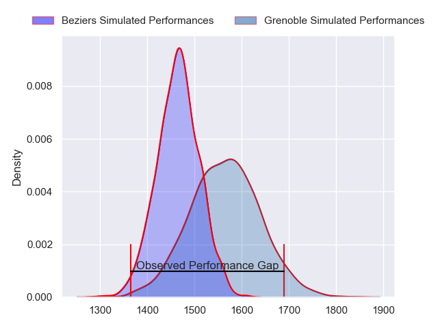
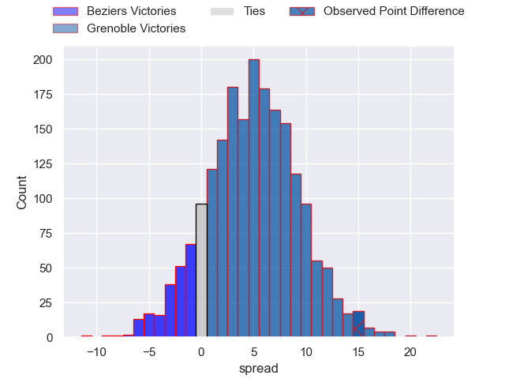
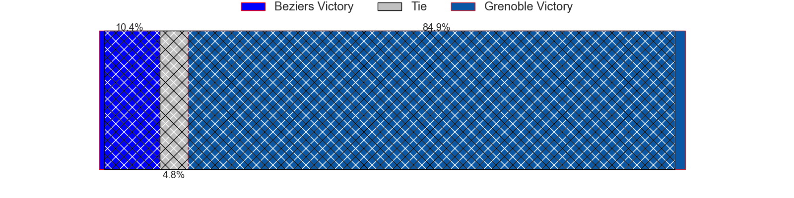
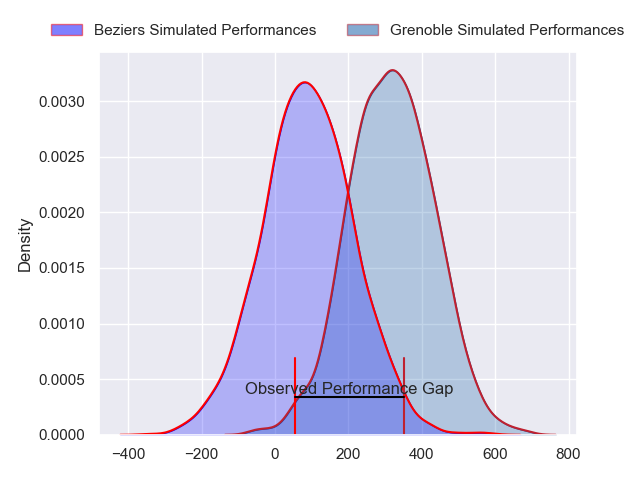
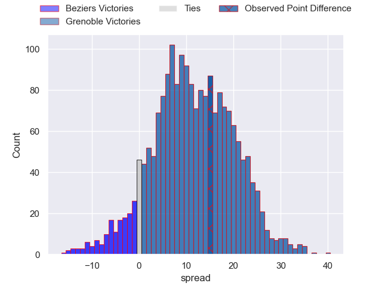
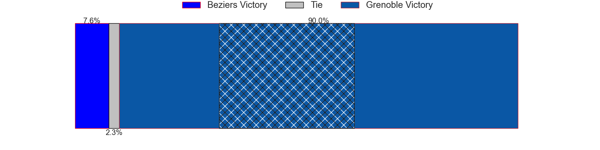

---  
layout: page  
title: Beziers at Grenoble; 19-34  
date: 2024-04-26 18:00:00 -0500  
categories: "Pro D2 2023" match review  
---
# Beziers at Grenoble; 19-34

# Club Level Predictions

The first set of predictions treats a club as the smallest object, as the club develops its members, organizes a gameplan, and deploys its players as needed for each match. This club model has a prediction of 0.64, which translates to predicting Grenoble to win by 5.0.

Our Over/Under is 45.5 - and combined with the spread above, we have a predicted scoreline of 20 to 25

Each club has a rating and a rating deviation (similar to a Glicko rating), and expected performances can be generated. This allows for simulated matches and spreads like the ones below.
## Projected Performances - Club Model

## Projected Spreads - Club Model

## Projected Results - Club Model

# Player Level Predictions - Version 2

Treating teams instead as an entity made up of the currently active players, I have ratings for each player in an altogether different system. These can be combined to form team ratings once teamsheets are announced, weighting starters a bit higher than the reserves. After the match is played, players can be weighted by their minutes on the field, allowing for an accurate measure of the team's composition. With these compiled team ratings, we can make predictions, measure inaccuracy, and update the individual player ratings.
## Prediction without Player Minutes: Grenoble by 12.8

Grenoble by 4.9 on a neutral pitch

## Projected Performances - Player Model

## Projected Spreads - Player Model

## Projected Results - Player Model

|   Away Minutes | Away Player        |   Away Percentile |   Number |   Home Percentile | Home Player         |   Home Minutes |
|---------------:|:-------------------|------------------:|---------:|------------------:|:--------------------|---------------:|
|             44 | Youssef Amrouni    |             36.16 |        1 |             80.33 | Zack Gauthier       |             45 |
|             44 | Yanis Boulassel    |             19.88 |        2 |             48.8  | Mathis Sarragallet  |             45 |
|             44 | Filippo Alongi     |             13.89 |        3 |             83.9  | Regis Montagne      |             45 |
|             44 | Hans N'kinsi       |              6.53 |        4 |             57.68 | Thomas Lainault     |             80 |
|             44 | Pierre Gayraud     |             13.42 |        5 |             83.68 | Georgi Javakhia     |             80 |
|             44 | William van Bost   |             26.22 |        6 |             63.89 | Thibaut Martel      |             75 |
|             80 | Clement Ancely     |             73.06 |        7 |             79.02 | Steeve Blanc-Mappaz |             80 |
|             80 | Sias Koen          |             58.1  |        8 |             70.07 | Pio Muarua          |             66 |
|             80 | Mitch Short        |             33.62 |        9 |             12.05 | Barnabe Couilloud   |             56 |
|             44 | Victor Dreuille    |             13.51 |       10 |             83.64 | Sam Davies          |             75 |
|             80 | Maxime Mazzella    |             31.89 |       11 |             17.37 | Nathan Farissier    |             80 |
|             80 | Paul Recor         |             53.65 |       12 |             74.29 | Romain Trouilloud   |             80 |
|             44 | Maxime Espeut      |             48.83 |       13 |             44.99 | Romain Fusier       |             58 |
|             80 | Pierre Courtaud    |             19.89 |       14 |             69.26 | Geoffrey Cros       |             80 |
|             80 | Harry Glynn        |             25.19 |       15 |             96.69 | Julien Farnoux      |             80 |
|             36 | John Madigan       |             25.76 |       16 |             22.76 | Eli Eglaine         |             35 |
|             36 | Wilmar Arnoldi     |             74.9  |       17 |             74.5  | Barnabé Massa       |             35 |
|             36 | Giorgi Akhaladze   |             20.64 |       18 |             81.1  | Irakli Aptsiauri    |             35 |
|             36 | Pierrick Gunther   |              0.36 |       19 |             90.49 | Eric Escande        |             24 |
|             36 | Samuel Marques     |             89.43 |       20 |             96.17 | Bautista Ezcurra    |             22 |
|             36 | Jon Zabala Arrieta |             73    |       21 |             34.68 | Victor Guillaumond  |             14 |
|             36 | Otonuku Jr Pauta   |             71.75 |       22 |            nan    | Diego Pinheiro Ruiz |              5 |
|             36 | Watisoni Votu      |             88.13 |       23 |             71.43 | Max Clement         |              5 |

