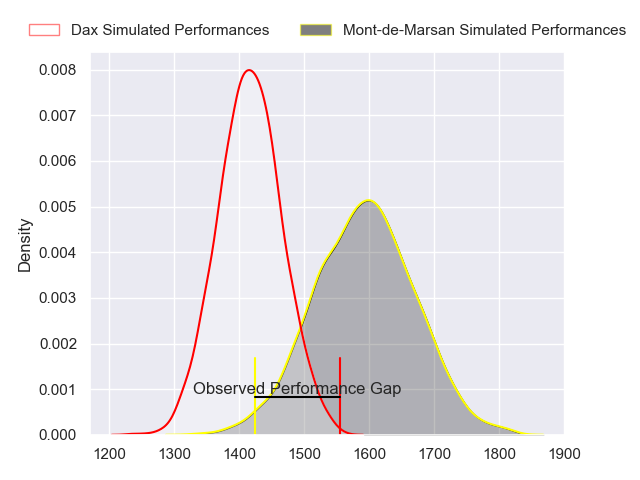
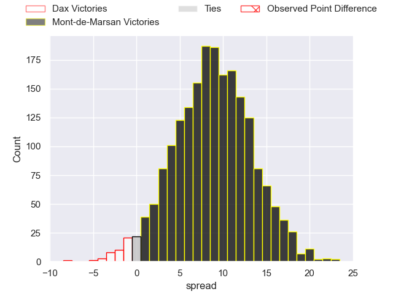
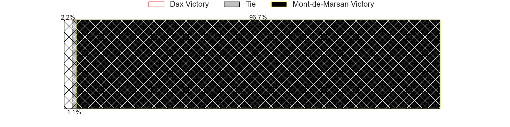
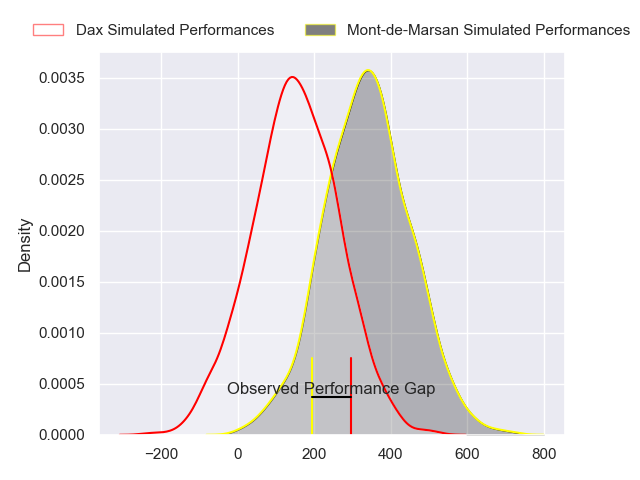
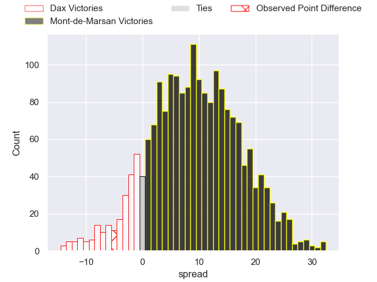
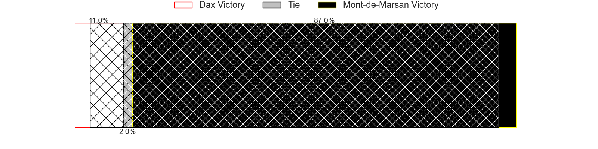

---  
layout: page  
title: Dax at Mont-de-Marsan; 18-13  
date: 2024-04-26 18:00:00 -0500  
categories: "Pro D2 2023" match review  
---
# Dax at Mont-de-Marsan; 18-13

# Club Level Predictions

The first set of predictions treats a club as the smallest object, as the club develops its members, organizes a gameplan, and deploys its players as needed for each match. This club model has a prediction of 0.734, which translates to predicting Mont-de-Marsan to win by 8.9.

Our Over/Under is 51.5 - and combined with the spread above, we have a predicted scoreline of 21 to 30

Each club has a rating and a rating deviation (similar to a Glicko rating), and expected performances can be generated. This allows for simulated matches and spreads like the ones below.
## Projected Performances - Club Model

## Projected Spreads - Club Model

## Projected Results - Club Model

# Player Level Predictions - Version 2

Treating teams instead as an entity made up of the currently active players, I have ratings for each player in an altogether different system. These can be combined to form team ratings once teamsheets are announced, weighting starters a bit higher than the reserves. After the match is played, players can be weighted by their minutes on the field, allowing for an accurate measure of the team's composition. With these compiled team ratings, we can make predictions, measure inaccuracy, and update the individual player ratings.
## Prediction without Player Minutes: Mont-de-Marsan by 9.0

Mont-de-Marsan by 1.2 on a neutral pitch

## Projected Performances - Player Model

## Projected Spreads - Player Model

## Projected Results - Player Model

|   Away Minutes | Away Player           |   Away Percentile |   Number |   Home Percentile | Home Player         |   Home Minutes |
|---------------:|:----------------------|------------------:|---------:|------------------:|:--------------------|---------------:|
|             45 | Asa Faitotoa          |             63.74 |        1 |              6.46 | Jean-Luc Innocente  |             50 |
|             45 | Maxime Delonca        |             50.4  |        2 |             30.32 | Florian Dufour      |             62 |
|             45 | Nephi Leatigaga       |             39.83 |        3 |              6.36 | Anthony Alves       |             50 |
|             80 | Josh Furno            |             59.85 |        4 |             70.13 | Romain Durand       |             80 |
|             45 | Jean-Baptiste Singer  |             20.8  |        5 |             48.25 | Andrei Ostrikov     |             80 |
|             80 | Jean-Baptiste Barrère |             51.13 |        6 |             44.82 | Aurélien Lisena     |             58 |
|             80 | Arnaud Aletti         |             81.41 |        7 |             77.12 | Leo Banos           |             80 |
|             42 | Genesis Mamea Lemalu  |             90.02 |        8 |             22.44 | Mike Faleafa        |             48 |
|             46 | Sylvère Reteau        |             80.13 |        9 |             26.43 | Nicolas Darquier    |             58 |
|             80 | Hugo Cerisier         |             75.58 |       10 |             21.3  | Patricio Fernandez  |             67 |
|             80 | Jope Naceava          |             84.8  |       11 |             67.09 | Eroni Sau           |             80 |
|             80 | Ilikena Bolakoro      |             89.25 |       12 |             68.11 | Jules Even          |             80 |
|             49 | Benjamin Puntous      |             25.96 |       13 |             79.48 | Nacani Wakaya       |             80 |
|             80 | Maxime Oltmann        |             17.49 |       14 |             45.94 | Semi Lagivala       |             56 |
|             56 | Théo Duprat           |             66.92 |       15 |              8.91 | Simao Broeiro Bento |             80 |
|             38 | Ratu Nacika           |             38.97 |       16 |             14.75 | Myles Edwards       |             32 |
|             35 | Diogo Hasse Ferreira  |             20.25 |       17 |             39.54 | Thomas Bultel       |             30 |
|             35 | David Lolohea         |             17.55 |       18 |             82.06 | Gheorghe Gajion     |             30 |
|             35 | Iban Hiriart-Urruty   |             77.91 |       19 |             43.76 | Gatien Masse        |             24 |
|             35 | Mat Luamanu           |             65.42 |       20 |             28.25 | Yann Brethous       |             22 |
|             34 | Paul Ravier           |             76.32 |       21 |             34.04 | Kevin Viallard      |             22 |
|             31 | Bastien Daguerre      |             65.76 |       22 |             45.18 | Samuel Lagrange     |             18 |
|             24 | Romuald Séguy         |             56.88 |       23 |             16.36 | Joris Pialot        |             13 |

