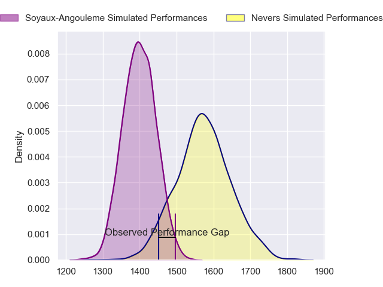
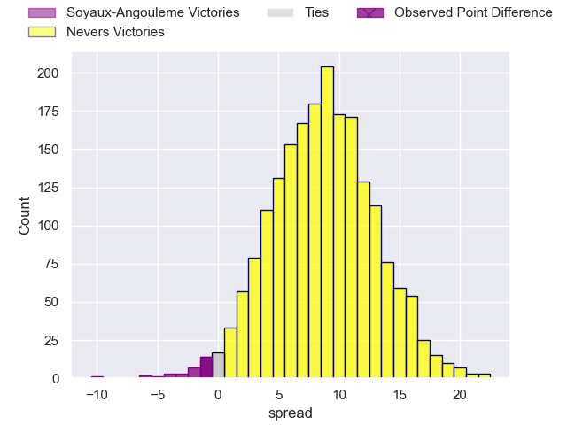
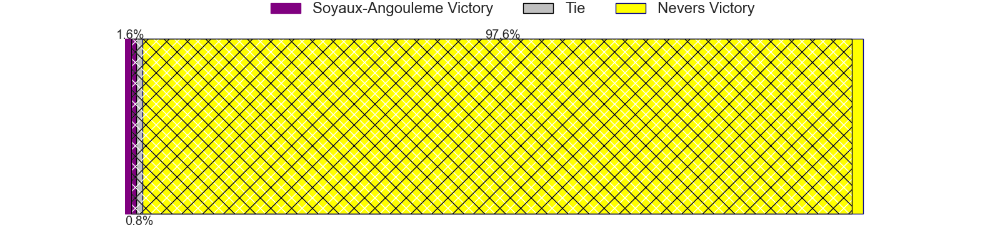
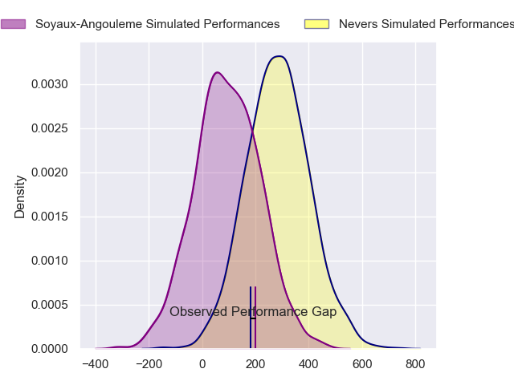
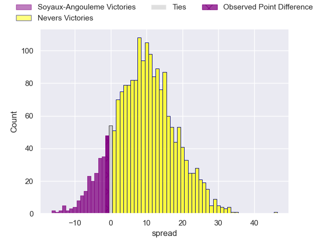
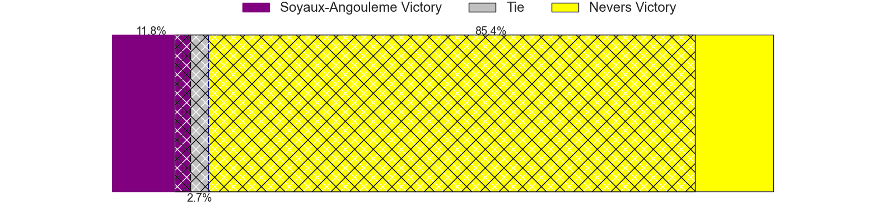

---  
layout: page  
title: Soyaux-Angouleme at Nevers; 16-15  
date: 2024-04-26 18:00:00 -0500  
categories: "Pro D2 2023" match review  
---
# Soyaux-Angouleme at Nevers; 16-15

# Club Level Predictions

The first set of predictions treats a club as the smallest object, as the club develops its members, organizes a gameplan, and deploys its players as needed for each match. This club model has a prediction of 0.725, which translates to predicting Nevers to win by 8.5.

Our Over/Under is 41.5 - and combined with the spread above, we have a predicted scoreline of 17 to 25

Each club has a rating and a rating deviation (similar to a Glicko rating), and expected performances can be generated. This allows for simulated matches and spreads like the ones below.
## Projected Performances - Club Model

## Projected Spreads - Club Model

## Projected Results - Club Model

# Player Level Predictions - Version 2

Treating teams instead as an entity made up of the currently active players, I have ratings for each player in an altogether different system. These can be combined to form team ratings once teamsheets are announced, weighting starters a bit higher than the reserves. After the match is played, players can be weighted by their minutes on the field, allowing for an accurate measure of the team's composition. With these compiled team ratings, we can make predictions, measure inaccuracy, and update the individual player ratings.
## Prediction without Player Minutes: Nevers by 11.5

Nevers by 7.8 on a neutral pitch

## Projected Performances - Player Model

## Projected Spreads - Player Model

## Projected Results - Player Model

|   Away Minutes | Away Player        |   Away Percentile |   Number |   Home Percentile | Home Player         |   Home Minutes |
|---------------:|:-------------------|------------------:|---------:|------------------:|:--------------------|---------------:|
|             48 | Omar Odishvili     |             71.69 |        1 |             52.89 | Tornike Mataradze   |             63 |
|             59 | Rayne Barka        |             82.41 |        2 |             53.58 | Elia Elia           |             67 |
|             59 | Yassine Boutemane  |             32.42 |        3 |             56.32 | Ilia Kaikatsishvili |             48 |
|             67 | Enzo Morand-Bruyat |             65.9  |        4 |             33.62 | Lado Chachanidze    |             80 |
|             80 | Matthew Dalton     |              8.74 |        5 |             81.67 | Lasha Jaiani        |             63 |
|             64 | Gautier Gibouin    |              7.77 |        6 |             84.95 | Hugues Bastide      |             48 |
|             80 | Nicolas Martins    |             89.25 |        7 |             79.09 | Julien Kazubek      |             80 |
|             80 | Alexander Masibaka |             67.52 |        8 |             86.45 | Jason-Colin Fraser  |             80 |
|             50 | Adrien Bau         |              7.45 |        9 |              8.3  | Hugo Bouyssou       |             80 |
|             80 | Rémi Brosset       |             48.56 |       10 |             72.32 | Yohan Le Bourhis    |             51 |
|             80 | Marvin Lestremau   |             58.83 |       11 |             45.03 | Arthur Mathiron     |             80 |
|             45 | Franck Giraudeau   |             43.84 |       12 |             63.39 | Leonard Paris       |             80 |
|             59 | George Tilsley     |             89.66 |       13 |             69.74 | Alifereti Loaloa    |             80 |
|             80 | Matthys Gratien    |             81.87 |       14 |             53.33 | Christian Ambadiang |             64 |
|             80 | Jules Dubecq       |             72.11 |       15 |             73.62 | Kylian Jaminet      |             80 |
|             35 | Ledua Mau          |             87.42 |       16 |             35.46 | Cleopas Kundiona    |             32 |
|             32 | Khatchik Vartanov  |             18.51 |       17 |             34.83 | Kevin Noah          |             32 |
|             30 | Alexis Levron      |             38.51 |       18 |             28.72 | Shaun Reynolds      |             29 |
|             21 | Patxi Bidart       |             57.87 |       19 |             68.66 | Kamaliele Tufele    |             17 |
|             21 | Inaki Ayarza       |             33.33 |       20 |             98.18 | Will Skelton        |             17 |
|             21 | Seydou Diakité     |             19    |       21 |              8.94 | Guillaume Manevy    |             16 |
|             16 | Hubert Texier      |             37.08 |       22 |             11.45 | Jonathan Maiau      |             13 |
|             13 | Matt Va'ai         |              9.72 |       23 |            nan    | nan                 |            nan |

