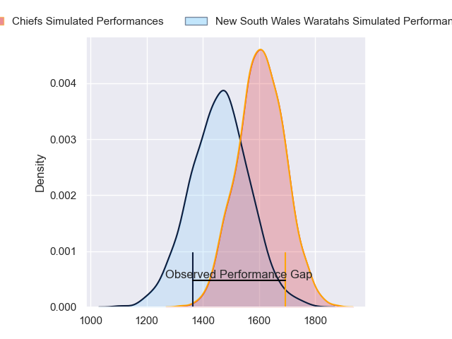
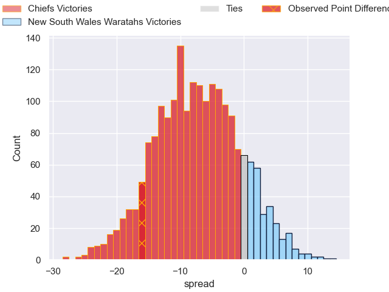
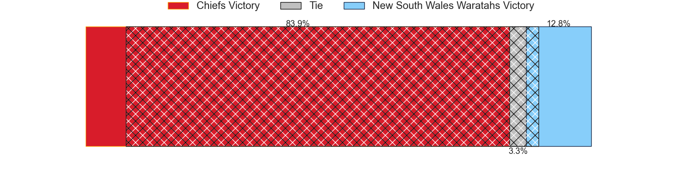
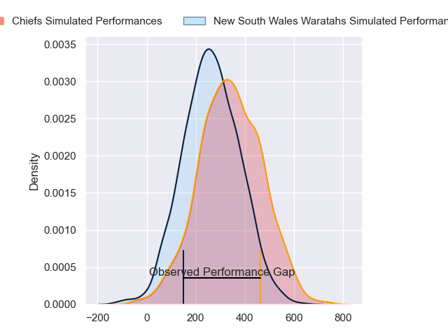
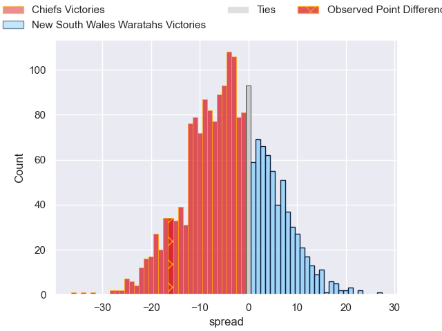
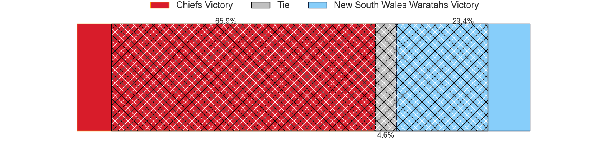

---  
layout: page  
title: Chiefs at New South Wales Waratahs; 38-22  
date: 2024-04-26 18:00:00 -0500  
categories: "Super Rugby Pacific 2024" match review  
---
# Chiefs at New South Wales Waratahs; 38-22

# Club Level Predictions

The first set of predictions treats a club as the smallest object, as the club develops its members, organizes a gameplan, and deploys its players as needed for each match. This club model has a prediction of 0.31, which translates to predicting Chiefs to win by 7.2.

Our Over/Under is 52.5 - and combined with the spread above, we have a predicted scoreline of 30 to 23

Each club has a rating and a rating deviation (similar to a Glicko rating), and expected performances can be generated. This allows for simulated matches and spreads like the ones below.
## Projected Performances - Club Model

## Projected Spreads - Club Model

## Projected Results - Club Model

# Player Level Predictions - Version 2

Treating teams instead as an entity made up of the currently active players, I have ratings for each player in an altogether different system. These can be combined to form team ratings once teamsheets are announced, weighting starters a bit higher than the reserves. After the match is played, players can be weighted by their minutes on the field, allowing for an accurate measure of the team's composition. With these compiled team ratings, we can make predictions, measure inaccuracy, and update the individual player ratings.
## Prediction without Player Minutes: Chiefs by 3.4

Chiefs by 7.7 on a neutral pitch

## Projected Performances - Player Model

## Projected Spreads - Player Model

## Projected Results - Player Model

|   Away Minutes | Away Player          |   Away Percentile |   Number |   Home Percentile | Home Player          |   Home Minutes |
|---------------:|:---------------------|------------------:|---------:|------------------:|:---------------------|---------------:|
|             55 | Aidan Ross           |             98.07 |        1 |             56.22 | Harry Johnson-Holmes |             77 |
|             63 | Samisoni Taukei'aho  |             93.17 |        2 |             31.53 | Julian Heaven        |             77 |
|             53 | George Dyer          |             82.35 |        3 |             17.07 | Tom Ross             |             54 |
|             67 | Jimmy Tupou          |             42.93 |        4 |             14.87 | Hugh Sinclair        |             46 |
|             80 | Tupou Vaa'i          |             89.96 |        5 |              4.59 | Miles Amatosero      |             54 |
|             80 | Samipeni Finau       |             93.68 |        6 |              9.89 | Lachlan Swinton      |             80 |
|             80 | Kaylum Boshier       |             47.68 |        7 |             65.08 | Charlie Gamble       |             80 |
|             67 | Wallace Sititi       |             34.91 |        8 |             43.39 | Ned Hanigan          |             80 |
|             67 | Cortez Ratima        |             69.56 |        9 |             84.14 | Jake Gordon          |             58 |
|             80 | Damian McKenzie      |             97.92 |       10 |             28.57 | Tane Edmed           |             58 |
|             80 | Etene Nanai-Seturo   |             47.31 |       11 |             54.06 | Triston Reilly       |             80 |
|             72 | Rameka Poihipi       |             73.3  |       12 |             72.31 | Lalakai Foketi       |             80 |
|             80 | Anton Lienert-Brown  |             89.74 |       13 |             79.6  | Joey Walton          |             45 |
|             80 | Emoni Narawa         |             90.4  |       14 |             31.31 | Mark Nawaqanitawase  |             80 |
|             24 | Shaun Stevenson      |             90.08 |       15 |             51.4  | Max Jorgensen        |             80 |
|             25 | Jared Proffit        |             27.58 |       16 |            nan    | Lewis Ponini         |             26 |
|             17 | Tyrone Thompson      |             70.28 |       17 |            nan    | Jay Fonokalafi       |              3 |
|             27 | Reuben O'Neill       |             26.04 |       18 |            nan    | Bradley Amituanai    |              3 |
|             13 | Manaaki Selby-Rickit |             14.39 |       19 |             27.57 | Jed Holloway         |             34 |
|             13 | Simon Parker         |             33.13 |       20 |             66.33 | Langi Gleeson        |             26 |
|              8 | Josh Ioane           |             45.04 |       21 |            nan    | Jack Grant           |             22 |
|             13 | Xavier Roe           |             37.21 |       22 |            nan    | Will Harrison        |             22 |
|             56 | Quinn Tupaea         |             84.05 |       23 |             52.78 | Izaia Perese         |             35 |

