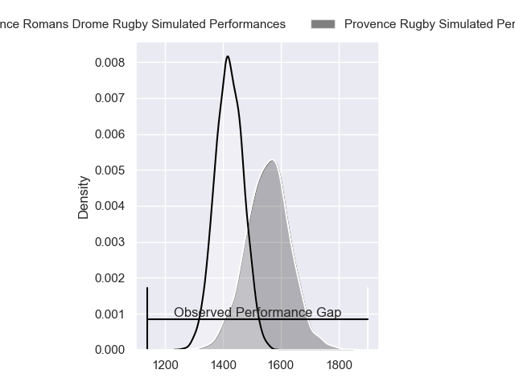
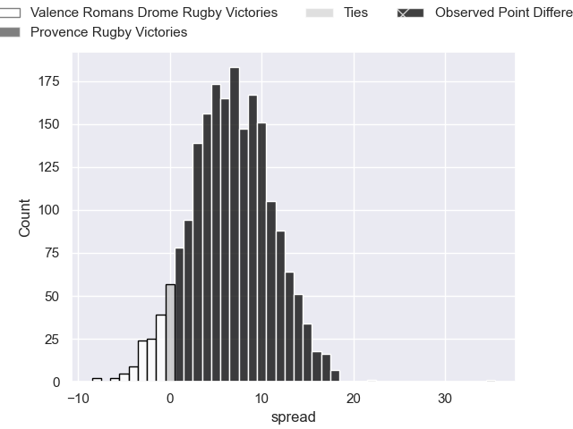
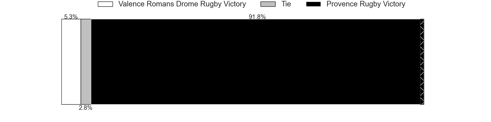
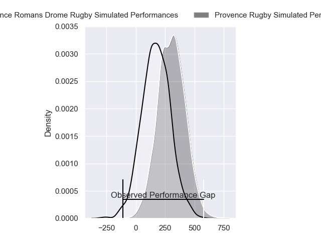
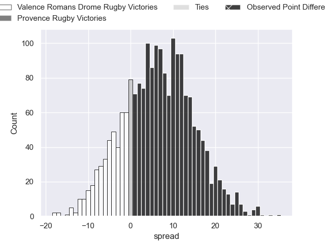
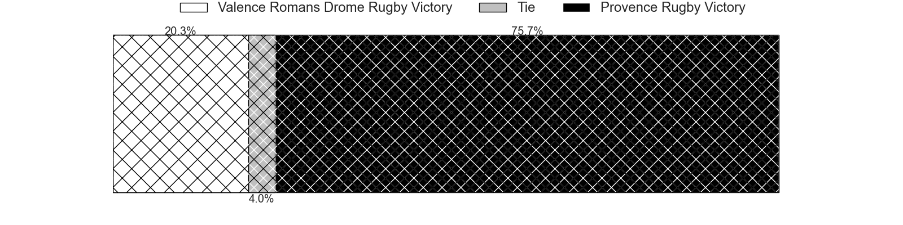

---  
layout: page  
title: Valence Romans Drome Rugby at Provence Rugby; 8-43  
date: 2024-04-26 18:00:00 -0500  
categories: "Pro D2 2023" match review  
---
# Valence Romans Drome Rugby at Provence Rugby; 8-43

# Club Level Predictions

The first set of predictions treats a club as the smallest object, as the club develops its members, organizes a gameplan, and deploys its players as needed for each match. This club model has a prediction of 0.686, which translates to predicting Provence Rugby to win by 6.9.

Our Over/Under is 42.5 - and combined with the spread above, we have a predicted scoreline of 18 to 25

Each club has a rating and a rating deviation (similar to a Glicko rating), and expected performances can be generated. This allows for simulated matches and spreads like the ones below.
## Projected Performances - Club Model

## Projected Spreads - Club Model

## Projected Results - Club Model

# Player Level Predictions - Version 2

Treating teams instead as an entity made up of the currently active players, I have ratings for each player in an altogether different system. These can be combined to form team ratings once teamsheets are announced, weighting starters a bit higher than the reserves. After the match is played, players can be weighted by their minutes on the field, allowing for an accurate measure of the team's composition. With these compiled team ratings, we can make predictions, measure inaccuracy, and update the individual player ratings.
## Prediction without Player Minutes: Provence Rugby by 7.9

Provence Rugby by 2.1 on a neutral pitch

## Projected Performances - Player Model

## Projected Spreads - Player Model

## Projected Results - Player Model

|   Away Minutes | Away Player         |   Away Percentile |   Number |   Home Percentile | Home Player           |   Home Minutes |
|---------------:|:--------------------|------------------:|---------:|------------------:|:----------------------|---------------:|
|             49 | Andrea Pontanier    |             62.49 |        1 |             83.94 | Julius Nostadt        |             57 |
|             49 | Cyril Deligny       |              2.45 |        2 |              3.07 | Loick Jammes          |             50 |
|             61 | Gareth Milasinovich |             42.51 |        3 |             99.22 | Tomas Francis         |             57 |
|             69 | Darrell Dyer        |             80.1  |        4 |             87.14 | Jérôme Dufour         |             50 |
|             56 | Florian Goumat      |             74.64 |        5 |             51.33 | Malohi Suta           |             80 |
|             80 | Axel Bruchet        |             39.19 |        6 |             72.04 | Guillaume Piazzoli    |             56 |
|             80 | Mathieu Vachon      |              0.12 |        7 |             72.64 | Charly Gambini        |             80 |
|             49 | Ioane Iashagashvili |             89.26 |        8 |             79.8  | Teimana Harrison      |             80 |
|             49 | Tim Menzel          |             80.21 |        9 |             65.96 | Arthur Coville        |             58 |
|             80 | Joris Moura         |             77.02 |       10 |             88.77 | Jimmy Gopperth        |             58 |
|             80 | Mosese Mawalu       |             89.94 |       11 |             81.64 | Sione Tui             |             80 |
|             80 | Mathieu Guillomot   |              8.22 |       12 |             89.91 | Kaveinga Finau        |             80 |
|             49 | Isaac Te Tamaki     |              6.23 |       13 |             49.69 | Atila Septar          |             50 |
|             80 | Adam Vargas         |             95.09 |       14 |             23.16 | Adrien Lapegue-Lafaye |             80 |
|             80 | Charles Bouldoire   |             92.21 |       15 |             62.31 | Léo Drouet            |             80 |
|             31 | Anthony Aléo        |             61.02 |       16 |             90.59 | Lucas Martin          |             30 |
|             31 | Dorian Marco Pena   |             79.75 |       17 |             84.11 | Bilel Taieb           |             30 |
|             31 | Philippe Laville    |            nan    |       18 |             35.24 | Eto Bainivalu         |             30 |
|             31 | Thomas Lhusero      |             84.89 |       19 |             52.67 | Clément Chartier      |             24 |
|             31 | Anatole Pauvert     |             81.44 |       20 |             62.68 | Paul Mallez           |             23 |
|             24 | Thembelani Bholi    |             78.73 |       21 |             47.89 | Nicolas Toth          |             23 |
|             19 | Mathis Roume        |             33.69 |       22 |             65.11 | Joris Cazenave        |             22 |
|             11 | Ryan McCauley       |             63.23 |       23 |             86.68 | Enzo Selponi          |             22 |

