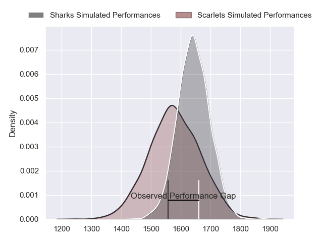
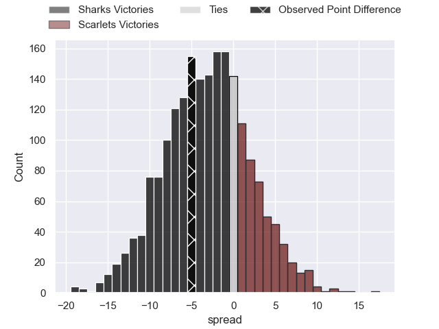
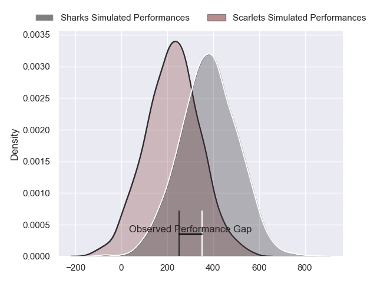
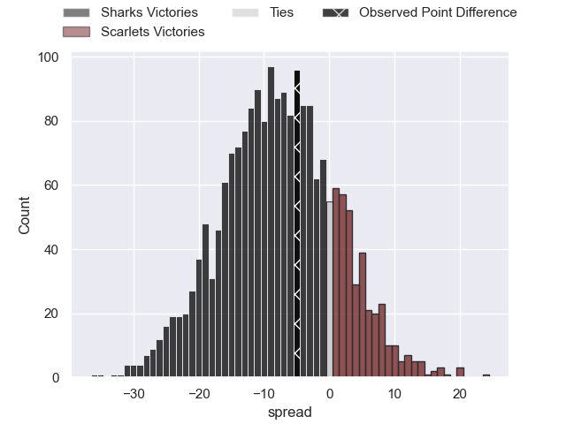
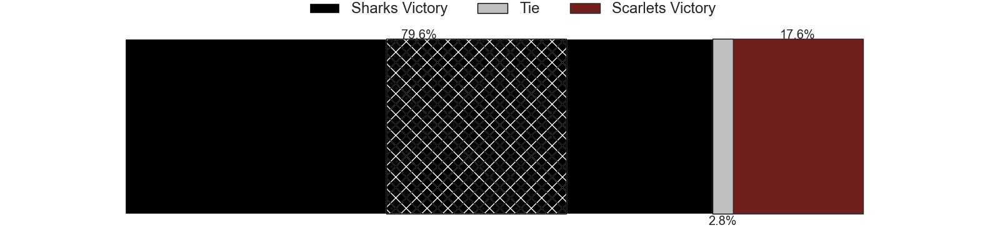

---  
layout: page  
title: Sharks at Scarlets; 32-27  
date: 2024-04-26 18:00:00 -0500  
categories: "United Rugby Championship 2023" match review  
---
# Sharks at Scarlets; 32-27

# Club Level Predictions

The first set of predictions treats a club as the smallest object, as the club develops its members, organizes a gameplan, and deploys its players as needed for each match. This club model has a prediction of 0.409, which translates to predicting Sharks to win by 3.2.

Our Over/Under is 39.5 - and combined with the spread above, we have a predicted scoreline of 21 to 18

Each club has a rating and a rating deviation (similar to a Glicko rating), and expected performances can be generated. This allows for simulated matches and spreads like the ones below.
## Projected Performances - Club Model

## Projected Spreads - Club Model

## Projected Results - Club Model

# Player Level Predictions - Version 2

Treating teams instead as an entity made up of the currently active players, I have ratings for each player in an altogether different system. These can be combined to form team ratings once teamsheets are announced, weighting starters a bit higher than the reserves. After the match is played, players can be weighted by their minutes on the field, allowing for an accurate measure of the team's composition. With these compiled team ratings, we can make predictions, measure inaccuracy, and update the individual player ratings.
## Prediction without Player Minutes: Sharks by 7.7

Sharks by 13.4 on a neutral pitch

## Projected Performances - Player Model

## Projected Spreads - Player Model

## Projected Results - Player Model

|   Away Minutes | Away Player         |   Away Percentile |   Number |   Home Percentile | Home Player      |   Home Minutes |
|---------------:|:--------------------|------------------:|---------:|------------------:|:-----------------|---------------:|
|             58 | Ox Nche             |             99.81 |        1 |             58.53 | Kemsley Mathias  |             52 |
|             75 | Fez Mbatha          |             87.95 |        2 |             91.16 | Ryan Elias       |             71 |
|             58 | Vincent Koch        |             57.18 |        3 |             16.78 | Sam Wainwright   |             52 |
|             63 | Eben Etzebeth       |             98.31 |        4 |              3.63 | Morgan Jones     |             70 |
|             80 | Emile van Heerden   |             59.37 |        5 |             65.3  | Sam Lousi        |             80 |
|             80 | Phepsi Buthelezi    |             56.02 |        6 |             54.83 | Taine Plumtree   |             80 |
|             58 | Jeandre Labuschagne |             41.72 |        7 |             62.1  | Dan Davis        |             80 |
|             80 | Vincent Tshituka    |             82.54 |        8 |             93.52 | Vaea Fifita      |             49 |
|             57 | Grant Williams      |             62.37 |        9 |             35.52 | Gareth Davies    |             57 |
|             80 | Siya Masuku         |             56.62 |       10 |             40.26 | Sam Costelow     |             80 |
|             80 | Makazole Mapimpi    |             99.43 |       11 |             78.86 | Tomi Lewis       |             80 |
|             63 | Ethan Hooker        |             33    |       12 |             22.62 | Eddie James      |             80 |
|             80 | Lukhanyo Am         |             86.16 |       13 |             70.95 | Johnny Williams  |             80 |
|             80 | Werner Kok          |             74.63 |       14 |             16.69 | Tom Rogers       |             58 |
|             75 | Aphelele Fassi      |             90.59 |       15 |              9.92 | Ioan Nicholas    |             80 |
|             23 | Jaden Hendrikse     |             84.57 |       16 |             45.89 | Carwyn Tuipulotu |             31 |
|             22 | Gerbrandt Grobler   |             19.83 |       17 |             19.67 | Steffan Thomas   |             28 |
|             22 | Ntuthuko Mchunu     |             45.03 |       18 |              8.97 | Harri O'Connor   |             28 |
|             22 | Hanru Jacobs        |             46.48 |       19 |             61.52 | Kieran Hardy     |             23 |
|             17 | Corne Rahl          |             20.07 |       20 |             19.31 | Ryan Conbeer     |             22 |
|             17 | Francois Venter     |             55.01 |       21 |              5.56 | Jac Price        |             10 |
|              5 | Kerron van Vuuren   |             31.33 |       22 |              5.22 | Shaun Evans      |              9 |
|              5 | Boeta Chamberlain   |             46.23 |       23 |            nan    | nan              |            nan |

