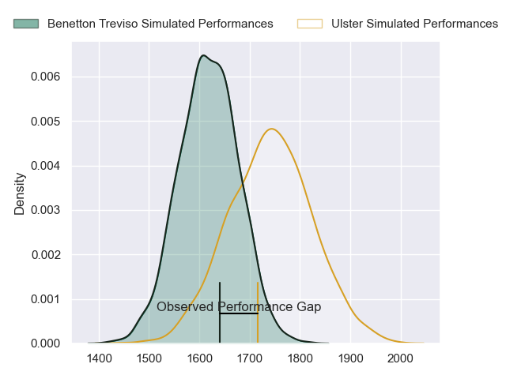
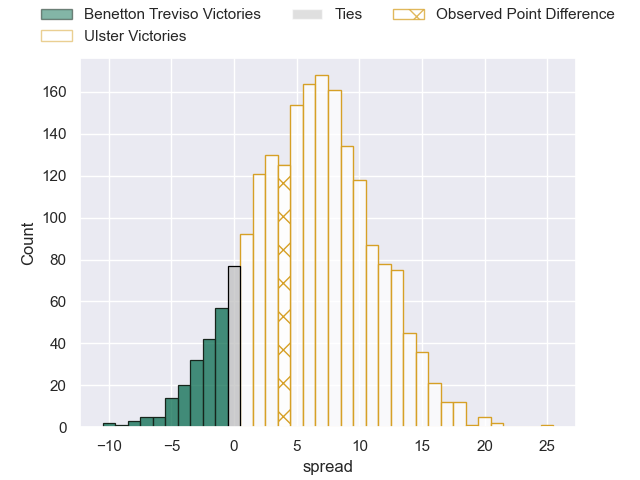
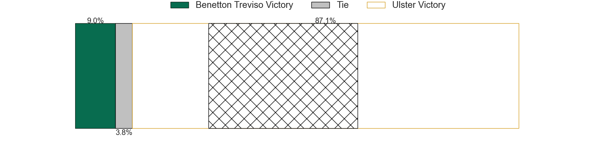
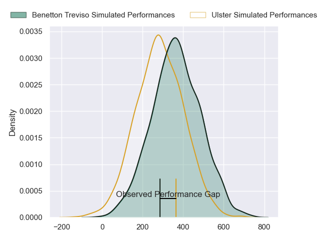
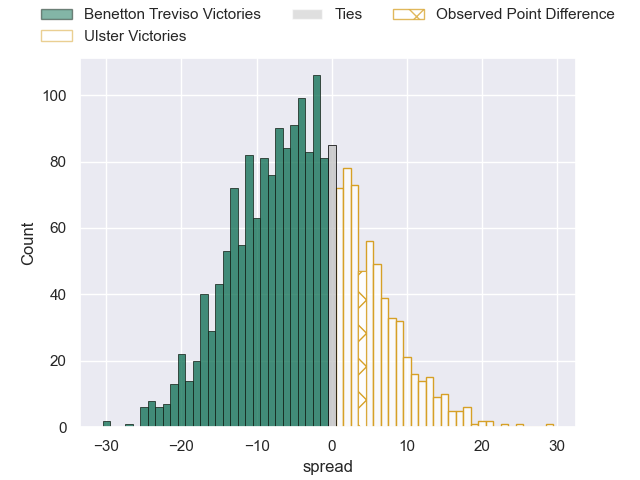

---  
layout: page  
title: Benetton Treviso at Ulster; 34-38  
date: 2024-04-26 18:00:00 -0500  
categories: "United Rugby Championship 2023" match review  
---
# Benetton Treviso at Ulster; 34-38

# Club Level Predictions

The first set of predictions treats a club as the smallest object, as the club develops its members, organizes a gameplan, and deploys its players as needed for each match. This club model has a prediction of 0.67, which translates to predicting Ulster to win by 6.2.

Our Over/Under is 46.5 - and combined with the spread above, we have a predicted scoreline of 20 to 27

Each club has a rating and a rating deviation (similar to a Glicko rating), and expected performances can be generated. This allows for simulated matches and spreads like the ones below.
## Projected Performances - Club Model

## Projected Spreads - Club Model

## Projected Results - Club Model

# Player Level Predictions - Version 2

Treating teams instead as an entity made up of the currently active players, I have ratings for each player in an altogether different system. These can be combined to form team ratings once teamsheets are announced, weighting starters a bit higher than the reserves. After the match is played, players can be weighted by their minutes on the field, allowing for an accurate measure of the team's composition. With these compiled team ratings, we can make predictions, measure inaccuracy, and update the individual player ratings.
## Prediction without Player Minutes: Benetton Treviso by 3.9

Benetton Treviso by 10.5 on a neutral pitch

## Projected Performances - Player Model

## Projected Spreads - Player Model

## Projected Results - Player Model

|   Away Minutes | Away Player        |   Away Percentile |   Number |   Home Percentile | Home Player       |   Home Minutes |
|---------------:|:-------------------|------------------:|---------:|------------------:|:------------------|---------------:|
|             59 | Thomas Gallo       |             86.58 |        1 |             77.08 | Eric O'Sullivan   |             54 |
|             48 | Giacomo Nicotera   |             97.55 |        2 |              4.7  | Tom Stewart       |             75 |
|             52 | Simone Ferrari     |             94.81 |        3 |             65.03 | Scott Wilson      |             65 |
|             41 | Scott Scrafton     |             57.4  |        4 |             84.95 | Harry Sheridan    |             82 |
|             65 | Edoardo Iachizzi   |             69.05 |        5 |             67.11 | Alan O'Connor     |             65 |
|             82 | Alessandro Izekor  |             48.03 |        6 |             90.92 | Dave Ewers        |             58 |
|             48 | Michele Lamaro     |             95.58 |        7 |             49.58 | Reuben Crothers   |             82 |
|             82 | Lorenzo Cannone    |             88.75 |        8 |             64.71 | David McCann      |             82 |
|             58 | Andy Uren          |             13.62 |        9 |             89.36 | John Cooney       |             77 |
|             82 | Tomas Albornoz     |             73.11 |       10 |             46.48 | Billy Burns       |             82 |
|             82 | Rhyno Smith        |             85.43 |       11 |             38.01 | Jacob Stockdale   |             44 |
|             77 | Marco Zanon        |             57.04 |       12 |             74.22 | Stuart McCloskey  |             82 |
|             82 | Tommaso Menoncello |             83.69 |       13 |             83.94 | Will Addison      |             75 |
|             82 | Leonardo Marin     |             65.5  |       14 |              8.3  | Robert Baloucoune |             82 |
|             82 | Jacob Umaga        |             69.35 |       15 |             34.92 | Mike Lowry        |             82 |
|             34 | Gianmarco Lucchesi |             84.87 |       16 |             34.36 | John Andrew       |              7 |
|             23 | Ivan Nemer         |             81.78 |       17 |             12.93 | Andrew Warwick    |             28 |
|             30 | Tiziano Pasquali   |             83.15 |       18 |            nan    | James French      |             17 |
|             41 | Niccolo Cannone    |             64.44 |       19 |             52.55 | Cormac Izuchukwu  |             17 |
|             17 | Riccardo Favretto  |             34.34 |       20 |            nan    | Greg Jones        |             24 |
|             34 | Toa Halafihi       |             62.66 |       21 |            nan    | Dave Shanahan     |              5 |
|             24 | Alessandro Garbisi |             65.74 |       22 |             87.67 | Luke Marshall     |              7 |
|              5 | Filippo Drago      |             30.51 |       23 |             79.3  | Ethan McIlroy     |             38 |

