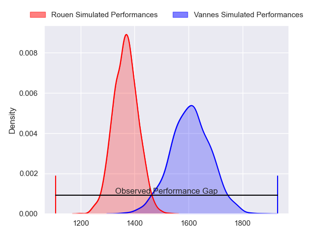
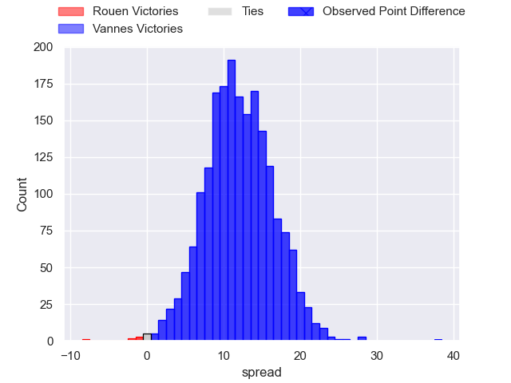
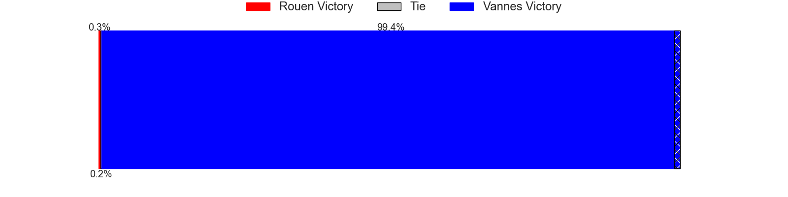
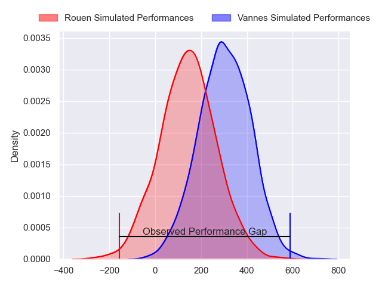
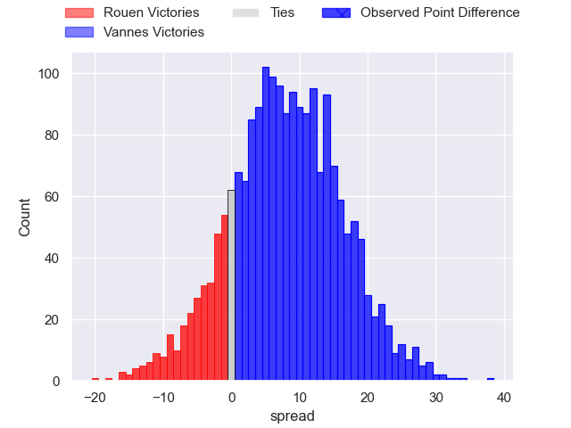
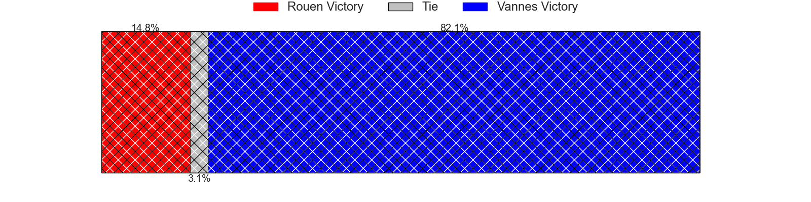

---  
layout: page  
title: Rouen at Vannes; 14-52  
date: 2024-04-26 18:00:00 -0500  
categories: "Pro D2 2023" match review  
---
# Rouen at Vannes; 14-52

# Club Level Predictions

The first set of predictions treats a club as the smallest object, as the club develops its members, organizes a gameplan, and deploys its players as needed for each match. This club model has a prediction of 0.796, which translates to predicting Vannes to win by 11.9.

Our Over/Under is 57.5 - and combined with the spread above, we have a predicted scoreline of 23 to 35

Each club has a rating and a rating deviation (similar to a Glicko rating), and expected performances can be generated. This allows for simulated matches and spreads like the ones below.
## Projected Performances - Club Model

## Projected Spreads - Club Model

## Projected Results - Club Model

# Player Level Predictions - Version 2

Treating teams instead as an entity made up of the currently active players, I have ratings for each player in an altogether different system. These can be combined to form team ratings once teamsheets are announced, weighting starters a bit higher than the reserves. After the match is played, players can be weighted by their minutes on the field, allowing for an accurate measure of the team's composition. With these compiled team ratings, we can make predictions, measure inaccuracy, and update the individual player ratings.
## Prediction without Player Minutes: Vannes by 9.4

Vannes by 5.5 on a neutral pitch

## Projected Performances - Player Model

## Projected Spreads - Player Model

## Projected Results - Player Model

|   Away Minutes | Away Player        |   Away Percentile |   Number |   Home Percentile | Home Player             |   Home Minutes |
|---------------:|:-------------------|------------------:|---------:|------------------:|:------------------------|---------------:|
|             54 | Antoine Fournier   |             68.85 |        1 |             90.65 | Andy Bordelai           |             54 |
|             59 | Jeremie Maurouard  |              3.21 |        2 |             62.85 | Théo Beziat             |             54 |
|             52 | Soso Bekoshvili    |             72.9  |        3 |             94.12 | Paga Tafili             |             54 |
|             80 | John-Charles Astle |             33.62 |        4 |             70.01 | Anton Bresler           |             50 |
|             54 | Toby Salmon        |             57.32 |        5 |             85.25 | Darren O'Shea           |             54 |
|             80 | Lucas Costa        |             34.92 |        6 |             39.57 | Juan Bautista Pedemonte |             80 |
|             80 | Jean Leleu         |             13.95 |        7 |             98.45 | Francisco Gorrissen     |             80 |
|             59 | Tino Mapapalangi   |             17.46 |        8 |             59.35 | Sione Kalamafoni        |             54 |
|             54 | Florent Campeggia  |             51.37 |        9 |             94.08 | Michael Ruru            |             63 |
|             54 | Franck Pourteau    |             84.16 |       10 |             64.68 | Thibault Debaes         |             63 |
|             80 | Paul Vallee        |             61.37 |       11 |             80    | Romaric Camou           |             80 |
|             80 | JT Jackson         |             27.32 |       12 |             22.25 | Andres Vilaseca         |             80 |
|             63 | Pablo Patilla      |             42.03 |       13 |             63.91 | Robin Taccola           |             80 |
|             80 | Kevin Bly          |             88.8  |       14 |             70.4  | Paul Surano             |             80 |
|             80 | Pete Lydon         |             83.46 |       15 |             98.73 | Gwenaël Duplenne        |             80 |
|             28 | Luka Azariashvili  |              2.03 |       16 |             15.11 | Eric Marks              |             30 |
|             26 | Cody Thomas        |             37.61 |       17 |              7.91 | Ximun Bessonart         |             26 |
|             26 | Julien Ruaud       |             81.17 |       18 |             42.37 | Cyril Blanchard         |             26 |
|             26 | Maxime Sidobre     |             72.94 |       19 |             21.4  | Mattéo Desjeux          |             26 |
|             26 | Edgar Retiere      |             48.57 |       20 |             32.5  | Simon Bourgeois         |             26 |
|             21 | Efi Ma'afu         |             36.35 |       21 |             91.27 | Joe Edwards             |             26 |
|             21 | Willy N'Diaye      |              3.81 |       22 |             94.81 | Maxime Lafage           |             17 |
|             17 | Opetera Peleseuma  |              7.17 |       23 |             37.84 | Jules Le Bail           |             17 |

