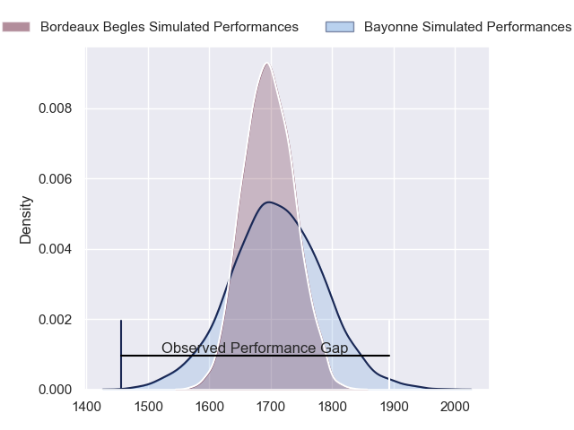
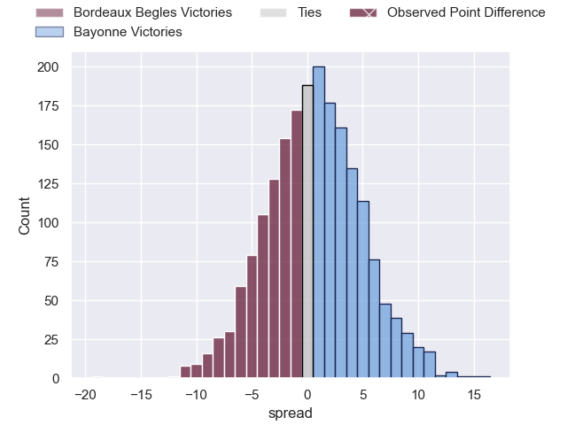
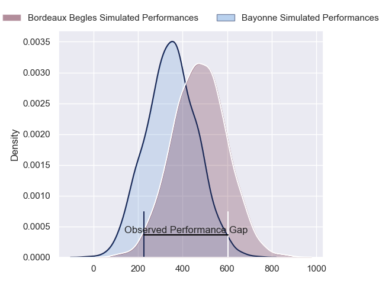
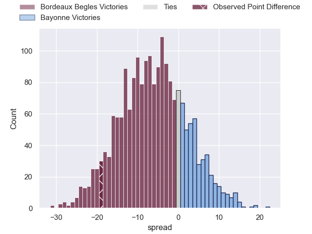
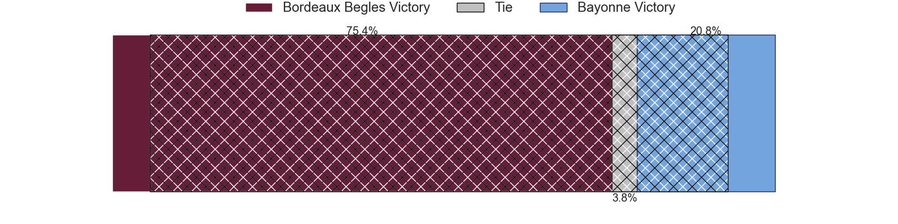

---  
layout: page  
title: Bordeaux Begles at Bayonne; 34-15  
date: 2024-04-27 18:00:00 -0500  
categories: "Top 14 Orange 2023" match review  
---
# Bordeaux Begles at Bayonne; 34-15

# Club Level Predictions

The first set of predictions treats a club as the smallest object, as the club develops its members, organizes a gameplan, and deploys its players as needed for each match. This club model has a prediction of 0.517, which translates to predicting Bayonne to win by 0.6.

Our Over/Under is 51.5 - and combined with the spread above, we have a predicted scoreline of 25 to 26

Each club has a rating and a rating deviation (similar to a Glicko rating), and expected performances can be generated. This allows for simulated matches and spreads like the ones below.
## Projected Performances - Club Model

## Projected Spreads - Club Model

## Projected Results - Club Model

# Player Level Predictions - Version 2

Treating teams instead as an entity made up of the currently active players, I have ratings for each player in an altogether different system. These can be combined to form team ratings once teamsheets are announced, weighting starters a bit higher than the reserves. After the match is played, players can be weighted by their minutes on the field, allowing for an accurate measure of the team's composition. With these compiled team ratings, we can make predictions, measure inaccuracy, and update the individual player ratings.
## Prediction without Player Minutes: Bordeaux Begles by 5.9

Bordeaux Begles by 14.1 on a neutral pitch

## Projected Performances - Player Model

## Projected Spreads - Player Model

## Projected Results - Player Model

|   Away Minutes | Away Player               |   Away Percentile |   Number |   Home Percentile | Home Player             |   Home Minutes |
|---------------:|:--------------------------|------------------:|---------:|------------------:|:------------------------|---------------:|
|             68 | Ugo Boniface              |             90.36 |        1 |             51.69 | Matis Perchaud          |             54 |
|             65 | Maxime Lamothe            |             61.04 |        2 |             10.44 | Vincent Giudicelli      |             59 |
|             49 | Carlu Sadie               |             39.15 |        3 |             26.9  | Tevita Tatafu           |             59 |
|             71 | Cyril Cazeaux             |             91.66 |        4 |             73.88 | Thomas Ceyte            |             80 |
|             57 | Adam Coleman              |             98.67 |        5 |             56.47 | Lucas Paulos            |             54 |
|             80 | Bastien Vergnes Taillefer |             76.16 |        6 |             38.86 | Pierre Huguet           |             54 |
|             68 | Mahamadou Diaby           |             77.95 |        7 |             85.34 | Baptiste Heguy          |             80 |
|             59 | Tevita Tatafu             |             85.54 |        8 |             76.31 | Uzair Cassiem           |             80 |
|             80 | Maxime Lucu               |             99.37 |        9 |             67.86 | Guillaume Rouet Piffard |             64 |
|             80 | Matthieu Jalibert         |             96.62 |       10 |             92.47 | Camille Lopez           |             80 |
|             80 | Louis Bielle-Biarrey      |             78.51 |       11 |             73.49 | Nadir Megdoud           |             80 |
|             57 | Ben Tapuai                |             54.26 |       12 |             40.42 | Federico Mori           |             59 |
|             80 | Yoram Moefana             |             78.24 |       13 |             47.96 | Arnaud Erbinartegaray   |             80 |
|             80 | Damian Penaud             |             95.66 |       14 |             54.17 | Mateo Carreras          |             80 |
|             80 | Romain Buros              |             97.46 |       15 |             16.79 | Cheikh Tiberghien       |             59 |
|             31 | Ben Tameifuna             |             95.85 |       16 |              4.23 | Konstantin Mikautadze   |             26 |
|             23 | Guido Petti               |             88.39 |       17 |             93.92 | Remi Bourdeau           |             26 |
|             23 | Nicolas Depoortere        |             79.98 |       18 |             58.92 | Swan Cormenier          |             26 |
|             15 | Romain Latterrade         |             14.66 |       19 |             16.07 | Guillaume Martocq       |             21 |
|             12 | Pete Samu                 |             85.46 |       20 |             78.78 | Luke Tagi               |             21 |
|             12 | Lekso Kaulashvili         |             87.27 |       21 |             14.29 | Tom Spring              |             21 |
|              9 | Kane Douglas              |             73.28 |       22 |             84.94 | Thomas Acquier          |             21 |
|            nan | nan                       |            nan    |       23 |             91.97 | Maxime Machenaud        |             16 |

