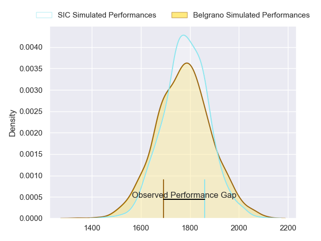
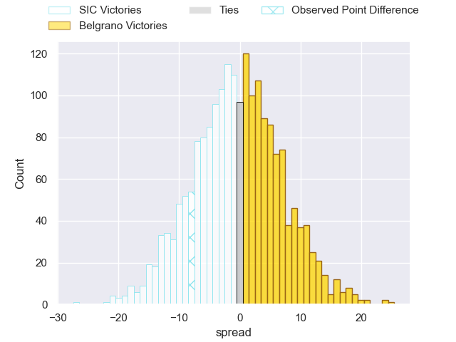
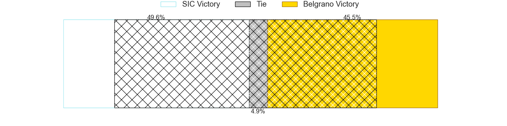
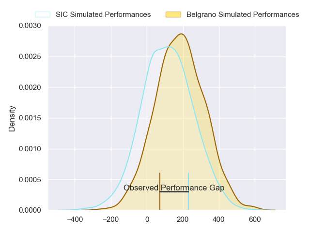
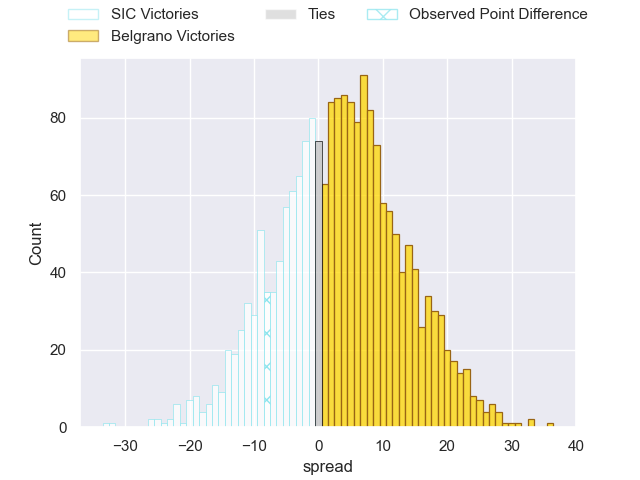
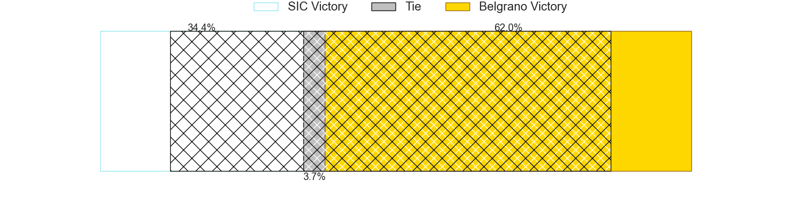

---  
layout: page  
title: SIC at Belgrano; 32-24  
date: 2024-04-27 18:00:00 -0500  
categories: "URBA Top 12 2024" match review  
---
# SIC at Belgrano; 32-24

# Club Level Predictions

The first set of predictions treats a club as the smallest object, as the club develops its members, organizes a gameplan, and deploys its players as needed for each match. This club model has a prediction of 0.485, which translates to predicting SIC to win by 0.6.

Our Over/Under is 44.5 - and combined with the spread above, we have a predicted scoreline of 22 to 22

Each club has a rating and a rating deviation (similar to a Glicko rating), and expected performances can be generated. This allows for simulated matches and spreads like the ones below.
## Projected Performances - Club Model

## Projected Spreads - Club Model

## Projected Results - Club Model

# Player Level Predictions - Version 2

Treating teams instead as an entity made up of the currently active players, I have ratings for each player in an altogether different system. These can be combined to form team ratings once teamsheets are announced, weighting starters a bit higher than the reserves. After the match is played, players can be weighted by their minutes on the field, allowing for an accurate measure of the team's composition. With these compiled team ratings, we can make predictions, measure inaccuracy, and update the individual player ratings.
## Prediction without Player Minutes: Belgrano by 3.9

SIC by 0.0 on a neutral pitch

## Projected Performances - Player Model

## Projected Spreads - Player Model

## Projected Results - Player Model

|   Away Minutes | Away Player                  |   Away Percentile |   Number |   Home Percentile | Home Player            |   Home Minutes |
|---------------:|:-----------------------------|------------------:|---------:|------------------:|:-----------------------|---------------:|
|             80 | Marcos Piccinini             |             86.68 |        1 |             53.97 | Francisco Ferronato    |             80 |
|             80 | Lucas Rocha                  |             85.69 |        2 |             55.21 | Francisco Lusarreta    |             80 |
|             80 | Benjamin Chiappe             |             83.84 |        3 |             49.17 | Lisandro Garcia Dragui |             80 |
|             80 | Bautista Viero               |             83.5  |        4 |             35.68 | Augusto Vaccarino      |             80 |
|             80 | Tomas Borghi                 |             81.55 |        5 |             37.26 | Mikael Quesada         |             80 |
|             80 | Andrea Panzarini             |             77.3  |        6 |             50.12 | Joaquin de la Serna    |             80 |
|             80 | Franco Delger                |             79.33 |        7 |             50.12 | Julian Rebusone        |             80 |
|             80 | Tomas Meyrelles              |             70.59 |        8 |             48.08 | Franco Vega            |             80 |
|             80 | Felipe Sascaro               |             80    |        9 |             47.87 | Ignacio Marino         |             80 |
|             80 | Santiago Pavlovsky           |             77.28 |       10 |             48.04 | Joaquin Mihura         |             80 |
|             80 | Nicanor Acosta               |             74.15 |       11 |             51.7  | Ignacio Diaz           |             80 |
|             80 | Santos Rubio                 |             77.58 |       12 |             46.51 | Ramon Arana            |             80 |
|             80 | Carlos Piran                 |             69.36 |       13 |             46.51 | Tomas Etchepare        |             80 |
|             80 | Franco Moneta                |             81.29 |       14 |             35.44 | Tobias Bernabe         |             80 |
|             80 | Jacinto Campbell             |             77.39 |       15 |             45.23 | Juan Lando             |             80 |
|              0 | Ricardo Alberto Macchiavello |            nan    |       16 |            nan    | Jose Saporitti         |              0 |
|              0 | Segundo Rubio                |            nan    |       17 |            nan    | Eliseo Marchetti       |              0 |
|              0 | Juan Pedro Olcese            |            nan    |       18 |            nan    | Justo Duranona         |              0 |
|              0 | Pedro Georgalo               |            nan    |       19 |             59.59 | Luciano Tecca          |              0 |
|              0 | Alejo Daireaux               |             57.83 |       20 |            nan    | Francisco Gradin       |              0 |
|              0 | Lucas Albanese               |            nan    |       21 |            nan    | Juan Aparicio          |              0 |
|              0 | Agustin Sascaro              |            nan    |       22 |            nan    | Juan Brescia           |              0 |
|              0 | Away Team 23                 |            nan    |       23 |            nan    | Theo Blaksley          |              0 |

