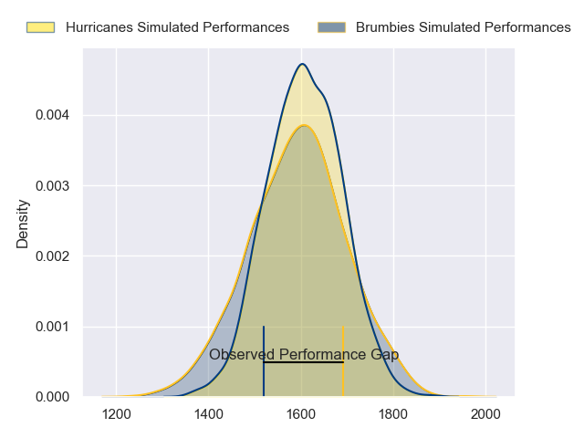
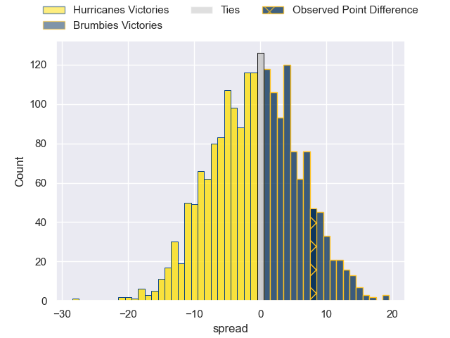
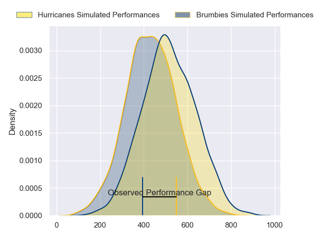
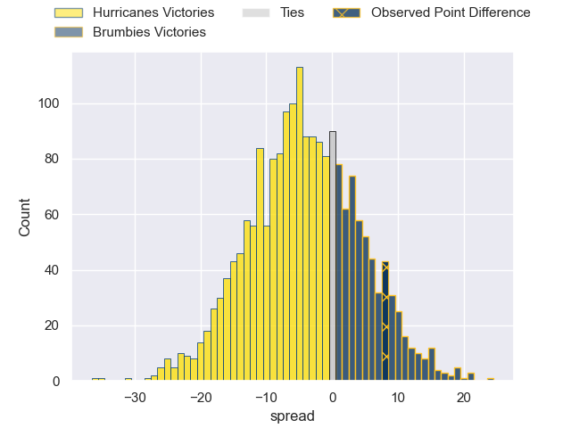
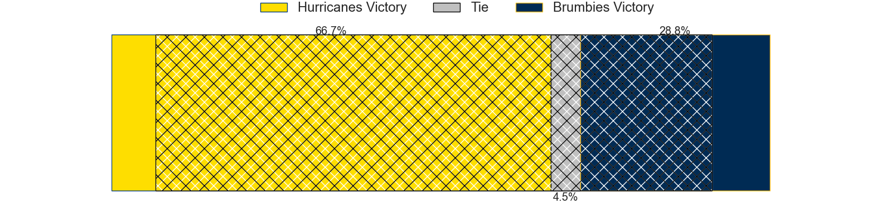

---  
layout: page  
title: Hurricanes at Brumbies; 19-27  
date: 2024-04-27 18:00:00 -0500  
categories: "Super Rugby Pacific 2024" match review  
---
# Hurricanes at Brumbies; 19-27

# Club Level Predictions

The first set of predictions treats a club as the smallest object, as the club develops its members, organizes a gameplan, and deploys its players as needed for each match. This club model has a prediction of 0.482, which translates to predicting Hurricanes to win by 0.7.

Our Over/Under is 49.5 - and combined with the spread above, we have a predicted scoreline of 25 to 25

Each club has a rating and a rating deviation (similar to a Glicko rating), and expected performances can be generated. This allows for simulated matches and spreads like the ones below.
## Projected Performances - Club Model

## Projected Spreads - Club Model

## Projected Results - Club Model

# Player Level Predictions - Version 2

Treating teams instead as an entity made up of the currently active players, I have ratings for each player in an altogether different system. These can be combined to form team ratings once teamsheets are announced, weighting starters a bit higher than the reserves. After the match is played, players can be weighted by their minutes on the field, allowing for an accurate measure of the team's composition. With these compiled team ratings, we can make predictions, measure inaccuracy, and update the individual player ratings.
## Prediction without Player Minutes: Hurricanes by 0.6

Hurricanes by 5.3 on a neutral pitch

## Projected Performances - Player Model

## Projected Spreads - Player Model

## Projected Results - Player Model

|   Away Minutes | Away Player          |   Away Percentile |   Number |   Home Percentile | Home Player      |   Home Minutes |
|---------------:|:---------------------|------------------:|---------:|------------------:|:-----------------|---------------:|
|             59 | Xavier Numia         |             95.49 |        1 |             93.63 | James Slipper    |             62 |
|             27 | James O'Reilly       |             40.08 |        2 |             71.57 | Billy Pollard    |             55 |
|             59 | Tyrel Lomax          |             93.93 |        3 |             95.69 | Allan Alaalatoa  |             41 |
|             80 | Caleb Delany         |             84.83 |        4 |             63.96 | Darcy Swain      |             80 |
|             64 | Isaia Walker-Leawere |             96.84 |        5 |             98.79 | Cadeyrn Neville  |             48 |
|             80 | Brad Shields         |             92.11 |        6 |             96.68 | Rob Valetini     |             80 |
|             80 | Du'Plessis Kirifi    |             91.16 |        7 |             57.23 | Rory Scott       |             80 |
|             51 | Brayden Iose         |              1.53 |        8 |             54.22 | Charlie Cale     |             80 |
|             64 | TJ Perenara          |             97.23 |        9 |             74.47 | Ryan Lonergan    |             59 |
|             80 | Brett Cameron        |             18.8  |       10 |             84.07 | Noah Lolesio     |             80 |
|             80 | Salesi Rayasi        |             85.5  |       11 |             54.62 | Corey Toole      |             45 |
|             71 | Jordie Barrett       |             96.26 |       12 |             60.4  | Tamati Tua       |             80 |
|             59 | Peter Umaga-Jensen   |             33    |       13 |             78.58 | Len Ikitau       |             51 |
|             80 | Kini Naholo          |             96.02 |       14 |             90.76 | Ollie Sapsford   |             80 |
|             80 | Ruben Love           |             93.47 |       15 |             71.36 | Tom Wright       |             80 |
|             53 | Raymond Tuputupu     |            nan    |       16 |             84.66 | Connal McInerney |             25 |
|             21 | Tevita Mafileo       |             88.44 |       17 |             44.96 | Blake Schoupp    |             18 |
|             21 | Pasilio Tosi         |             51.13 |       18 |             32.62 | Sefo Kautai      |             39 |
|             16 | Ben Grant            |             52.06 |       19 |             73.42 | Tom Hooper       |             32 |
|             29 | Peter Lakai          |             94.62 |       20 |             83.03 | Jahrome Brown    |              0 |
|             16 | Richard Judd         |             94.68 |       21 |             24.68 | Harrison Goddard |             21 |
|              9 | Riley Higgins        |             86.3  |       22 |             68.15 | Jack Debreczeni  |             29 |
|             21 | Bailyn Sullivan      |             24.21 |       23 |             92.51 | Andy Muirhead    |             35 |

