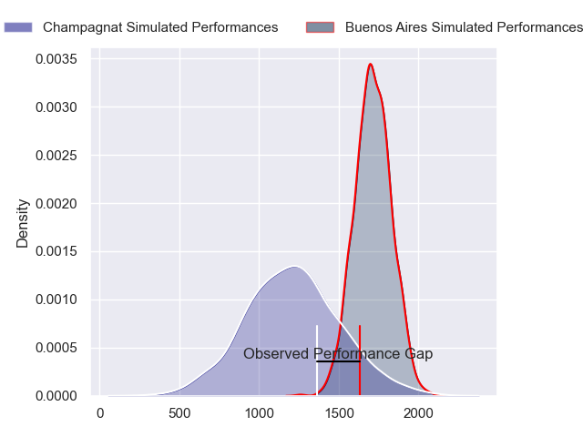
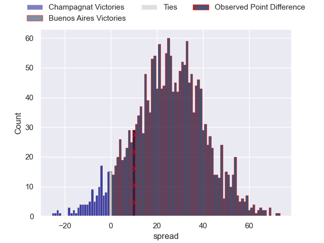
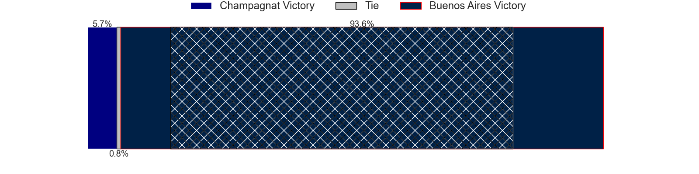
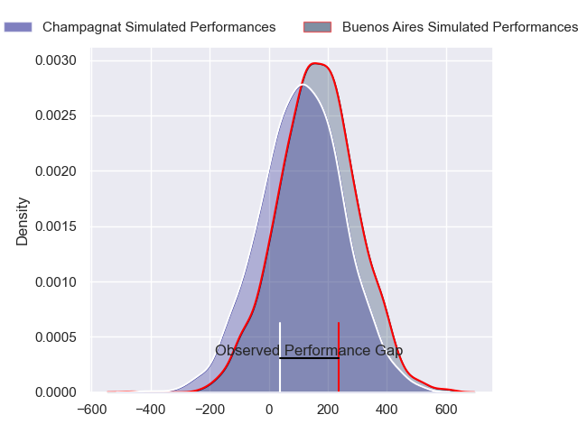
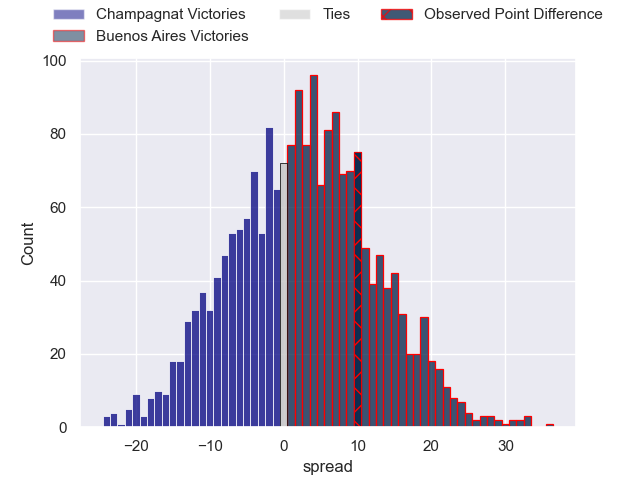
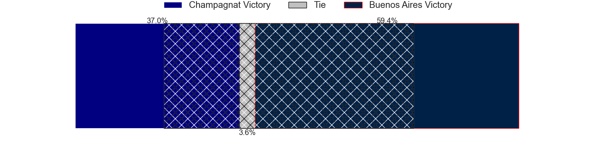

---  
layout: page  
title: Champagnat at Buenos Aires; 23-33  
date: 2024-04-27 18:00:00 -0500  
categories: "URBA Top 12 2024" match review  
---
# Champagnat at Buenos Aires; 23-33

# Club Level Predictions

The first set of predictions treats a club as the smallest object, as the club develops its members, organizes a gameplan, and deploys its players as needed for each match. This club model has a prediction of 0.892, which translates to predicting Buenos Aires to win by 25.1.

Our Over/Under is 39.5 - and combined with the spread above, we have a predicted scoreline of 7 to 32

Each club has a rating and a rating deviation (similar to a Glicko rating), and expected performances can be generated. This allows for simulated matches and spreads like the ones below.
## Projected Performances - Club Model

## Projected Spreads - Club Model

## Projected Results - Club Model

# Player Level Predictions - Version 2

Treating teams instead as an entity made up of the currently active players, I have ratings for each player in an altogether different system. These can be combined to form team ratings once teamsheets are announced, weighting starters a bit higher than the reserves. After the match is played, players can be weighted by their minutes on the field, allowing for an accurate measure of the team's composition. With these compiled team ratings, we can make predictions, measure inaccuracy, and update the individual player ratings.
## Prediction without Player Minutes: Buenos Aires by 2.8

Champagnat by 0.0 on a neutral pitch

## Projected Performances - Player Model

## Projected Spreads - Player Model

## Projected Results - Player Model

|   Away Minutes | Away Player                   |   Away Percentile |   Number |   Home Percentile | Home Player            |   Home Minutes |
|---------------:|:------------------------------|------------------:|---------:|------------------:|:-----------------------|---------------:|
|             90 | Tomas Distel                  |             43.39 |        1 |             70.32 | Pablo Gaston Vaca      |             90 |
|             90 | Fernando Rodriguez Pascarella |             44.58 |        2 |             66.46 | Tomas Rosasco          |             90 |
|             90 | Alberto Adissi                |             44.07 |        3 |             70.13 | Tomas Gallo            |             90 |
|             90 | Inaki Ustariz                 |             45.39 |        4 |             64.93 | Francisco Jose Sluga   |             90 |
|             90 | Santiago Escuti               |             46.12 |        5 |             65.05 | Pedro Maria Del Carril |             90 |
|             90 | Matias Alonso Boto            |             39.73 |        6 |             60.33 | Jordi Dieguez          |             90 |
|             90 | Francisco Castelli            |             39.73 |        7 |             58.9  | Matias Espina          |             90 |
|             90 | Matias Muniagurria            |             40.15 |        8 |             47.06 | Tomas Etcheverry       |             90 |
|             90 | Martin Graciarena             |             42.55 |        9 |             64.26 | Mateo Freire           |             90 |
|             90 | Benjamin Panelo               |             36.29 |       10 |             56.14 | Mateo Capalbo          |             90 |
|             90 | Tomas Baca Castex             |             42.81 |       11 |             63.63 | Tomas Acosta Pimentel  |             90 |
|             90 | Tobias Imbrosciano            |             38.36 |       12 |             57.47 | Agustin Lamensa Sanudo |             90 |
|             90 | Tomas Cotter                  |             38.11 |       13 |             57.47 | Tobias Diaz Borda      |             90 |
|             90 | Simon Zappella                |             42.69 |       14 |             62.81 | Alfonso Latorre        |             90 |
|             90 | Geronimo Tomasella            |             35.93 |       15 |             57.04 | Julian Quetglas Bojar  |             90 |
|              0 | Joaquin Guerra                |            nan    |       16 |             43.15 | Tomas Ruiz             |              0 |
|              0 | Manuel Mauvecin               |            nan    |       17 |             43.58 | Tomas Herrador         |              0 |
|              0 | Marcos Magaro                 |            nan    |       18 |            nan    | Mariano Cederbaum      |              0 |
|              0 | Lucas Moresco                 |            nan    |       19 |            nan    | Lucas Etcheverry       |              0 |
|              0 | Marcos Lafuente               |            nan    |       20 |            nan    | Tomas Alvarez Bayon    |              0 |
|              0 | Pedro Del Piano               |            nan    |       21 |            nan    | Juan Monasterio        |              0 |
|              0 | Antonio Lopez Llovet          |            nan    |       22 |            nan    | Tomas Bunge            |              0 |
|              0 | Gregorio Carol Lugones        |            nan    |       23 |            nan    | Inaki Latorre          |              0 |

