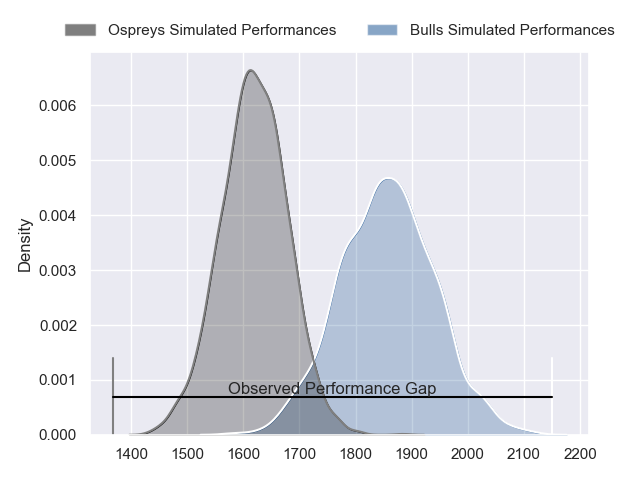
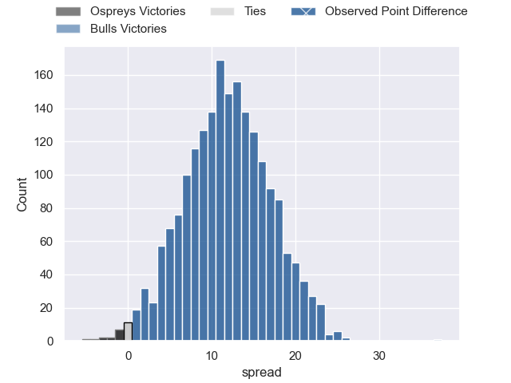
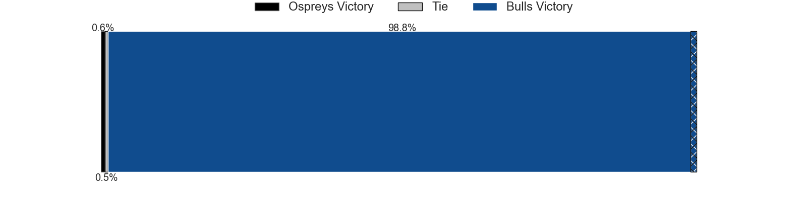
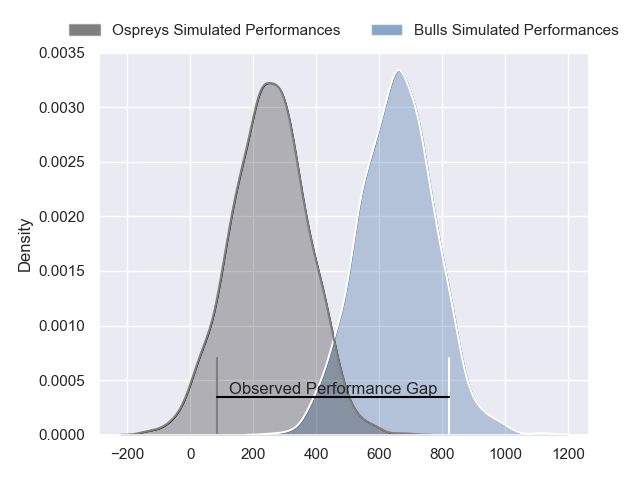
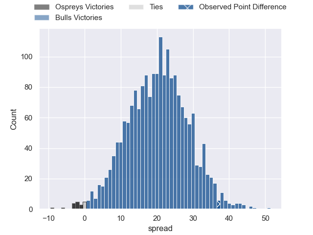
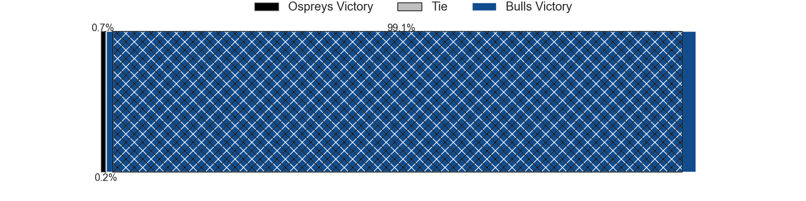

---  
layout: page  
title: Ospreys at Bulls; 24-61  
date: 2024-04-27 18:00:00 -0500  
categories: "United Rugby Championship 2023" match review  
---
# Ospreys at Bulls; 24-61

# Club Level Predictions

The first set of predictions treats a club as the smallest object, as the club develops its members, organizes a gameplan, and deploys its players as needed for each match. This club model has a prediction of 0.794, which translates to predicting Bulls to win by 11.9.

Our Over/Under is 49.5 - and combined with the spread above, we have a predicted scoreline of 19 to 31

Each club has a rating and a rating deviation (similar to a Glicko rating), and expected performances can be generated. This allows for simulated matches and spreads like the ones below.
## Projected Performances - Club Model

## Projected Spreads - Club Model

## Projected Results - Club Model

# Player Level Predictions - Version 2

Treating teams instead as an entity made up of the currently active players, I have ratings for each player in an altogether different system. These can be combined to form team ratings once teamsheets are announced, weighting starters a bit higher than the reserves. After the match is played, players can be weighted by their minutes on the field, allowing for an accurate measure of the team's composition. With these compiled team ratings, we can make predictions, measure inaccuracy, and update the individual player ratings.
## Prediction without Player Minutes: Bulls by 22.1

Bulls by 17.6 on a neutral pitch

## Projected Performances - Player Model

## Projected Spreads - Player Model

## Projected Results - Player Model

|   Away Minutes | Away Player            |   Away Percentile |   Number |   Home Percentile | Home Player         |   Home Minutes |
|---------------:|:-----------------------|------------------:|---------:|------------------:|:--------------------|---------------:|
|             51 | Gareth Thomas          |             64.25 |        1 |             92.85 | Gerhard Steenekamp  |             65 |
|             51 | Sam Parry              |             68.3  |        2 |             95.5  | Johan Grobbelaar    |             54 |
|             58 | Rhys Henry             |             86.19 |        3 |             99.41 | Wilco Louw          |             65 |
|             80 | Adam Beard             |             94.42 |        4 |             18.57 | Ruan Vermaak        |             67 |
|             58 | Huw Owen-Sutton        |             64.08 |        5 |             78.52 | Reinhardt Ludwig    |             80 |
|             51 | Morgan Morse           |             38.71 |        6 |             92.59 | Nizaam Carr         |             80 |
|             80 | Justin Tipuric         |             97.73 |        7 |             91.52 | Elrigh Louw         |             80 |
|             80 | Morgan Morris          |             15.6  |        8 |             31.71 | Cameron Hanekom     |             62 |
|             51 | Luke Davies            |             61.06 |        9 |             94.47 | Embrose Papier      |             62 |
|             80 | Jack Walsh             |             67.89 |       10 |             35.51 | Chris William Smith |             71 |
|             80 | Keelan Giles           |             16.96 |       11 |             98.48 | Kurt-Lee Arendse    |             80 |
|             80 | Keiran Williams        |             85.43 |       12 |             95.77 | Harold Vorster      |             80 |
|             58 | Owen Watkin            |             98.26 |       13 |             94.02 | David Kriel         |             80 |
|             80 | Luke Morgan            |             24.33 |       14 |             99.3  | Canan Moodie        |             67 |
|             72 | Max Nagy               |             78.39 |       15 |             96.73 | Willie le Roux      |             80 |
|             29 | Dewi Lake              |             43.97 |       16 |             99.39 | Akker van der Merwe |             26 |
|             29 | Nicky Smith            |             68.27 |       17 |             76.89 | Simphiwe Matanzima  |             15 |
|             22 | Ben Warren             |            nan    |       18 |             78.35 | Mornay Smith        |             15 |
|             22 | James Ratti            |             73.12 |       19 |             83.13 | Janko Swanepoel     |             13 |
|             29 | Harri Deaves           |             86.62 |       20 |            nan    | Jannes Kirsten      |             18 |
|             29 | Reuben Morgan-Williams |             75.53 |       21 |             85.96 | Zak Burger          |             18 |
|              8 | Owen Williams          |             91.38 |       22 |             65.27 | Jaco van der Walt   |              9 |
|             22 | Evardi Boshoff         |              3.24 |       23 |             83.42 | Devon Williams      |             13 |

