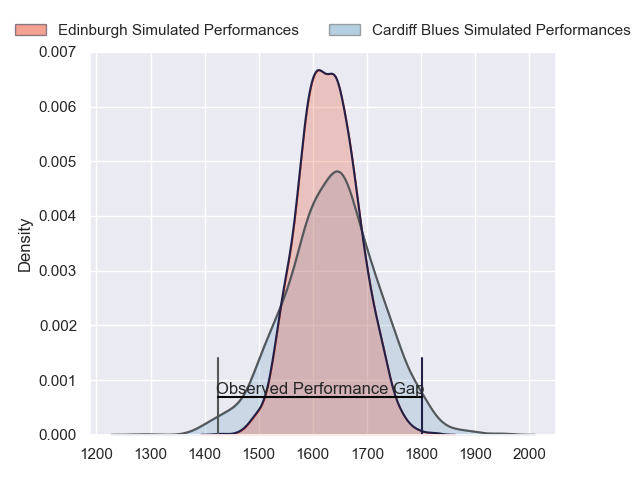
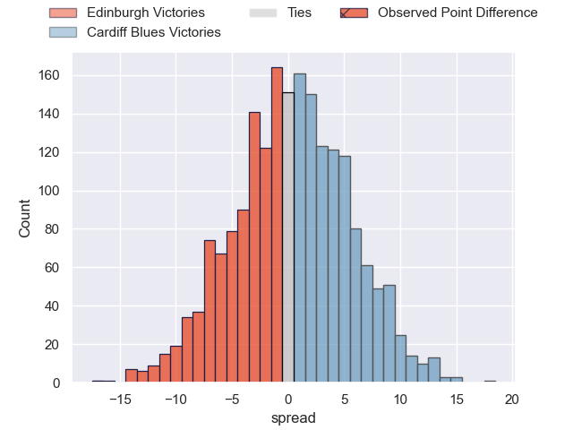
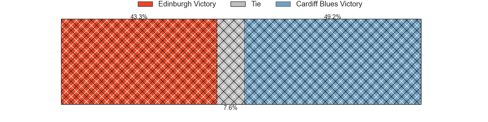
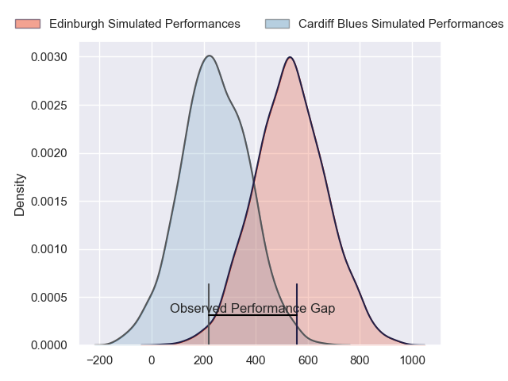
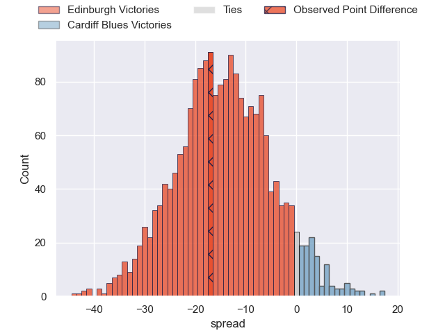
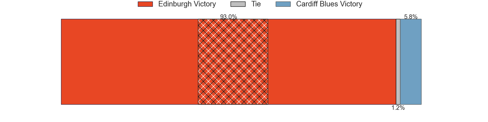

---  
layout: page  
title: Edinburgh at Cardiff Blues; 24-7  
date: 2024-04-27 18:00:00 -0500  
categories: "United Rugby Championship 2023" match review  
---
# Edinburgh at Cardiff Blues; 24-7

# Club Level Predictions

The first set of predictions treats a club as the smallest object, as the club develops its members, organizes a gameplan, and deploys its players as needed for each match. This club model has a prediction of 0.509, which translates to predicting Cardiff Blues to win by 0.3.

Our Over/Under is 43.5 - and combined with the spread above, we have a predicted scoreline of 22 to 22

Each club has a rating and a rating deviation (similar to a Glicko rating), and expected performances can be generated. This allows for simulated matches and spreads like the ones below.
## Projected Performances - Club Model

## Projected Spreads - Club Model

## Projected Results - Club Model

# Player Level Predictions - Version 2

Treating teams instead as an entity made up of the currently active players, I have ratings for each player in an altogether different system. These can be combined to form team ratings once teamsheets are announced, weighting starters a bit higher than the reserves. After the match is played, players can be weighted by their minutes on the field, allowing for an accurate measure of the team's composition. With these compiled team ratings, we can make predictions, measure inaccuracy, and update the individual player ratings.
## Prediction without Player Minutes: Edinburgh by 14.6

Edinburgh by 21.6 on a neutral pitch

## Projected Performances - Player Model

## Projected Spreads - Player Model

## Projected Results - Player Model

|   Away Minutes | Away Player         |   Away Percentile |   Number |   Home Percentile | Home Player       |   Home Minutes |
|---------------:|:--------------------|------------------:|---------:|------------------:|:------------------|---------------:|
|             80 | Pierre Schoeman     |             91.71 |        1 |             16.39 | Rhys Carré        |             80 |
|             80 | Ewan Ashman         |             83.73 |        2 |             67.27 | Liam Belcher      |             80 |
|             80 | WP Nel              |             99.04 |        3 |             34.33 | Keiron Assiratti  |             80 |
|             80 | Sam Skinner         |             80.53 |        4 |             85.97 | Ben Donnell       |             80 |
|             80 | Grant Gilchrist     |             94.8  |        5 |             23.1  | Teddy Williams    |             80 |
|             80 | Jamie Ritchie       |            100    |        6 |             15.38 | Alex Mann         |             80 |
|             80 | Hamish Watson       |             55.07 |        7 |             43.62 | Ellis Jenkins     |             80 |
|             80 | Luke Crosbie        |             91.52 |        8 |             42.64 | Mackenzie Martin  |             80 |
|             80 | Ali Price           |             85.62 |        9 |             68.5  | Gonzalo Bertranou |             80 |
|             80 | Ben Healy           |             78.7  |       10 |             65.45 | Tinus de Beer     |             80 |
|             80 | Duhan van der Merwe |             83.31 |       11 |             50.74 | Theo Cabango      |             80 |
|             80 | James Lang          |             91.72 |       12 |             58.84 | Ben Thomas        |             80 |
|             80 | Matt Currie         |             81.46 |       13 |             79.73 | Mason Grady       |             80 |
|             80 | Emiliano Boffelli   |             67.2  |       14 |              7.31 | Harri Millard     |             80 |
|             80 | Wes Goosen          |             93.13 |       15 |             25.45 | Cameron Winnett   |             80 |

