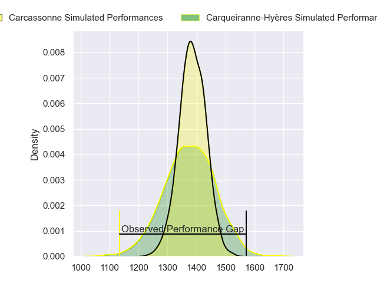
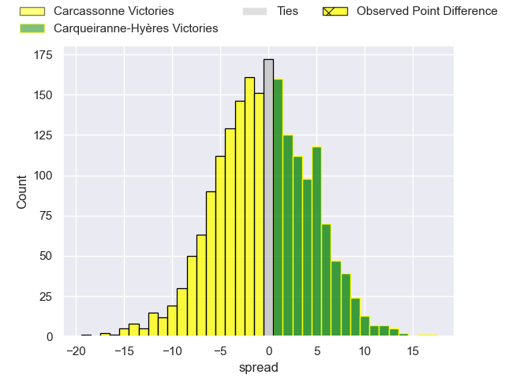
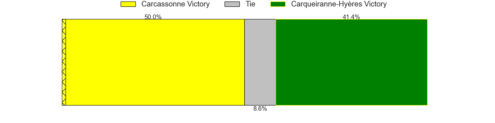
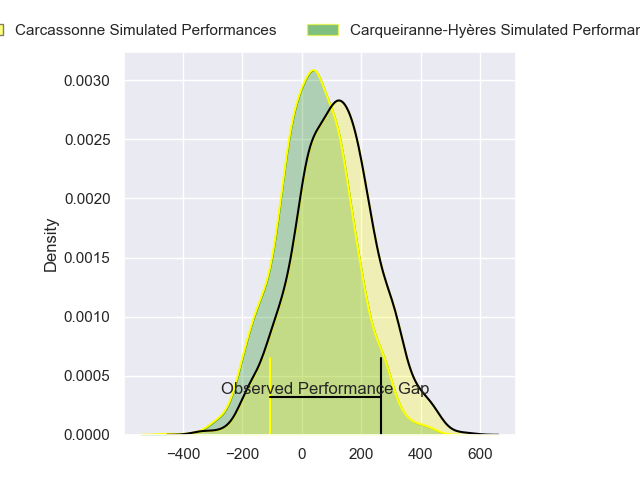
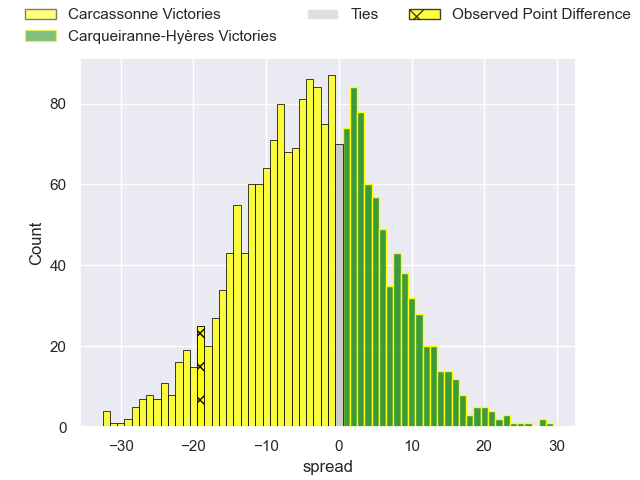
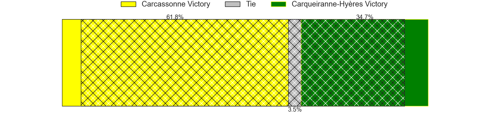

---  
layout: page  
title: Carcassonne at Carqueiranne-Hyeres; 32-13  
date: 2024-04-27 18:00:00 -0500  
categories: "Nationale 2023" match review  
---
# Carcassonne at Carqueiranne-Hyeres; 32-13

# Club Level Predictions

The first set of predictions treats a club as the smallest object, as the club develops its members, organizes a gameplan, and deploys its players as needed for each match. This club model has a prediction of 0.479, which translates to predicting Carcassonne to win by 0.7.

Our Over/Under is 45.5 - and combined with the spread above, we have a predicted scoreline of 23 to 22

Each club has a rating and a rating deviation (similar to a Glicko rating), and expected performances can be generated. This allows for simulated matches and spreads like the ones below.
## Projected Performances - Club Model

## Projected Spreads - Club Model

## Projected Results - Club Model

# Player Level Predictions - Version 2

Treating teams instead as an entity made up of the currently active players, I have ratings for each player in an altogether different system. These can be combined to form team ratings once teamsheets are announced, weighting starters a bit higher than the reserves. After the match is played, players can be weighted by their minutes on the field, allowing for an accurate measure of the team's composition. With these compiled team ratings, we can make predictions, measure inaccuracy, and update the individual player ratings.
## Prediction without Player Minutes: Carcassonne by 4.1

Carcassonne by 6.6 on a neutral pitch

## Projected Performances - Player Model

## Projected Spreads - Player Model

## Projected Results - Player Model

|   Away Minutes | Away Player           |   Away Percentile |   Number |   Home Percentile | Home Player      |   Home Minutes |
|---------------:|:----------------------|------------------:|---------:|------------------:|:-----------------|---------------:|
|             80 | Andrei Ursache        |             96.91 |        1 |             62.3  | Sti Sithole      |             80 |
|             80 | Raphael Carbou        |             81.73 |        2 |              0.2  | Theo Lachaud     |             80 |
|             80 | Vakhtangi Akhobadze   |             17.36 |        3 |             28.25 | Costel Burtila   |             80 |
|             80 | Romain Manchia        |             64.93 |        4 |             50.67 | Nathan Gendre    |             80 |
|             80 | Clément Fontaine      |             49.21 |        5 |             10.64 | Cesar Damiani    |             80 |
|             80 | Valentin Sese         |              7.15 |        6 |              1.07 | Nicolas Baquer   |             80 |
|             80 | Etienne Herjean       |             88.2  |        7 |             91.66 | Joachim Beaumont |             80 |
|             80 | Shaun Adendorff       |             67.58 |        8 |              5.49 | Andre Gorin      |             80 |
|             80 | Martin Landajo        |              1.27 |        9 |              4.23 | Rémi Dubié       |             80 |
|             80 | Gabin Michet          |             64.94 |       10 |             30.91 | Juan Kotze       |             80 |
|             80 | Clement Egiziano      |             95.09 |       11 |             92.23 | Paul Gadea       |             80 |
|             80 | Jordan Puletua        |             76.51 |       12 |              0.87 | Romain Leveque   |             80 |
|             80 | Mathys Barka          |             10.75 |       13 |             53.77 | Charles Brousse  |             80 |
|             80 | Sakiusa Bureitakiyaca |             13.83 |       14 |              4.11 | Josselyn Bouchon |             80 |
|             80 | Maxime Gianet         |             93.38 |       15 |              4.07 | Ionel Melinte    |             80 |

