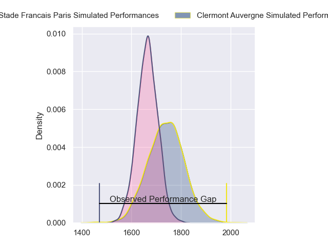
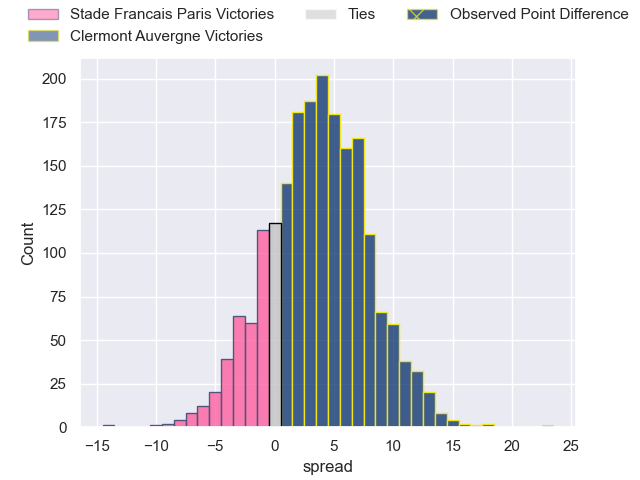
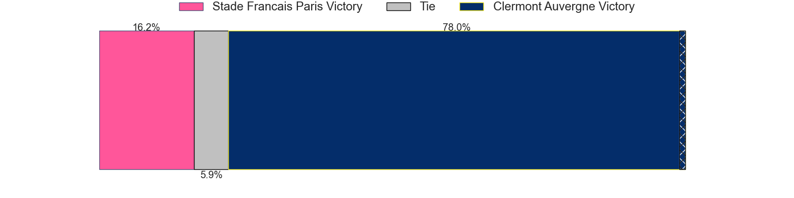
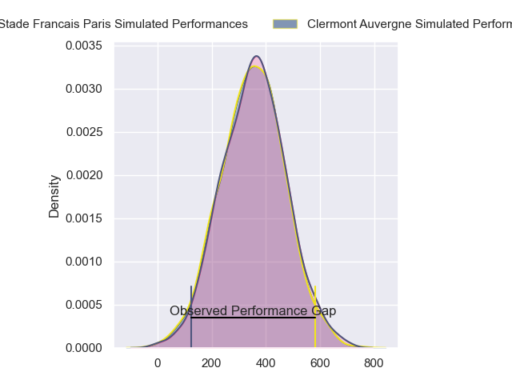
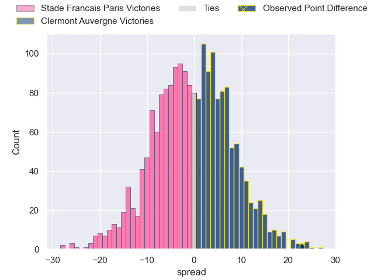
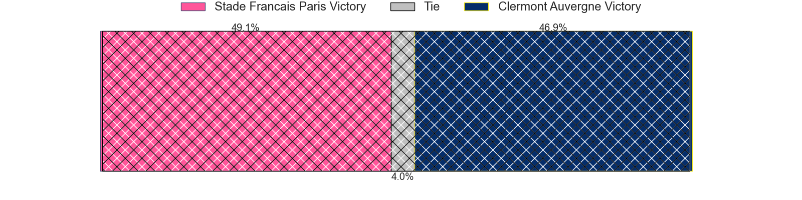

---  
layout: page  
title: Stade Francais Paris at Clermont Auvergne; 18-41  
date: 2024-04-27 18:00:00 -0500  
categories: "Top 14 Orange 2023" match review  
---
# Stade Francais Paris at Clermont Auvergne; 18-41

# Club Level Predictions

The first set of predictions treats a club as the smallest object, as the club develops its members, organizes a gameplan, and deploys its players as needed for each match. This club model has a prediction of 0.607, which translates to predicting Clermont Auvergne to win by 3.8.

Our Over/Under is 33.5 - and combined with the spread above, we have a predicted scoreline of 15 to 19

Each club has a rating and a rating deviation (similar to a Glicko rating), and expected performances can be generated. This allows for simulated matches and spreads like the ones below.
## Projected Performances - Club Model

## Projected Spreads - Club Model

## Projected Results - Club Model

# Player Level Predictions - Version 2

Treating teams instead as an entity made up of the currently active players, I have ratings for each player in an altogether different system. These can be combined to form team ratings once teamsheets are announced, weighting starters a bit higher than the reserves. After the match is played, players can be weighted by their minutes on the field, allowing for an accurate measure of the team's composition. With these compiled team ratings, we can make predictions, measure inaccuracy, and update the individual player ratings.
## Prediction without Player Minutes: Stade Francais Paris by 1.0

Stade Francais Paris by 8.5 on a neutral pitch

## Projected Performances - Player Model

## Projected Spreads - Player Model

## Projected Results - Player Model

|   Away Minutes | Away Player             |   Away Percentile |   Number |   Home Percentile | Home Player         |   Home Minutes |
|---------------:|:------------------------|------------------:|---------:|------------------:|:--------------------|---------------:|
|             58 | Sergo Abramishvili      |             24    |        1 |             49.36 | Giorgi Beria        |             81 |
|             41 | Mickael Ivaldi          |             94.68 |        2 |             58.28 | Etienne Fourcade    |             64 |
|             58 | Giorgi Melikidze        |             91.58 |        3 |             83.55 | Rabah Slimani       |             49 |
|             41 | Pierre-Henri Azagoh     |             70.39 |        4 |             77.91 | Thibaud Lanen       |             64 |
|             73 | Baptiste Pesenti        |             77.06 |        5 |             93.69 | Rob Simmons         |             81 |
|             81 | Tanginoa Halaifonua     |             21.51 |        6 |             34.65 | Peceli Yato         |             66 |
|             81 | Romain Briatte          |             55.91 |        7 |             82.08 | Marcos Kremer       |             62 |
|             81 | Mathieu Hirigoyen       |              3.32 |        8 |             92.33 | Fritz Lee           |             64 |
|             64 | Brad Weber              |             95.74 |        9 |             48.94 | Baptiste Jauneau    |             74 |
|             56 | Zack Henry              |             76.24 |       10 |             93.21 | Anthony Belleau     |             81 |
|             81 | Lester Etien            |             86.67 |       11 |             23.63 | Alivereti Raka      |             81 |
|             41 | Julien Delbouis         |             84.18 |       12 |             93.4  | George Moala        |             70 |
|             81 | Jeremy Ward             |             81.32 |       13 |             69.24 | Leon Darricarrere   |             66 |
|             81 | Joe Marchant            |             88.3  |       14 |             85.73 | Bautista Delguy     |             81 |
|             81 | Leo Barre               |             65.33 |       15 |             78.14 | Alex Newsome        |             81 |
|             40 | Lucas Peyresblanques    |             34.56 |       16 |             33.13 | Yohan Beheregaray   |             17 |
|             23 | Clement Castets         |             53.57 |       17 |            nan    | Giorgi Dzmanashvili |              7 |
|             40 | JJ van der Mescht       |             85.8  |       18 |             92.72 | Tomas Lavanini      |             17 |
|             18 | Giovanni Habel-Kueffner |             90.03 |       19 |             80.31 | Pita Gus Sowakula   |             32 |
|             17 | Jules Gimbert           |             12.77 |       20 |             67.74 | Alexandre Fischer   |             19 |
|             25 | Joris Segonds           |             78.07 |       21 |            nan    | Theo Giral          |              7 |
|             30 | Peniasi Dakuwaqa        |             54.97 |       22 |             62.39 | Julien Heriteau     |             26 |
|             23 | Francisco Gomez Kodela  |             94.71 |       23 |             72.97 | Cristian Ojovan     |             25 |

