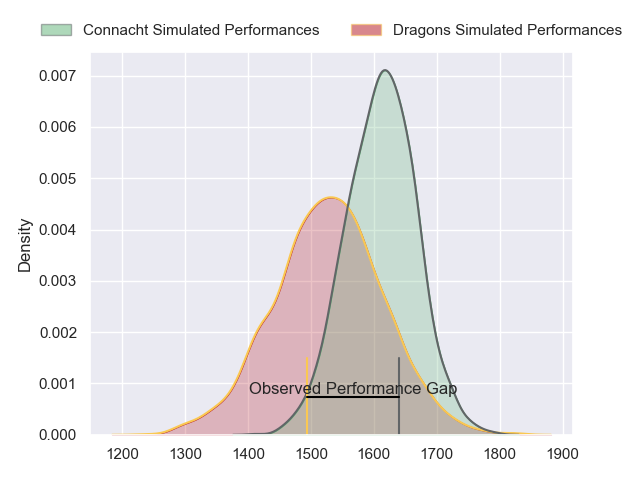
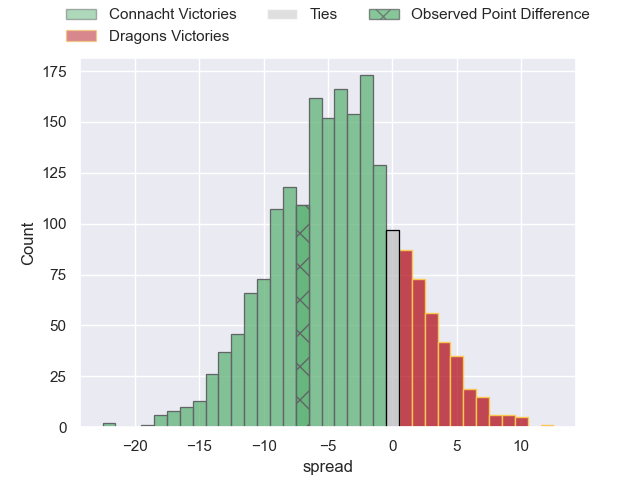
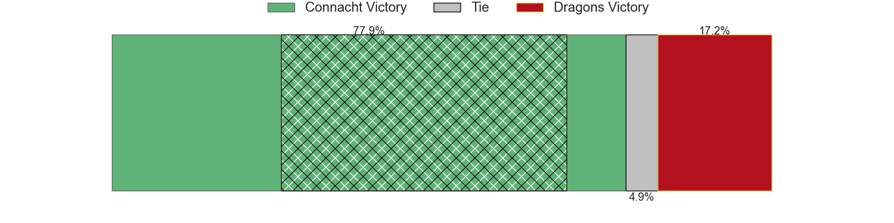
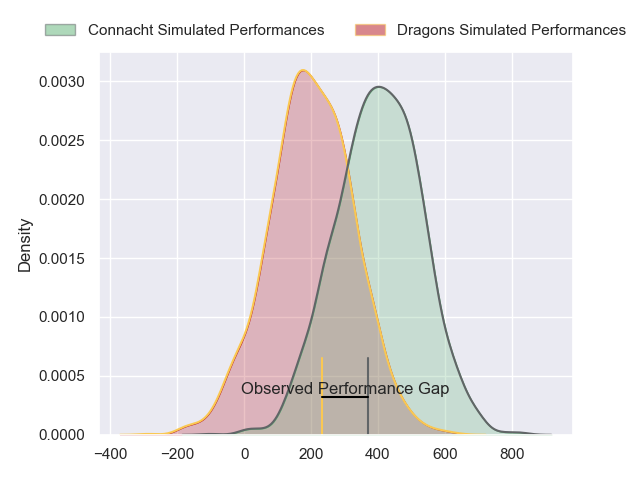
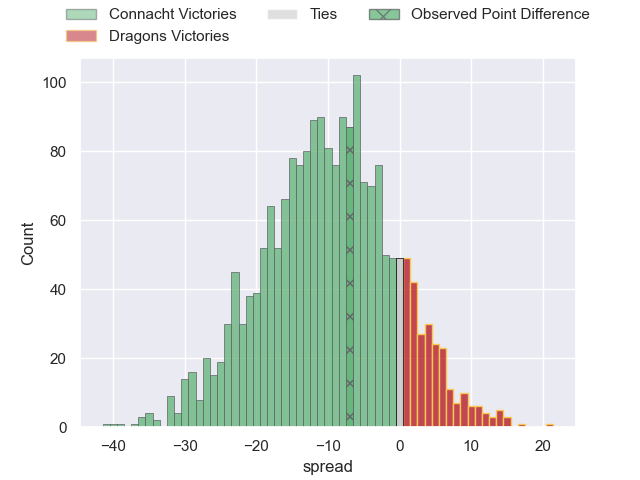
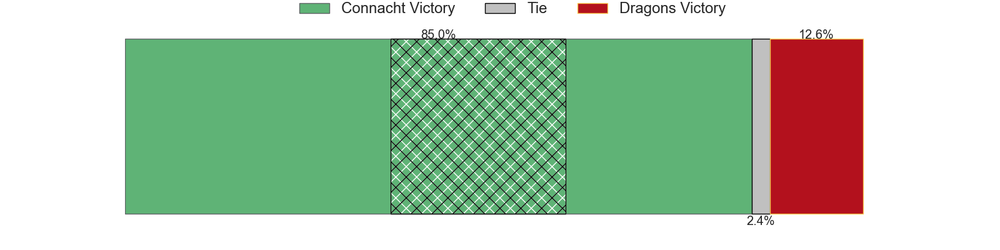

---  
layout: page  
title: Connacht at Dragons; 34-27  
date: 2024-04-27 18:00:00 -0500  
categories: "United Rugby Championship 2023" match review  
---
# Connacht at Dragons; 34-27

# Club Level Predictions

The first set of predictions treats a club as the smallest object, as the club develops its members, organizes a gameplan, and deploys its players as needed for each match. This club model has a prediction of 0.389, which translates to predicting Connacht to win by 4.0.

Our Over/Under is 56.5 - and combined with the spread above, we have a predicted scoreline of 30 to 26

Each club has a rating and a rating deviation (similar to a Glicko rating), and expected performances can be generated. This allows for simulated matches and spreads like the ones below.
## Projected Performances - Club Model

## Projected Spreads - Club Model

## Projected Results - Club Model

# Player Level Predictions - Version 2

Treating teams instead as an entity made up of the currently active players, I have ratings for each player in an altogether different system. These can be combined to form team ratings once teamsheets are announced, weighting starters a bit higher than the reserves. After the match is played, players can be weighted by their minutes on the field, allowing for an accurate measure of the team's composition. With these compiled team ratings, we can make predictions, measure inaccuracy, and update the individual player ratings.
## Prediction without Player Minutes: Connacht by 8.1

Connacht by 14.0 on a neutral pitch

## Projected Performances - Player Model

## Projected Spreads - Player Model

## Projected Results - Player Model

|   Away Minutes | Away Player           |   Away Percentile |   Number |   Home Percentile | Home Player      |   Home Minutes |
|---------------:|:----------------------|------------------:|---------:|------------------:|:-----------------|---------------:|
|              6 | Denis Buckley         |             87.46 |        1 |              4.9  | Rhodri Jones     |             69 |
|             67 | Dave Heffernan        |             64.01 |        2 |             88.55 | Elliot Dee       |             80 |
|             63 | Finlay Bealham        |             96.08 |        3 |             32.13 | Chris Coleman    |             80 |
|             80 | Joe Joyce             |             94.9  |        4 |             20.63 | Ben Carter       |             80 |
|             51 | Gavin Thornbury       |             86.17 |        5 |              0.97 | Matthew Screech  |             80 |
|             80 | Shamus Hurley-Langton |             57.47 |        6 |             22.82 | Sean Lonsdale    |             80 |
|             63 | Conor Oliver          |             82.68 |        7 |             31.42 | Taine Basham     |             80 |
|             12 | Cian Prendergast      |             54.48 |        8 |             83.89 | Aaron Wainwright |             41 |
|             63 | Matthew Devine        |             45.96 |        9 |             85.11 | Rhodri Williams  |             75 |
|             67 | JJ Hanrahan           |             87.21 |       10 |             15.4  | Cai Evans        |             80 |
|             80 | John Porch            |             92.16 |       11 |             44.33 | Ewan Rosser      |             76 |
|             80 | Bundee Aki            |             98.75 |       12 |             61.89 | Aneurin Owen     |             75 |
|             80 | Tom Farrell           |             51.68 |       13 |             80.57 | Steffan Hughes   |             80 |
|             80 | Shane Jennings        |             58.71 |       14 |             26.2  | Rio Dyer         |             80 |
|             80 | Tiernan O'Halloran    |             86.43 |       15 |             74.87 | Jordan Williams  |             80 |
|             13 | Dylan Tierney-Martin  |            nan    |       16 |             13.7  | James Benjamin   |              4 |
|             74 | Peter Dooley          |             97.45 |       17 |             61.12 | Rodrigo Martinez |             11 |
|             17 | Sam Illo              |            nan    |       18 |             42.8  | Luke Yendle      |              0 |
|             29 | Oisin Dowling         |             61.53 |       19 |             24.64 | George Nott      |             39 |
|             17 | Jarrad Butler         |             84.65 |       20 |            nan    | Barny Langton    |              0 |
|             17 | Caolin Blade          |             75.32 |       21 |            nan    | Che Hope         |              5 |
|             13 | Cathal Forde          |             21.17 |       22 |             30.81 | Will Reed        |              0 |
|             68 | Paul Boyle            |             55.24 |       23 |             33.37 | Joe Westwood     |              5 |

