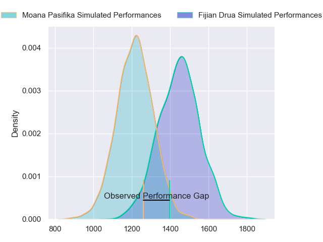
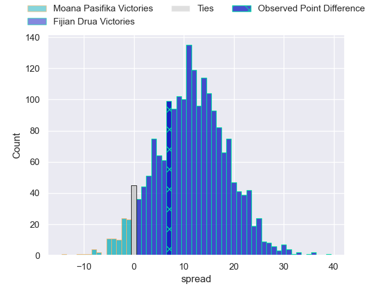
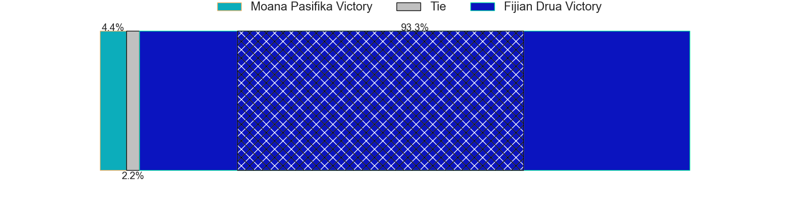
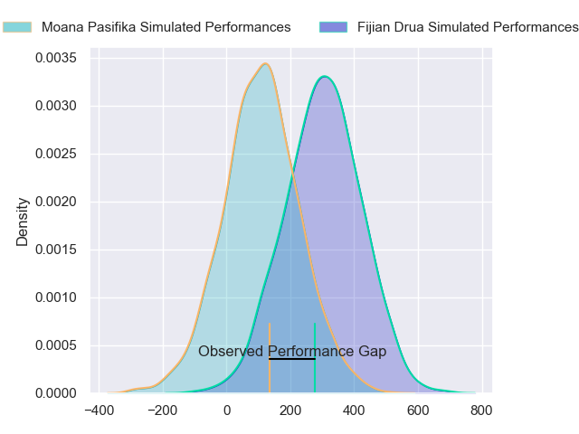
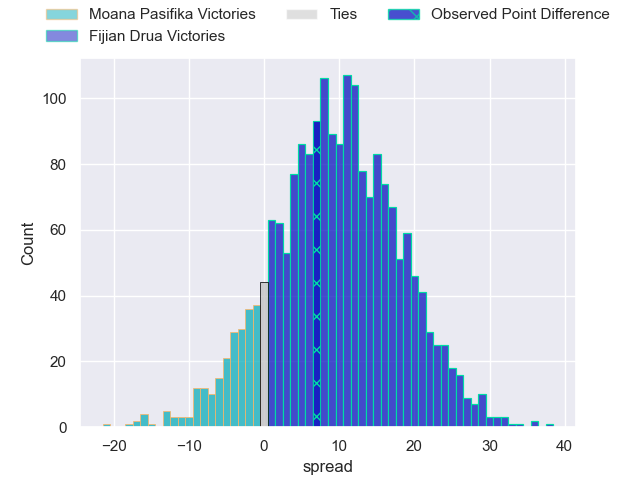
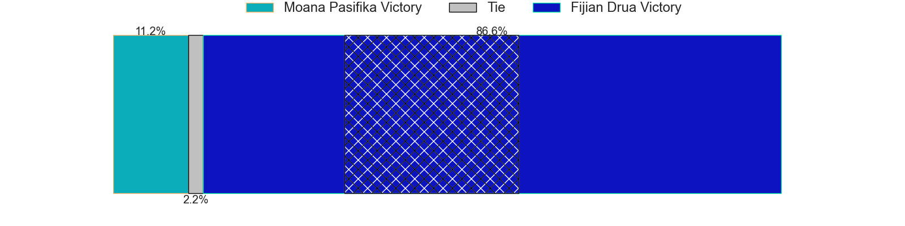

---  
layout: page  
title: Moana Pasifika at Fijian Drua; 17-24  
date: 2024-04-27 18:00:00 -0500  
categories: "Super Rugby Pacific 2024" match review  
---
# Moana Pasifika at Fijian Drua; 17-24

# Club Level Predictions

The first set of predictions treats a club as the smallest object, as the club develops its members, organizes a gameplan, and deploys its players as needed for each match. This club model has a prediction of 0.781, which translates to predicting Fijian Drua to win by 11.5.

Our Over/Under is 58.5 - and combined with the spread above, we have a predicted scoreline of 23 to 35

Each club has a rating and a rating deviation (similar to a Glicko rating), and expected performances can be generated. This allows for simulated matches and spreads like the ones below.
## Projected Performances - Club Model

## Projected Spreads - Club Model

## Projected Results - Club Model

# Player Level Predictions - Version 2

Treating teams instead as an entity made up of the currently active players, I have ratings for each player in an altogether different system. These can be combined to form team ratings once teamsheets are announced, weighting starters a bit higher than the reserves. After the match is played, players can be weighted by their minutes on the field, allowing for an accurate measure of the team's composition. With these compiled team ratings, we can make predictions, measure inaccuracy, and update the individual player ratings.
## Prediction without Player Minutes: Fijian Drua by 12.3

Fijian Drua by 9.9 on a neutral pitch

## Projected Performances - Player Model

## Projected Spreads - Player Model

## Projected Results - Player Model

|   Away Minutes | Away Player           |   Away Percentile |   Number |   Home Percentile | Home Player             |   Home Minutes |
|---------------:|:----------------------|------------------:|---------:|------------------:|:------------------------|---------------:|
|             62 | Abraham Pole          |             23.72 |        1 |             92.38 | Haereiti Hetet          |             54 |
|             56 | Samiuela Moli         |              5.42 |        2 |             35.14 | Zuriel Togiatama        |             44 |
|             46 | Sione Mafileo         |             59.21 |        3 |             32.21 | Mesake Doge             |             54 |
|             56 | Tom Savage            |             92.38 |        4 |             71.22 | Isoa Nasilasila         |             80 |
|             80 | Allan Craig           |             22.01 |        5 |             40.99 | Ratu Rotuisolia         |             60 |
|             41 | Irie Papuni           |             40.41 |        6 |             73.3  | Etonia Waqa             |             41 |
|             80 | Jacob Norris          |             85.7  |        7 |             10.49 | Kitione Salawa          |             80 |
|             80 | Sione Havili Talitui  |             86.53 |        8 |             76.81 | Ratu Meli Derenalagi    |             62 |
|             45 | Ere Enari             |              3.38 |        9 |             60.25 | Peni Matawalu           |             48 |
|             33 | William Havili        |             32.47 |       10 |             31.95 | Isaiah Armstrong-Ravula |             80 |
|             80 | Fine Inisi            |              7.2  |       11 |             40.91 | Taniela Rakuro          |             80 |
|             80 | Julian Savea          |             97.4  |       12 |             62.55 | Apisalome Vota          |             75 |
|             60 | Henry Taefu           |             32.76 |       13 |             75.15 | Iosefo Masi             |             80 |
|             80 | Viliami Fine          |              5.37 |       14 |             86.63 | Selestino Ravutaumada   |             80 |
|             80 | Danny Toala           |              9.16 |       15 |             72.26 | Ilaisa Droasese         |             80 |
|             24 | Sama Malolo           |             56.83 |       16 |             40.89 | Livai Natave            |             26 |
|             18 | Sateki Latu           |            nan    |       17 |              2.99 | Samu Tawake             |             26 |
|             34 | Sekope Kepu           |             83.03 |       18 |             39.16 | Mesu Dolokoto           |             36 |
|             24 | Michael Curry         |             74.85 |       19 |             68.32 | Mesake Vocevoce         |             20 |
|             39 | Lotu Inisi            |             13.47 |       20 |             60.91 | Vilive Miramira         |             39 |
|             35 | Jonathan Taumateine   |             48.2  |       21 |             64.59 | Elia Canakaivata        |             18 |
|             47 | Christian Leali'ifano |             78.18 |       22 |             39.75 | Simione Kuruvoli        |             32 |
|             20 | Neria Fomai           |             90.06 |       23 |             37.21 | Michael Naitokani       |              5 |

