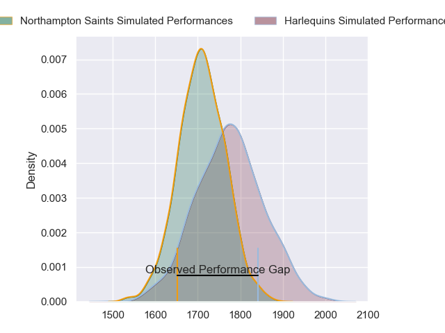
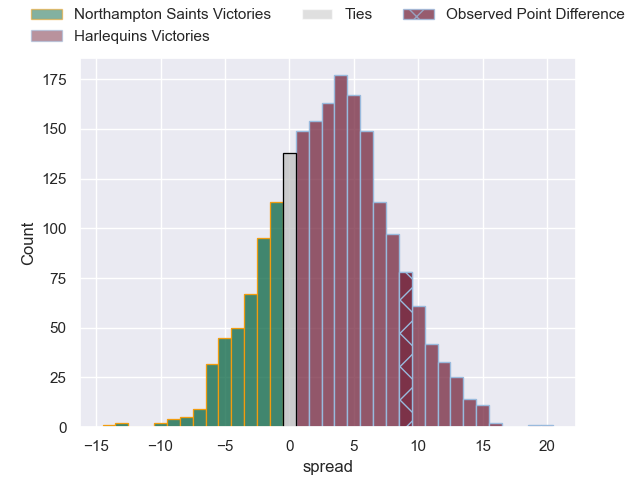
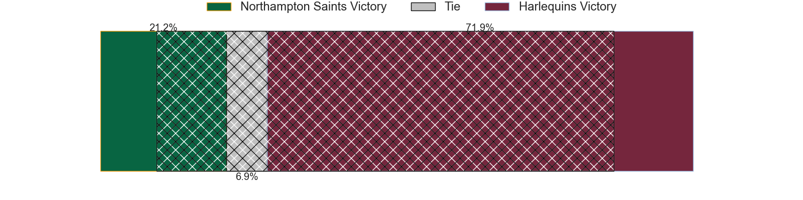
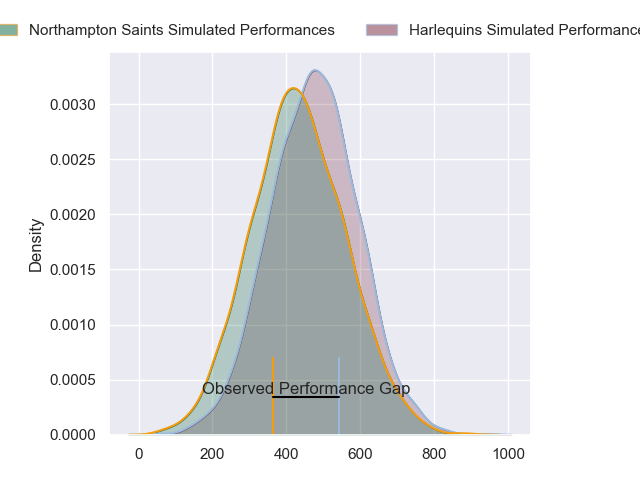
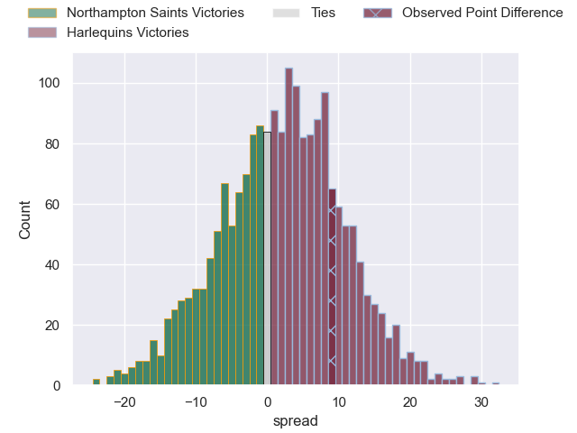
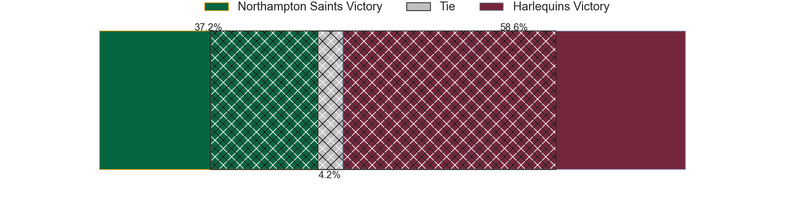

---  
layout: page  
title: Northampton Saints at Harlequins; 32-41  
date: 2024-04-27 18:00:00 -0500  
categories: "Gallagher Premiership 2023" match review  
---
# Northampton Saints at Harlequins; 32-41

# Club Level Predictions

The first set of predictions treats a club as the smallest object, as the club develops its members, organizes a gameplan, and deploys its players as needed for each match. This club model has a prediction of 0.595, which translates to predicting Harlequins to win by 3.4.

Our Over/Under is 54.5 - and combined with the spread above, we have a predicted scoreline of 26 to 29

Each club has a rating and a rating deviation (similar to a Glicko rating), and expected performances can be generated. This allows for simulated matches and spreads like the ones below.
## Projected Performances - Club Model

## Projected Spreads - Club Model

## Projected Results - Club Model

# Player Level Predictions - Version 2

Treating teams instead as an entity made up of the currently active players, I have ratings for each player in an altogether different system. These can be combined to form team ratings once teamsheets are announced, weighting starters a bit higher than the reserves. After the match is played, players can be weighted by their minutes on the field, allowing for an accurate measure of the team's composition. With these compiled team ratings, we can make predictions, measure inaccuracy, and update the individual player ratings.
## Prediction without Player Minutes: Harlequins by 3.5

Northampton Saints by 3.9 on a neutral pitch

## Projected Performances - Player Model

## Projected Spreads - Player Model

## Projected Results - Player Model

|   Away Minutes | Away Player         |   Away Percentile |   Number |   Home Percentile | Home Player               |   Home Minutes |
|---------------:|:--------------------|------------------:|---------:|------------------:|:--------------------------|---------------:|
|             63 | Emmanuel Iyogun     |             44.86 |        1 |             40.65 | Fin Baxter                |             55 |
|             63 | Sam Matavesi        |             82.21 |        2 |             31.49 | Jack Walker               |             69 |
|             63 | Trevor Davison      |              3.92 |        3 |             93.14 | Will Collier              |             55 |
|             63 | Temo Mayanavanua    |             90.41 |        4 |             79.49 | Irne Herbst               |             80 |
|             80 | Tom Lockett         |             38.23 |        5 |             85.92 | Stephan Lewies            |             69 |
|             80 | Courtney Lawes      |             98.21 |        6 |             78.97 | Chandler Cunningham-South |             73 |
|             63 | Lewis Ludlam        |             65.47 |        7 |             76.82 | Will Evans                |             80 |
|             51 | Sam Graham          |             98.92 |        8 |             88.49 | Alex Dombrandt            |             80 |
|             78 | Alex Mitchell       |             95.96 |        9 |             99.79 | Danny Care                |             63 |
|             80 | Fin Smith           |             83.81 |       10 |             87.99 | Marcus Smith              |             73 |
|             51 | Ollie Sleightholme  |             94.5  |       11 |             46.08 | Cadan Murley              |             67 |
|             80 | Tom Litchfield      |             55.92 |       12 |             98.01 | Andre Esterhuizen         |             80 |
|             80 | Tommy Freeman       |             96.76 |       13 |             81.82 | Luke Northmore            |             80 |
|             80 | James Ramm          |             77.19 |       14 |             85.61 | Louis Lynagh              |             80 |
|             80 | George Furbank      |             95.98 |       15 |             81.91 | Tyrone Green              |             80 |
|             17 | Robbie Smith        |            nan    |       16 |             61.55 | Sam Riley                 |             11 |
|             17 | Tarek Haffar        |            nan    |       17 |             97.75 | Joe Marler                |             25 |
|             17 | Elliot Millar-Mills |             63.86 |       18 |             26.84 | Simon Kerrod              |             25 |
|             17 | Chunya Munga        |             76.46 |       19 |             16.63 | George Hammond            |             11 |
|             17 | Angus Scott-Young   |             56.99 |       20 |            nan    | Will Trenholm             |              7 |
|             29 | Juarno Augustus     |             71.1  |       21 |             29.36 | Will Porter               |             17 |
|              2 | Tom James           |             20.64 |       22 |             84.6  | Jarrod Evans              |              7 |
|             29 | Fraser Dingwall     |             92.9  |       23 |             66.75 | Oscar Beard               |             13 |

