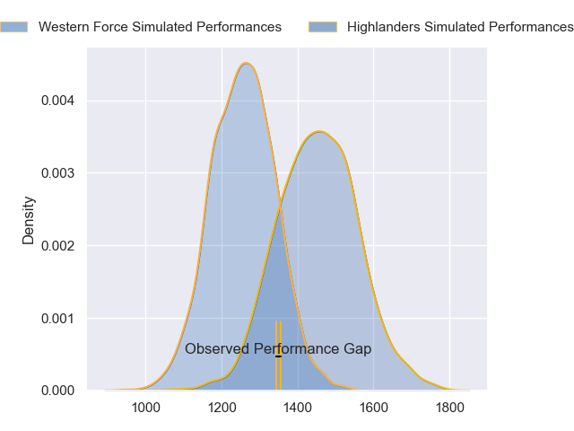
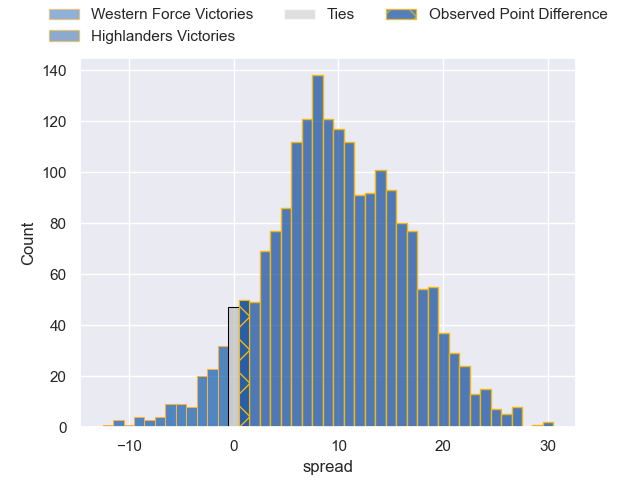
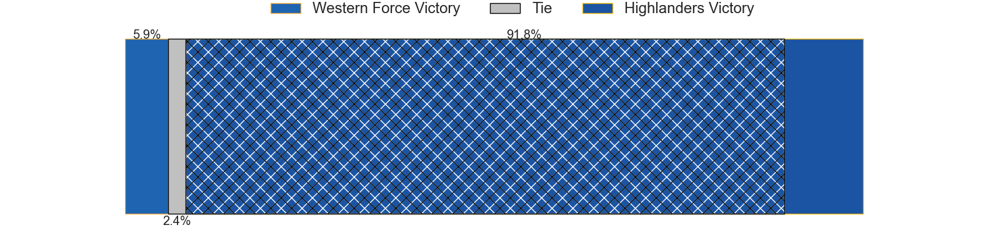
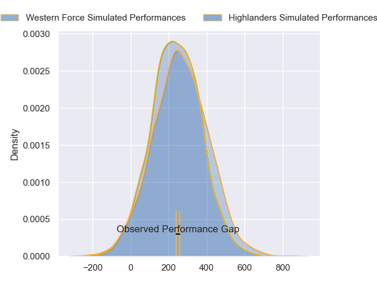
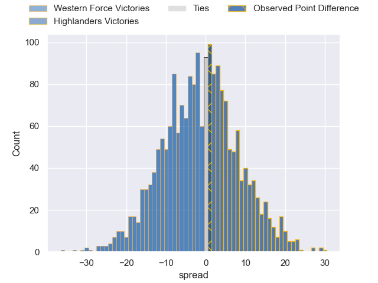

---  
layout: page  
title: Western Force at Highlanders; 6-7  
date: 2024-04-27 18:00:00 -0500  
categories: "Super Rugby Pacific 2024" match review  
---
# Western Force at Highlanders; 6-7

# Club Level Predictions

The first set of predictions treats a club as the smallest object, as the club develops its members, organizes a gameplan, and deploys its players as needed for each match. This club model has a prediction of 0.75, which translates to predicting Highlanders to win by 9.9.

Our Over/Under is 55.5 - and combined with the spread above, we have a predicted scoreline of 23 to 33

Each club has a rating and a rating deviation (similar to a Glicko rating), and expected performances can be generated. This allows for simulated matches and spreads like the ones below.
## Projected Performances - Club Model

## Projected Spreads - Club Model

## Projected Results - Club Model

# Player Level Predictions - Version 2

Treating teams instead as an entity made up of the currently active players, I have ratings for each player in an altogether different system. These can be combined to form team ratings once teamsheets are announced, weighting starters a bit higher than the reserves. After the match is played, players can be weighted by their minutes on the field, allowing for an accurate measure of the team's composition. With these compiled team ratings, we can make predictions, measure inaccuracy, and update the individual player ratings.
## Prediction without Player Minutes: Western Force by 0.4

Western Force by 5.0 on a neutral pitch

## Projected Performances - Player Model

## Projected Spreads - Player Model

## Projected Results - Player Model

|   Away Minutes | Away Player      |   Away Percentile |   Number |   Home Percentile | Home Player                   |   Home Minutes |
|---------------:|:-----------------|------------------:|---------:|------------------:|:------------------------------|---------------:|
|             80 | Marley Pearce    |             27.19 |        1 |             54.97 | Ethan de Groot                |             80 |
|             80 | Tom Horton       |             53.41 |        2 |             13.86 | Henry Bell                    |             80 |
|             80 | Santiago Medrano |              6.75 |        3 |             24.59 | Saula Mau                     |             80 |
|             80 | Sam Carter       |             94.92 |        4 |             74.24 | Mitchell Dunshea              |             80 |
|             80 | Izack Rodda      |             82.95 |        5 |             64.33 | Fabian Holland                |             80 |
|             80 | Will Harris      |             67.82 |        6 |             41.48 | Oliver Haig                   |             80 |
|             80 | Carlo Tizzano    |             13.35 |        7 |              7.39 | Sean Withy                    |             80 |
|             80 | Reed Prinsep     |             86.78 |        8 |             43.14 | Billy Harmon                  |             80 |
|             80 | Nic White        |             98.94 |        9 |             40.17 | Folau Fakatava                |             80 |
|             80 | Ben Donaldson    |             54.29 |       10 |             96.36 | Rhys Patchell                 |             80 |
|             80 | Chase Tiatia     |             76    |       11 |             36.8  | Connor Garden-Bachop          |             80 |
|             80 | Hamish Stewart   |             80.22 |       12 |             11.99 | Jake Te Hiwi                  |             80 |
|             80 | Sam Spink        |             29.54 |       13 |             13.72 | Tanielu Teleʻa                |             80 |
|             80 | Bayley Kuenzle   |              6.29 |       14 |             11.89 | Timoci Tavatavanawai          |             80 |
|             80 | Kurtley Beale    |             93.64 |       15 |             93.89 | Jacob Ratumaitavuki-Kneepkens |             80 |

