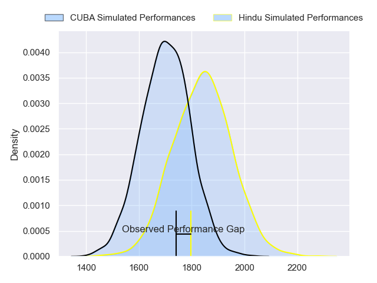
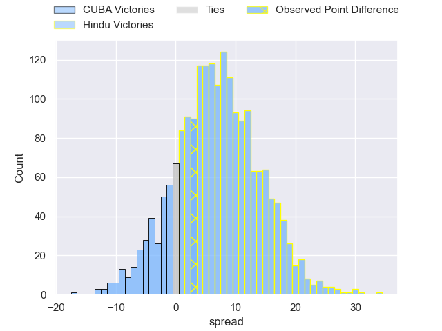
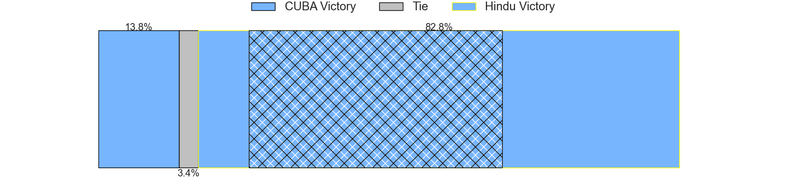
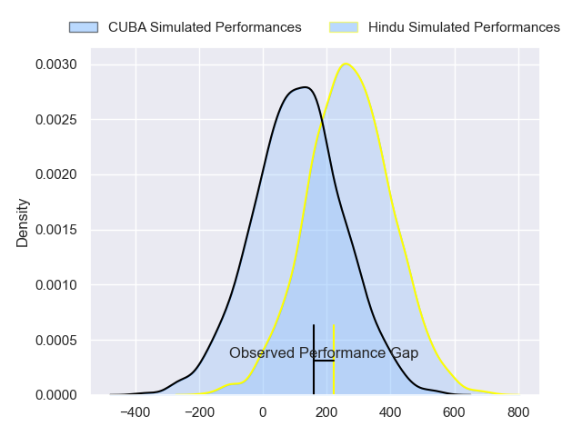
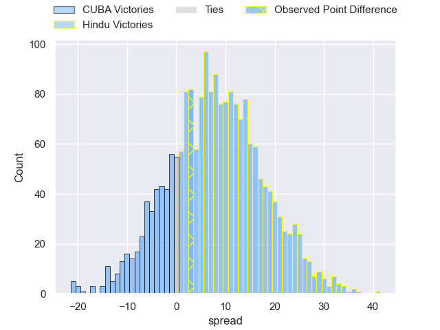

---  
layout: page  
title: CUBA at Hindu; 14-17  
date: 2024-04-27 18:00:00 -0500  
categories: "URBA Top 12 2024" match review  
---
# CUBA at Hindu; 14-17

# Club Level Predictions

The first set of predictions treats a club as the smallest object, as the club develops its members, organizes a gameplan, and deploys its players as needed for each match. This club model has a prediction of 0.685, which translates to predicting Hindu to win by 7.0.

Our Over/Under is 49.5 - and combined with the spread above, we have a predicted scoreline of 21 to 28

Each club has a rating and a rating deviation (similar to a Glicko rating), and expected performances can be generated. This allows for simulated matches and spreads like the ones below.
## Projected Performances - Club Model

## Projected Spreads - Club Model

## Projected Results - Club Model

# Player Level Predictions - Version 2

Treating teams instead as an entity made up of the currently active players, I have ratings for each player in an altogether different system. These can be combined to form team ratings once teamsheets are announced, weighting starters a bit higher than the reserves. After the match is played, players can be weighted by their minutes on the field, allowing for an accurate measure of the team's composition. With these compiled team ratings, we can make predictions, measure inaccuracy, and update the individual player ratings.
## Prediction without Player Minutes: Hindu by 8.4

Hindu by 4.5 on a neutral pitch

## Projected Performances - Player Model

## Projected Spreads - Player Model

## Projected Results - Player Model

|   Away Minutes | Away Player             |   Away Percentile |   Number |   Home Percentile | Home Player             |   Home Minutes |
|---------------:|:------------------------|------------------:|---------:|------------------:|:------------------------|---------------:|
|             80 | Facundo Aguirre         |             26.74 |        1 |             17.83 | Franco Diviesti         |             80 |
|             80 | Enrique Devoto          |             43.56 |        2 |             16.56 | Agustin Capurro         |             80 |
|             80 | Francisco Garoby        |             47.8  |        3 |             14.2  | Nicolas Leiva           |             80 |
|             80 | Santiago Uriarte        |             32.28 |        4 |             40.53 | Carlos Repetto          |             80 |
|             80 | Santiago Landau         |             28.76 |        5 |             19.54 | Juan Ignacio Comolli    |             80 |
|             80 | Lucas Campion           |             25.45 |        6 |             16.61 | Tomas Scallan           |             80 |
|             80 | Segundo Pisani          |             23.18 |        7 |             14.81 | Santino Amayav          |             80 |
|             80 | Benito Ortiz de Rozas   |             42.46 |        8 |             32.99 | Nicolas Amaya           |             80 |
|             80 | Manuel Madero           |             34.04 |        9 |             15.53 | Lucas Fernandez Miranda |             80 |
|             80 | Valentin Mastroizi      |             39.95 |       10 |             94.52 | Santiago Fernandez      |             80 |
|             80 | Pedro Mesones           |             48.19 |       11 |             22.81 | Federico Graglia        |             80 |
|             80 | Felipe de la Vega       |             25.28 |       12 |             16.06 | Bautista Farise         |             80 |
|             80 | Felipe Perdomo          |             26.4  |       13 |             81.94 | Belisario Agulla        |             80 |
|             80 | Francisco Nabia         |             47.37 |       14 |             18.13 | Tomas Amher             |             80 |
|             80 | Segundo Perdomo         |             24.62 |       15 |             15.33 | Lisandro Rodriguez      |             80 |
|              0 | Agustín Elías           |            nan    |       16 |            nan    | Benjamin Silveyra       |              0 |
|              0 | Tomas Anderlic          |             25.56 |       17 |            nan    | Rodrigo Palma           |              0 |
|              0 | Juan Cruz De Pellegrini |            nan    |       18 |            nan    | Mariano Leiva           |              0 |
|              0 | Esteban Iribarne        |            nan    |       19 |             21.72 | Elias Banach            |              0 |
|              0 | Tomas Recondo           |            nan    |       20 |             17.2  | Agustin Arburua         |              0 |
|              0 | Facundo Fontan Gotta    |             37.23 |       21 |            nan    | Lucas Pulido            |              0 |
|              0 | Mateo Mengelle          |            nan    |       22 |             74.67 | Joaquin Diaz Bonilla    |              0 |
|              0 | Pedro Castro Nevares    |            nan    |       23 |            nan    | Valentin Benito         |              0 |

