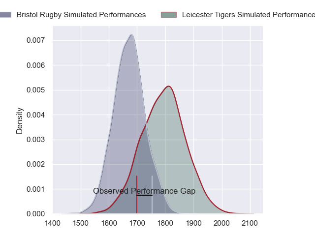
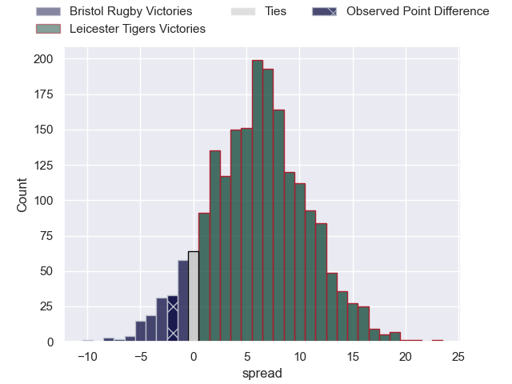
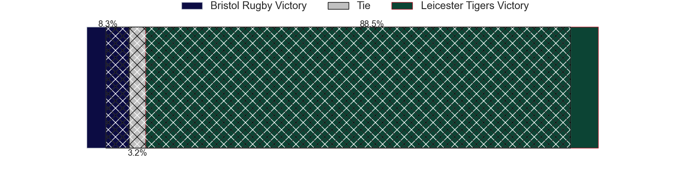
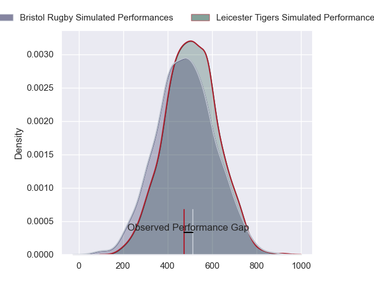
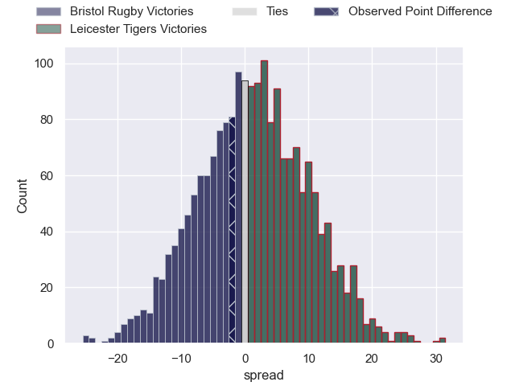

---  
layout: page  
title: Bristol Rugby at Leicester Tigers; 21-19  
date: 2024-04-27 18:00:00 -0500  
categories: "Gallagher Premiership 2023" match review  
---
# Bristol Rugby at Leicester Tigers; 21-19

# Club Level Predictions

The first set of predictions treats a club as the smallest object, as the club develops its members, organizes a gameplan, and deploys its players as needed for each match. This club model has a prediction of 0.665, which translates to predicting Leicester Tigers to win by 6.0.

Our Over/Under is 59.5 - and combined with the spread above, we have a predicted scoreline of 27 to 33

Each club has a rating and a rating deviation (similar to a Glicko rating), and expected performances can be generated. This allows for simulated matches and spreads like the ones below.
## Projected Performances - Club Model

## Projected Spreads - Club Model

## Projected Results - Club Model

# Player Level Predictions - Version 2

Treating teams instead as an entity made up of the currently active players, I have ratings for each player in an altogether different system. These can be combined to form team ratings once teamsheets are announced, weighting starters a bit higher than the reserves. After the match is played, players can be weighted by their minutes on the field, allowing for an accurate measure of the team's composition. With these compiled team ratings, we can make predictions, measure inaccuracy, and update the individual player ratings.
## Prediction without Player Minutes: Leicester Tigers by 2.0

Bristol Rugby by 6.1 on a neutral pitch

## Projected Performances - Player Model

## Projected Spreads - Player Model

## Projected Results - Player Model

|   Away Minutes | Away Player                |   Away Percentile |   Number |   Home Percentile | Home Player           |   Home Minutes |
|---------------:|:---------------------------|------------------:|---------:|------------------:|:----------------------|---------------:|
|             63 | Ellis Genge                |             77.72 |        1 |             89.2  | James Cronin          |             56 |
|             63 | Gabriel Oghre              |             72.09 |        2 |             94.78 | Julian Montoya        |             59 |
|             63 | Kyle Sinckler              |             92.48 |        3 |             36.35 | Dan Cole              |             56 |
|             59 | James Dun                  |             91.78 |        4 |             90.81 | George Martin         |             63 |
|             80 | Joe Batley                 |             90.08 |        5 |             72.79 | Ollie Chessum         |             80 |
|             75 | Steven Luatua              |             99.28 |        6 |             84.62 | Hanro Liebenberg      |             66 |
|             80 | Fitz Harding               |             88.92 |        7 |             83.79 | Tommy Reffell         |             80 |
|             80 | Magnus Bradbury            |             54.86 |        8 |             81.3  | Jasper Wiese          |             80 |
|             69 | Harry Randall              |             92.6  |        9 |             69.13 | Jack van Poortvliet   |             60 |
|             60 | AJ MacGinty                |             96.88 |       10 |             86.75 | Handre Pollard        |             80 |
|             80 | Gabriel Ibitoye            |             93.83 |       11 |             62.97 | Ollie Hassell-Collins |             80 |
|             80 | James Williams             |             81.83 |       12 |             78.86 | Dan Kelly             |             80 |
|             80 | Benhard Janse van Rensburg |             92.46 |       13 |             83.19 | Matt Scott            |             75 |
|             80 | Ratu Naulago               |             71.66 |       14 |             92.91 | Mike Brown            |             80 |
|             63 | Richard Lane               |             57.25 |       15 |             29.77 | Freddie Steward       |             80 |
|             17 | Jake Woolmore              |             84.96 |       16 |             74.83 | Francois van Wyk      |             24 |
|             17 | Harry Thacker              |             78.31 |       17 |              7.23 | Charlie Clare         |             21 |
|             17 | Max Lahiff                 |             49.37 |       18 |             38.57 | Will Hurd             |             24 |
|             21 | Josh Caulfield             |             47.04 |       19 |             76.3  | Harry Wells           |             17 |
|              5 | Jake Heenan                |             57.33 |       20 |             30.04 | Olly Cracknell        |             14 |
|             11 | Kieran Marmion             |             86.89 |       21 |             41.65 | Tom Whiteley          |             20 |
|             20 | Virimi Vakatawa            |             92.34 |       22 |            nan    | Phil Cokanasiga       |              5 |
|             17 | Piers O'Conor              |             20.77 |       23 |            nan    | nan                   |            nan |

