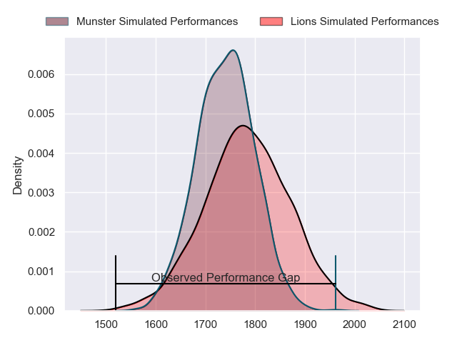
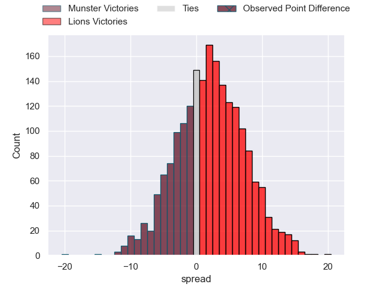
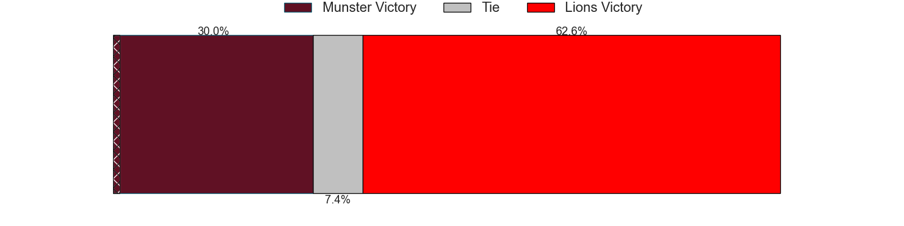
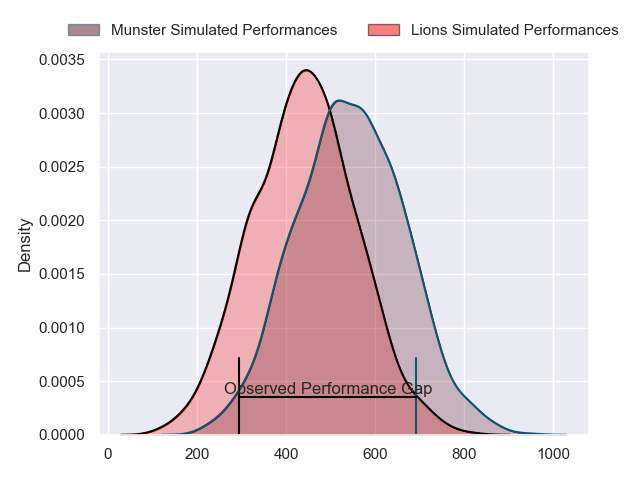
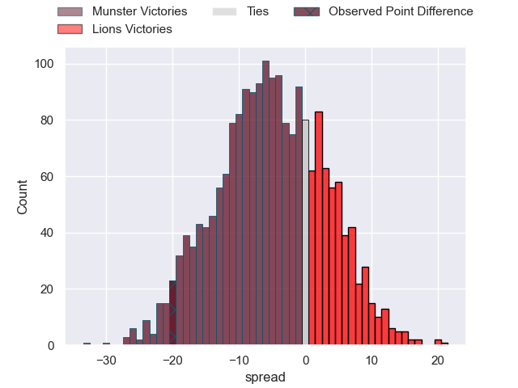
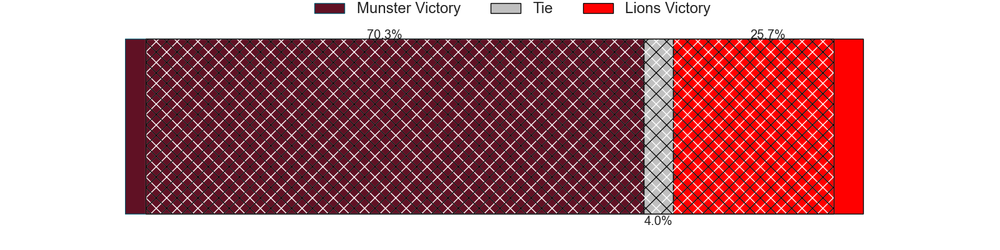

---  
layout: page  
title: Munster at Lions; 33-13  
date: 2024-04-27 18:00:00 -0500  
categories: "United Rugby Championship 2023" match review  
---
# Munster at Lions; 33-13

# Club Level Predictions

The first set of predictions treats a club as the smallest object, as the club develops its members, organizes a gameplan, and deploys its players as needed for each match. This club model has a prediction of 0.563, which translates to predicting Lions to win by 2.2.

Our Over/Under is 79.5 - and combined with the spread above, we have a predicted scoreline of 39 to 41

Each club has a rating and a rating deviation (similar to a Glicko rating), and expected performances can be generated. This allows for simulated matches and spreads like the ones below.
## Projected Performances - Club Model

## Projected Spreads - Club Model

## Projected Results - Club Model

# Player Level Predictions - Version 2

Treating teams instead as an entity made up of the currently active players, I have ratings for each player in an altogether different system. These can be combined to form team ratings once teamsheets are announced, weighting starters a bit higher than the reserves. After the match is played, players can be weighted by their minutes on the field, allowing for an accurate measure of the team's composition. With these compiled team ratings, we can make predictions, measure inaccuracy, and update the individual player ratings.
## Prediction without Player Minutes: Munster by 5.1

Munster by 8.8 on a neutral pitch

## Projected Performances - Player Model

## Projected Spreads - Player Model

## Projected Results - Player Model

|   Away Minutes | Away Player     |   Away Percentile |   Number |   Home Percentile | Home Player          |   Home Minutes |
|---------------:|:----------------|------------------:|---------:|------------------:|:---------------------|---------------:|
|             60 | Jeremy Loughman |             95.4  |        1 |             45.74 | Morgan Naude         |             64 |
|             68 | Niall Scannell  |             93.87 |        2 |             69.94 | Jaco Visagie         |             48 |
|             59 | Stephen Archer  |             98.43 |        3 |             98.63 | Ruan Dreyer          |             48 |
|             80 | RG Snyman       |             99.15 |        4 |             90.17 | Willem Alberts       |             52 |
|             80 | Tadhg Beirne    |             99.03 |        5 |             48.67 | Ruan Delport         |             80 |
|             52 | Peter O'Mahony  |             97.49 |        6 |             82.32 | JC Pretorius         |             80 |
|             80 | Alex Kendellen  |             81.24 |        7 |             69.53 | Emmanuel Tshituka    |             55 |
|             48 | Jack O'Donoghue |             78.52 |        8 |             98.98 | Francke Horn         |             80 |
|             45 | Conor Murray    |             98.3  |        9 |             87.66 | Morne van den Berg   |             68 |
|             80 | Jack Crowley    |             54.83 |       10 |             93.99 | Sanele Nohamba       |             80 |
|             80 | Shane Daly      |             96.37 |       11 |             91.11 | Edwill van der Merwe |             80 |
|             80 | Sean O'Brien    |             26.28 |       12 |             93.77 | Marius Louw          |             80 |
|             68 | Antoine Frisch  |             91.66 |       13 |             14.07 | Erich Cronje         |             80 |
|             80 | Calvin Nash     |             93.8  |       14 |             61.99 | Richard Kriel        |             80 |
|             55 | Simon Zebo      |             94.72 |       15 |             64.07 | Jordan Hendrikse     |             64 |
|             12 | Eoghan Clarke   |            nan    |       16 |             82    | PJ Botha             |             32 |
|             20 | Josh Wycherley  |             40.94 |       17 |             80.12 | Jean-Pierre Smith    |             16 |
|             21 | Oli Jager       |             89.72 |       18 |             71.4  | Asenathi Ntlabakanye |             32 |
|             28 | Thomas Ahern    |             54.13 |       19 |             90.9  | Reinhard Nothnagel   |             28 |
|             32 | Gavin Coombes   |             78.01 |       20 |             86.02 | Ruan Venter          |             25 |
|             35 | Craig Casey     |             78.3  |       21 |             21.98 | Sibusiso Sangweni    |              0 |
|             12 | Joey Carbery    |             74.41 |       22 |            nan    | Nico Steyn           |             12 |
|             25 | Mike Haley      |             87.69 |       23 |            nan    | Gianni Lombard       |             16 |

