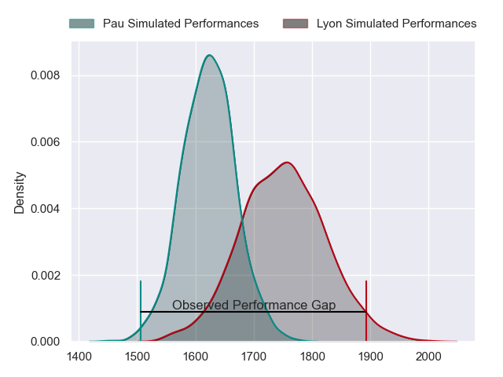
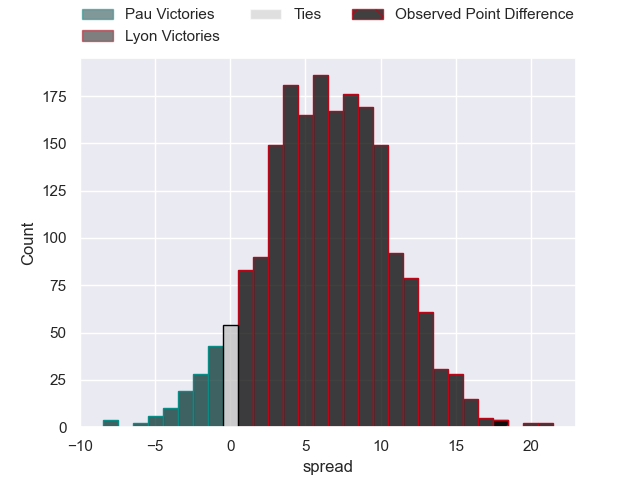
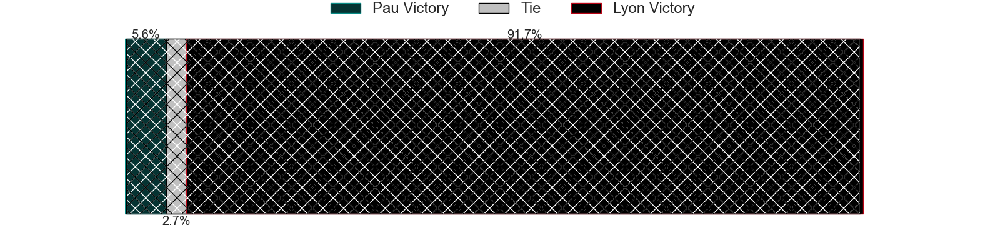
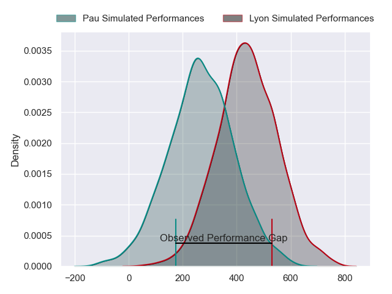
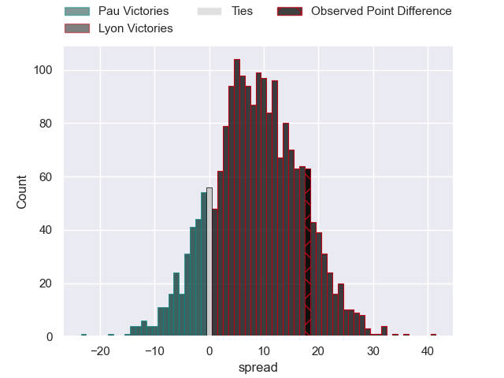
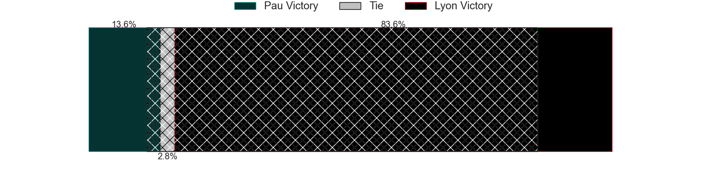

---  
layout: page  
title: Pau at Lyon; 20-38  
date: 2024-04-27 18:00:00 -0500  
categories: "Top 14 Orange 2023" match review  
---
# Pau at Lyon; 20-38

# Club Level Predictions

The first set of predictions treats a club as the smallest object, as the club develops its members, organizes a gameplan, and deploys its players as needed for each match. This club model has a prediction of 0.673, which translates to predicting Lyon to win by 6.3.

Our Over/Under is 55.5 - and combined with the spread above, we have a predicted scoreline of 25 to 31

Each club has a rating and a rating deviation (similar to a Glicko rating), and expected performances can be generated. This allows for simulated matches and spreads like the ones below.
## Projected Performances - Club Model

## Projected Spreads - Club Model

## Projected Results - Club Model

# Player Level Predictions - Version 2

Treating teams instead as an entity made up of the currently active players, I have ratings for each player in an altogether different system. These can be combined to form team ratings once teamsheets are announced, weighting starters a bit higher than the reserves. After the match is played, players can be weighted by their minutes on the field, allowing for an accurate measure of the team's composition. With these compiled team ratings, we can make predictions, measure inaccuracy, and update the individual player ratings.
## Prediction without Player Minutes: Lyon by 9.2

Lyon by 1.6 on a neutral pitch

## Projected Performances - Player Model

## Projected Spreads - Player Model

## Projected Results - Player Model

|   Away Minutes | Away Player          |   Away Percentile |   Number |   Home Percentile | Home Player          |   Home Minutes |
|---------------:|:---------------------|------------------:|---------:|------------------:|:---------------------|---------------:|
|             46 | Simon-Pierre Chauvac |             39.73 |        1 |             15.91 | Sebastien Taofifenua |             50 |
|             46 | Lucas Rey            |             13.65 |        2 |             83.94 | Liam Coltman         |             61 |
|             46 | Guram Papidze        |             17.94 |        3 |             90.94 | Demba Bamba          |             59 |
|             46 | Guillaume Ducat      |             18.38 |        4 |             81.74 | Felix Lambey         |             59 |
|             80 | Samuel Whitelock     |             98.91 |        5 |             45.47 | Romain Taofifenua    |             53 |
|             70 | Sacha Zegueur        |             18.71 |        6 |             61.03 | Joel Kpoku           |             80 |
|             18 | Luke Whitelock       |             98.93 |        7 |             89.27 | Arno Botha           |             80 |
|             80 | Beka Gorgadze        |             47.88 |        8 |             62.34 | Mickael Guillard     |             80 |
|             54 | Dan Robson           |             97.46 |        9 |             92.18 | Baptiste Couilloud   |             65 |
|             80 | Joe Simmonds         |             78.44 |       10 |             70.39 | Leo Berdeu           |             80 |
|             80 | Samuel Ezeala        |              9.14 |       11 |             97.71 | Monty Ioane          |             65 |
|             32 | Nathan Decron        |             59.09 |       12 |             16.32 | Josiah Maraku        |             80 |
|             80 | Elliot Roudil        |             14.09 |       13 |             63.41 | Alfred Parisien      |             70 |
|             80 | Emilien Gailleton    |             59.66 |       14 |             59.89 | Xavier Mignot        |             80 |
|             80 | Theo Attissogbe      |             15.27 |       15 |             80.92 | Davit Niniashvili    |             80 |
|             62 | Reece Hewat          |             73.9  |       16 |             27.29 | Jerome Rey           |             30 |
|             48 | Axel Desperes        |             73.25 |       17 |             92.27 | Jordan Taufua        |             27 |
|             34 | Youri Delhommel      |             49    |       18 |             28.05 | Theo William         |             21 |
|             34 | Siate Tokolahi       |             81.49 |       19 |             27    | Valentin Simutoga    |             21 |
|             34 | Lekima Tagitagivalu  |             67.23 |       20 |             50    | Yanis Charcosset     |             19 |
|             34 | Hugo Parrou          |            nan    |       21 |             58.27 | Alexandre Tchaptchet |             15 |
|             26 | Thibault Daubagna    |             90.06 |       22 |             75.26 | Martin Page-Relo     |             15 |
|             10 | Thibault Hamonou     |              8.82 |       23 |             59.54 | Ethan Dumortier      |             10 |

