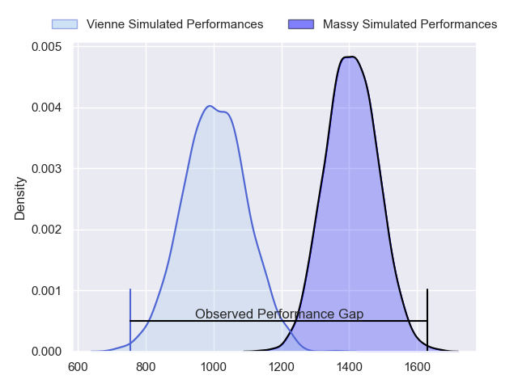
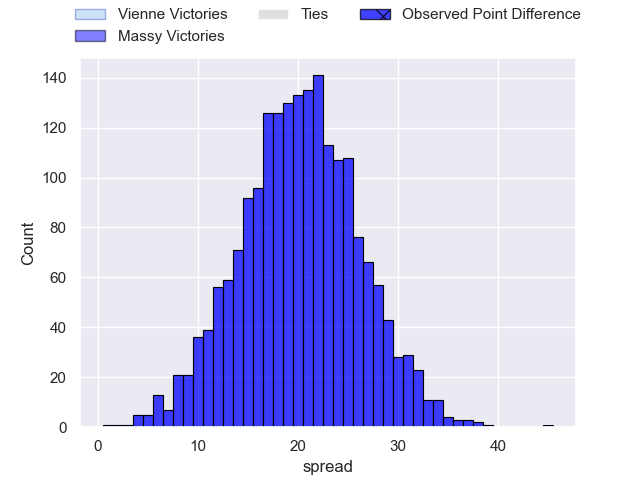
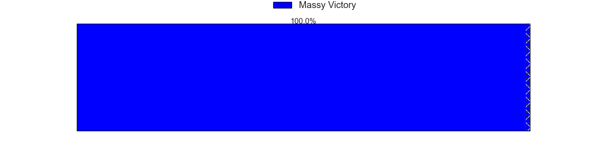
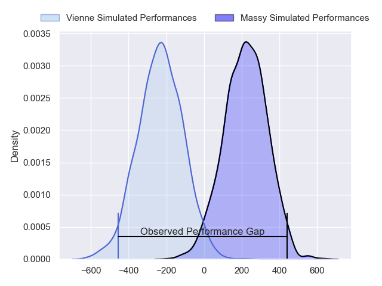
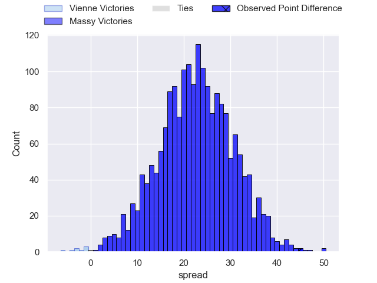
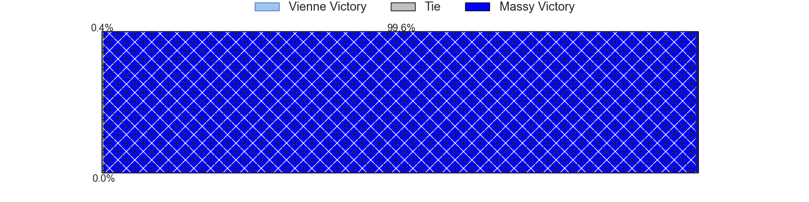

---  
layout: page  
title: Vienne at Massy; 17-62  
date: 2024-04-27 18:00:00 -0500  
categories: "Nationale 2023" match review  
---
# Vienne at Massy; 17-62

# Club Level Predictions

The first set of predictions treats a club as the smallest object, as the club develops its members, organizes a gameplan, and deploys its players as needed for each match. This club model has a prediction of 0.903, which translates to predicting Massy to win by 20.3.

Our Over/Under is 47.5 - and combined with the spread above, we have a predicted scoreline of 14 to 34

Each club has a rating and a rating deviation (similar to a Glicko rating), and expected performances can be generated. This allows for simulated matches and spreads like the ones below.
## Projected Performances - Club Model

## Projected Spreads - Club Model

## Projected Results - Club Model

# Player Level Predictions - Version 2

Treating teams instead as an entity made up of the currently active players, I have ratings for each player in an altogether different system. These can be combined to form team ratings once teamsheets are announced, weighting starters a bit higher than the reserves. After the match is played, players can be weighted by their minutes on the field, allowing for an accurate measure of the team's composition. With these compiled team ratings, we can make predictions, measure inaccuracy, and update the individual player ratings.
## Prediction without Player Minutes: Massy by 21.5

Massy by 17.3 on a neutral pitch

## Projected Performances - Player Model

## Projected Spreads - Player Model

## Projected Results - Player Model

|   Away Minutes | Away Player              |   Away Percentile |   Number |   Home Percentile | Home Player              |   Home Minutes |
|---------------:|:-------------------------|------------------:|---------:|------------------:|:-------------------------|---------------:|
|             45 | Benjamin Robin           |              7.64 |        1 |             36.83 | Robin Poipy              |             48 |
|             45 | Dimitri Gibierge         |              6.95 |        2 |             29.45 | Pierre-Alexandre Duclieu |             45 |
|             45 | Pierre-Mathieu Fernandes |              4.8  |        3 |             58.18 | Nicolas Ferrer           |             48 |
|             48 | Pierre Chapelle          |              3.52 |        4 |             33.74 | Lilian Rousset           |             80 |
|             80 | Nathanael Grosu          |             21.97 |        5 |             27.55 | Andrei Mahu              |             48 |
|             53 | Léon Peyrat              |              6.09 |        6 |             66.19 | Alexandre Loubiere       |             55 |
|             80 | Steven Giroud            |              2.87 |        7 |             47.07 | Clément Vidoni           |             80 |
|             80 | Théo Minodier            |             19.18 |        8 |             24.55 | Samuel Nollet            |             80 |
|             56 | Enzo Ravanello           |             17.87 |        9 |             74.68 | Benjamin Prier           |             55 |
|             63 | Charles Hager            |             16.71 |       10 |             16.97 | Hugo Verdu               |             80 |
|             80 | Antoine Grange           |             15.09 |       11 |              1.29 | Kimami Sitauti           |              6 |
|             80 | Matthias Giovale         |              1.99 |       12 |             68.62 | Victorien Jacomme        |             80 |
|             57 | Pierre Mollard           |              1.37 |       13 |             76.21 | Arthur Seigneuret        |             80 |
|             80 | Théo Brunel              |             19.53 |       14 |             79.77 | Alex Preira              |             80 |
|             80 | Brandon Bellavia         |              1.26 |       15 |             42.71 | Giorgi Gogoladze         |             48 |
|             35 | Louan Capuano            |              3.04 |       16 |              1.18 | Fernandez Correa         |             32 |
|             35 | Yanis Gimenez            |             13.91 |       17 |             39.57 | Nolan Pienaar            |             35 |
|             35 | Corentin Durand          |             18.9  |       18 |             75.42 | Tijde Visser             |             32 |
|             32 | Charles Massot           |              9.95 |       19 |             70.27 | Saba Pesvianidze         |             32 |
|             27 | Guillaume Moroldo        |              1.91 |       20 |             31.18 | Hugo Boutin              |             25 |
|             24 | Malory Piet              |              1.49 |       21 |             29.15 | Lucas Rubio              |             25 |
|             17 | Julien Hervouet          |             28.98 |       22 |            nan    | Lowen Michel Trumeau     |             74 |
|             23 | Bastien Colliat          |              1.52 |       23 |             36.55 | Tristan Joly             |             32 |

