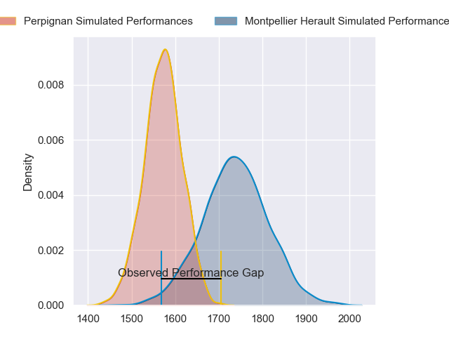
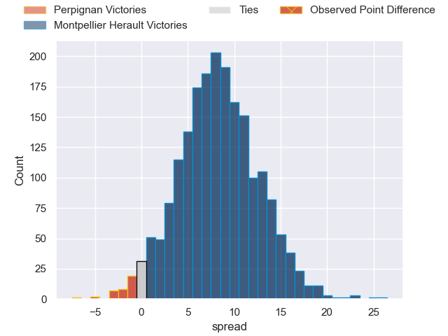
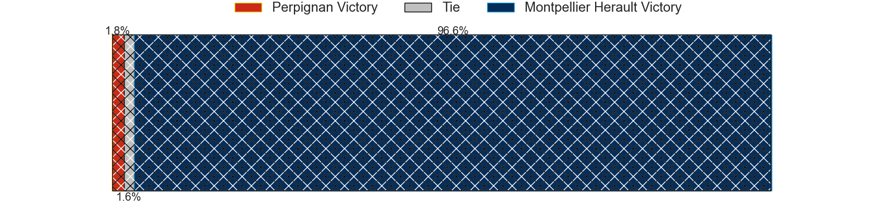
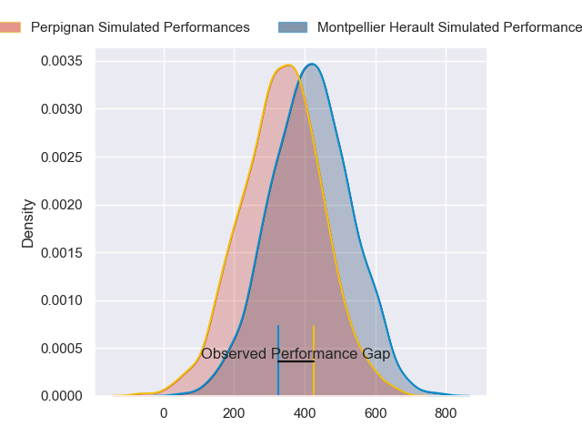
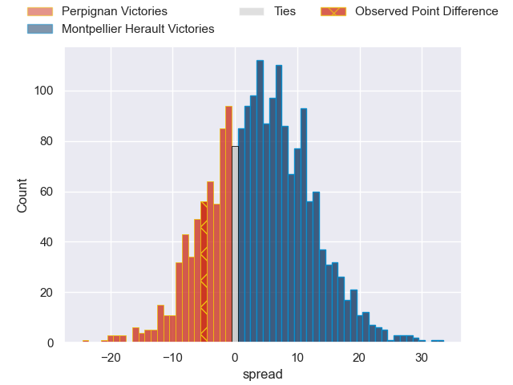
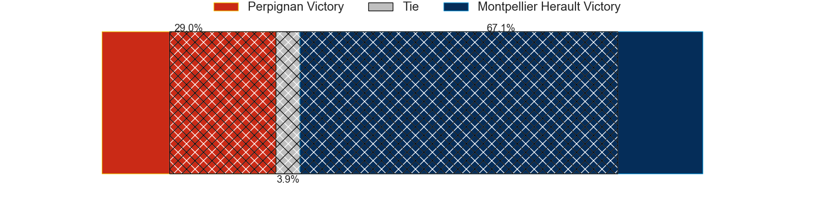

---  
layout: page  
title: Perpignan at Montpellier Herault; 25-20  
date: 2024-04-27 18:00:00 -0500  
categories: "Top 14 Orange 2023" match review  
---
# Perpignan at Montpellier Herault; 25-20

# Club Level Predictions

The first set of predictions treats a club as the smallest object, as the club develops its members, organizes a gameplan, and deploys its players as needed for each match. This club model has a prediction of 0.722, which translates to predicting Montpellier Herault to win by 8.4.

Our Over/Under is 45.5 - and combined with the spread above, we have a predicted scoreline of 19 to 27

Each club has a rating and a rating deviation (similar to a Glicko rating), and expected performances can be generated. This allows for simulated matches and spreads like the ones below.
## Projected Performances - Club Model

## Projected Spreads - Club Model

## Projected Results - Club Model

# Player Level Predictions - Version 2

Treating teams instead as an entity made up of the currently active players, I have ratings for each player in an altogether different system. These can be combined to form team ratings once teamsheets are announced, weighting starters a bit higher than the reserves. After the match is played, players can be weighted by their minutes on the field, allowing for an accurate measure of the team's composition. With these compiled team ratings, we can make predictions, measure inaccuracy, and update the individual player ratings.
## Prediction without Player Minutes: Montpellier Herault by 7.2

Perpignan by 0.3 on a neutral pitch

## Projected Performances - Player Model

## Projected Spreads - Player Model

## Projected Results - Player Model

|   Away Minutes | Away Player           |   Away Percentile |   Number |   Home Percentile | Home Player                 |   Home Minutes |
|---------------:|:----------------------|------------------:|---------:|------------------:|:----------------------------|---------------:|
|             48 | Xavier Chiocci        |             63.08 |        1 |              2.55 | Baptiste Erdocio            |             65 |
|             46 | Seilala Lam           |             90.18 |        2 |             89.16 | Christopher Tolofua         |             66 |
|             46 | Pietro Ceccarelli     |             74.44 |        3 |             70.81 | Luka Japaridze              |             66 |
|             46 | Mathieu Tanguy        |             73.18 |        4 |             47.57 | Florian Verhaeghe           |             80 |
|             80 | Posolo Tuilagi        |             48.79 |        5 |             74.27 | Bastien Chalureau           |             67 |
|             80 | Kelian Galletier      |             36.56 |        6 |             80.76 | Nicolaas Janse van Rensburg |             49 |
|             20 | Jacobus van Tonder    |             82.56 |        7 |             87.46 | Yacouba Camara              |             44 |
|             67 | Joaquin Oviedo        |             85.17 |        8 |             50.38 | Sam Simmonds                |             80 |
|             21 | Sadek Deghmache       |             11.91 |        9 |             88.94 | Cobus Reinach               |             56 |
|             80 | Jake McIntyre         |             93.73 |       10 |             45.95 | Louis Carbonel              |             80 |
|             80 | Lucas Dubois          |             84.09 |       11 |             90.53 | George Bridge               |             80 |
|             80 | Jeronimo de la Fuente |             99.38 |       12 |             73.23 | Jan Serfontein              |             65 |
|             50 | Alivereti Duguivalu   |             36.24 |       13 |             46.7  | Arthur Vincent              |             75 |
|             75 | Tavite Veredamu       |             86.32 |       14 |              3.39 | Gabriel Ngandebe            |             80 |
|             80 | Louis Dupichot        |             73.37 |       15 |             68.34 | Anthony Bouthier            |             20 |
|             34 | Ignacio Ruiz          |             87.12 |       16 |             37.83 | Vano Karkadze               |             14 |
|             37 | Sacha Lotrian         |             67.19 |       17 |            nan    | Luca Tabarot                |             15 |
|             13 | So'otala Fa'aso'o     |             92.58 |       18 |             51.94 | Tyler Duguid                |             44 |
|             34 | Marvin Orie           |             91.02 |       19 |             23.42 | Clement Doumenc             |             36 |
|             60 | Patrick Sobela        |             94.5  |       20 |             42.13 | Leo Coly                    |             24 |
|             59 | Tom Ecochard          |             89.15 |       21 |             16.94 | Thomas Darmon               |             20 |
|             30 | Apisai Naqalevu       |             46.08 |       22 |             96.14 | Ben Lam                     |             60 |
|             34 | Nemo Roelofse         |             76.79 |       23 |             51.03 | Lasha Macharashvili         |             14 |

