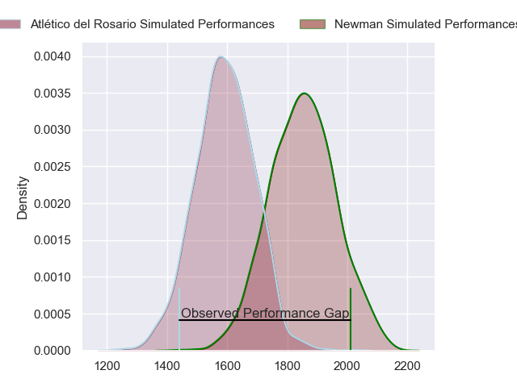
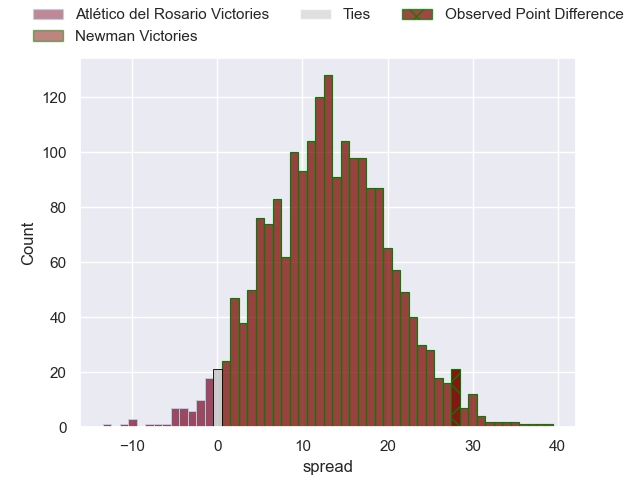
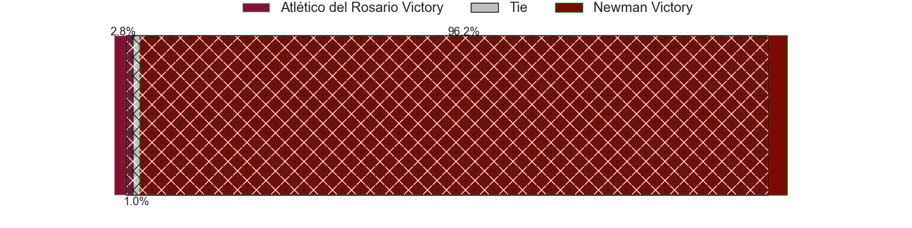
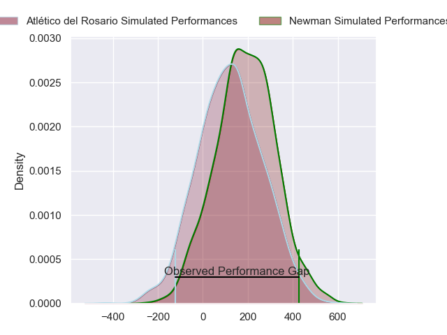
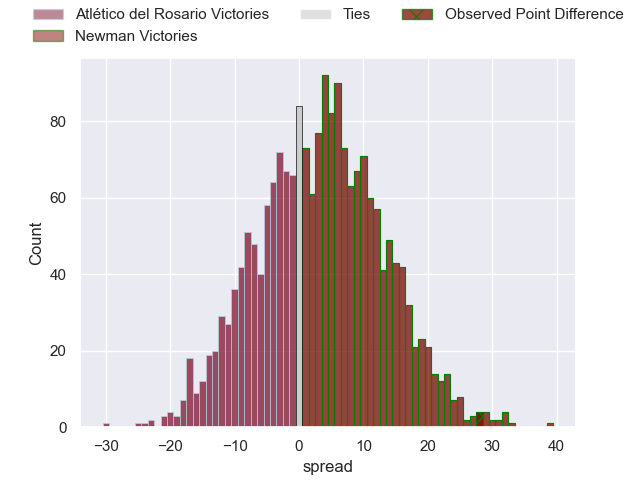
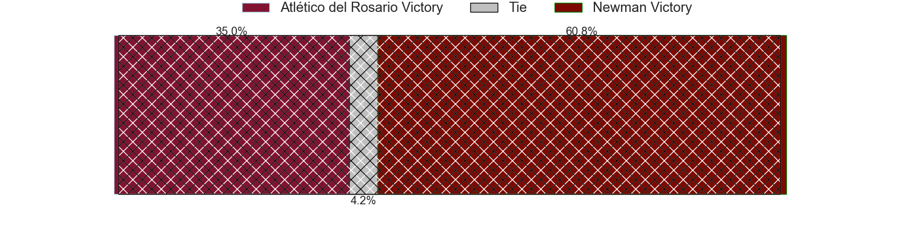

---  
layout: page  
title: Atletico del Rosario at Newman; 17-45  
date: 2024-04-27 18:00:00 -0500  
categories: "URBA Top 12 2024" match review  
---
# Atletico del Rosario at Newman; 17-45

# Club Level Predictions

The first set of predictions treats a club as the smallest object, as the club develops its members, organizes a gameplan, and deploys its players as needed for each match. This club model has a prediction of 0.801, which translates to predicting Newman to win by 12.7.

Our Over/Under is 40.5 - and combined with the spread above, we have a predicted scoreline of 14 to 27

Each club has a rating and a rating deviation (similar to a Glicko rating), and expected performances can be generated. This allows for simulated matches and spreads like the ones below.
## Projected Performances - Club Model

## Projected Spreads - Club Model

## Projected Results - Club Model

# Player Level Predictions - Version 2

Treating teams instead as an entity made up of the currently active players, I have ratings for each player in an altogether different system. These can be combined to form team ratings once teamsheets are announced, weighting starters a bit higher than the reserves. After the match is played, players can be weighted by their minutes on the field, allowing for an accurate measure of the team's composition. With these compiled team ratings, we can make predictions, measure inaccuracy, and update the individual player ratings.
## Prediction without Player Minutes: Newman by 4.1

Atlético del Rosario by 0.0 on a neutral pitch

## Projected Performances - Player Model

## Projected Spreads - Player Model

## Projected Results - Player Model

|   Away Minutes | Away Player                 |   Away Percentile |   Number |   Home Percentile | Home Player               |   Home Minutes |
|---------------:|:----------------------------|------------------:|---------:|------------------:|:--------------------------|---------------:|
|             82 | Agustin Fernandez           |             12.24 |        1 |             61.21 | Fermin Perkins            |             82 |
|             82 | Jeremias Aime               |              9.41 |        2 |             43.35 | Marcelo Brandi            |             82 |
|             82 | Lisandro Dipierri           |              8.42 |        3 |             64.35 | Luciano Borio             |             82 |
|             82 | Matias Kremer               |             12.99 |        4 |             59.22 | Pablo Cardinal            |             82 |
|             82 | Octavio Capella             |             12.01 |        5 |             44.9  | Alejandro Urtubey         |             82 |
|             82 | Santiago Casals             |             10.1  |        6 |             40.26 | Joaquin de la Vega        |             82 |
|             82 | Lucas Malanos               |             10.1  |        7 |             37.75 | Miguel Urtubey            |             82 |
|             82 | Valentin Tumosa             |             13.55 |        8 |             57.54 | Rodrigo Diaz de Vivar     |             82 |
|             82 | Matias Savatierra           |              9.57 |        9 |             43.62 | Felix Branca              |             82 |
|             82 | Pedro de Aro                |             10.7  |       10 |             38.64 | Gonzalo Guiterrez Taboada |             82 |
|             82 | Maximiliano Nicoli Fiscella |             15.56 |       11 |             56.73 | Justo Ortiz Basualdo      |             82 |
|             82 | Guido Vidalle               |             10.96 |       12 |             37.61 | Tomas Keena               |             82 |
|             82 | Valentino Aime              |             17.06 |       13 |             52.18 | Silvestre Casa            |             82 |
|             82 | Facundo Gerosa              |             20.58 |       14 |             41.75 | Leandro Leivas            |             82 |
|             82 | Pedro Bisio                 |             10.05 |       15 |             35.18 | Francisco Pasman          |             82 |
|              0 | Matias Malanos              |            nan    |       16 |            nan    | Rodrigo Pueyrredon        |              0 |
|              0 | Bruno Montenegro            |            nan    |       17 |             23.8  | Miguel Prince             |              0 |
|              0 | Jose Leon Caceres Musso     |            nan    |       18 |             21.35 | Bautista Bosch            |              0 |
|              0 | Francisco Echenique Menta   |            nan    |       19 |             30.1  | Tomas Ureta               |              0 |
|              0 | Joaquin Viola Artola        |            nan    |       20 |             19.12 | Mateo Montoya             |              0 |
|              0 | Pedro Guerrero              |            nan    |       21 |            nan    | Segundo Tezanos Pinto     |              0 |
|              0 | Ramiro Musio                |            nan    |       22 |            nan    | Carlos Menendez           |              0 |
|              0 | Federico Mayol              |            nan    |       23 |            nan    | Santiago Marolda          |              0 |

