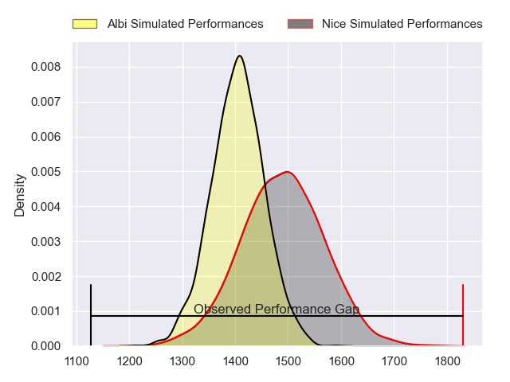
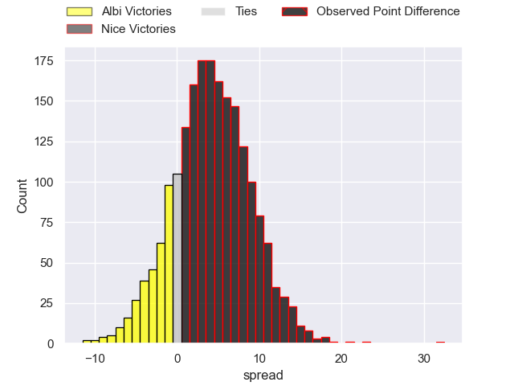
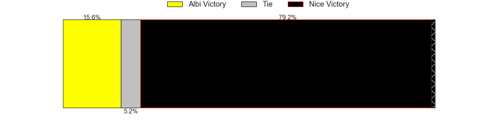
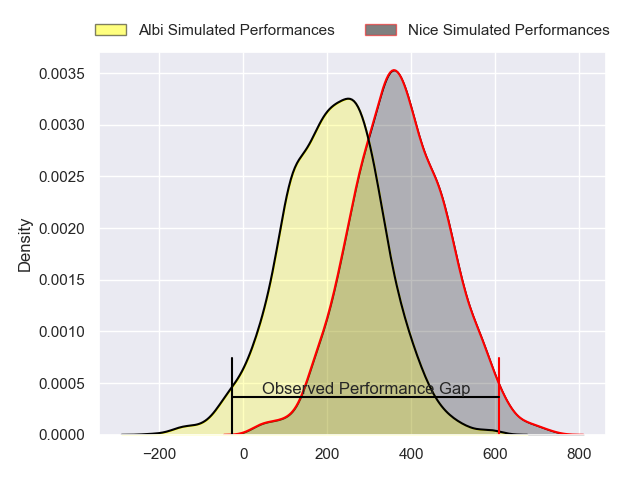
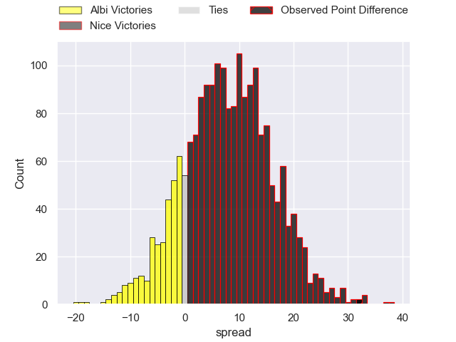
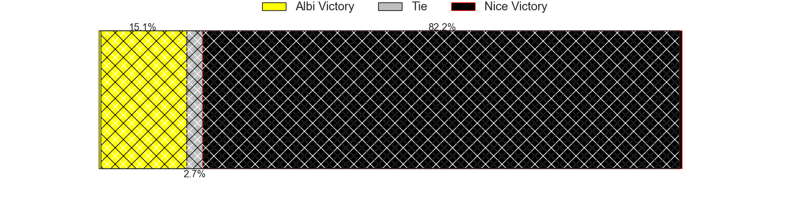

---  
layout: page  
title: Albi at Nice; 15-47  
date: 2024-04-27 18:00:00 -0500  
categories: "Nationale 2023" match review  
---
# Albi at Nice; 15-47

# Club Level Predictions

The first set of predictions treats a club as the smallest object, as the club develops its members, organizes a gameplan, and deploys its players as needed for each match. This club model has a prediction of 0.618, which translates to predicting Nice to win by 4.2.

Our Over/Under is 48.5 - and combined with the spread above, we have a predicted scoreline of 22 to 26

Each club has a rating and a rating deviation (similar to a Glicko rating), and expected performances can be generated. This allows for simulated matches and spreads like the ones below.
## Projected Performances - Club Model

## Projected Spreads - Club Model

## Projected Results - Club Model

# Player Level Predictions - Version 2

Treating teams instead as an entity made up of the currently active players, I have ratings for each player in an altogether different system. These can be combined to form team ratings once teamsheets are announced, weighting starters a bit higher than the reserves. After the match is played, players can be weighted by their minutes on the field, allowing for an accurate measure of the team's composition. With these compiled team ratings, we can make predictions, measure inaccuracy, and update the individual player ratings.
## Prediction without Player Minutes: Nice by 10.8

Nice by 8.0 on a neutral pitch

## Projected Performances - Player Model

## Projected Spreads - Player Model

## Projected Results - Player Model

|   Away Minutes | Away Player             |   Away Percentile |   Number |   Home Percentile | Home Player               |   Home Minutes |
|---------------:|:------------------------|------------------:|---------:|------------------:|:--------------------------|---------------:|
|             44 | Thibaud Sebire          |             51.81 |        1 |              6.46 | Jules Martinez            |             56 |
|             41 | Romain Maurice          |             85.89 |        2 |             78.94 | Sione Anga'aelangi        |             60 |
|             49 | Jean Baptiste De Clercq |             64.64 |        3 |             10.38 | Nicolas Ciancio           |             56 |
|             44 | Guillem Calmon          |             62.26 |        4 |             99.51 | Tom Murday                |             72 |
|             49 | Jacques Engelbrecht     |              5.46 |        5 |             57.16 | Martin Freytes            |             56 |
|             80 | Pierre Roussel          |             18.64 |        6 |             97.97 | Louis Suaud               |             80 |
|             44 | Luke Stringer           |             51.61 |        7 |             62.01 | Arthur Vignolles          |             63 |
|             80 | Sandrick Maciotta       |             85.93 |        8 |             10.49 | Ramiha Tarrel Tia Smiler  |             80 |
|             80 | Gilen Queheille         |             72.55 |        9 |             91.28 | Jules Solinas             |             65 |
|             40 | James Haydn Tedder      |             21.15 |       10 |             53.52 | Mathis Viard              |             80 |
|             80 | Sean Robinson           |             12.63 |       11 |             96.49 | Andrzej Charlat           |             80 |
|              6 | Jarrod Poi              |             10.34 |       12 |             84.43 | Romain Riguet             |             40 |
|             80 | Baptiste Couchinave     |             75.34 |       13 |             12.45 | Luca Cutayar              |             80 |
|             80 | Tim Giresse             |             59.18 |       14 |             93.1  | Simon Delas               |             80 |
|             80 | Enzo Marzocca           |             41.21 |       15 |             90.95 | David Odiete              |             80 |
|             36 | Lucas Pindor            |             46.52 |       16 |             84.13 | Sunia Vola                |             24 |
|             39 | Arthur Castant          |             22.7  |       17 |             62.78 | Santiago Benjamin Ovejero |             20 |
|             31 | Simon Renaud            |             27.62 |       18 |             63.96 | Luvuyo Pupuma             |             24 |
|             36 | Simon Meka              |             59.86 |       19 |             91.56 | Laijiasa Bolenaivalu      |              8 |
|             31 | Dion Evrard Oulai       |             19.66 |       20 |             43.33 | Yann Tivoli               |             24 |
|             36 | Mattéo Coustalat        |             11.23 |       21 |             16.25 | Bastien Berenguel         |             17 |
|             40 | Théo Vidal              |             88.09 |       22 |             18.09 | Matéo Jeune-Joly          |             15 |
|             74 | Benjamin Pehau          |             73.37 |       23 |             85.06 | Nathan Courtade           |             40 |

