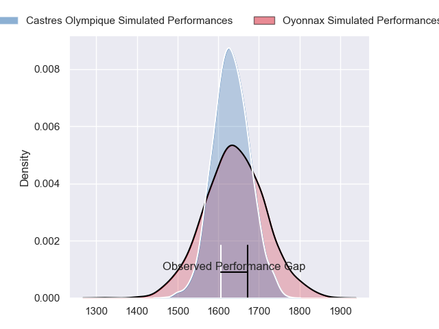
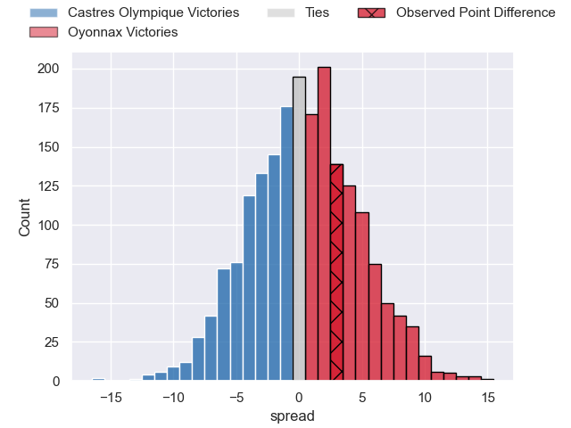
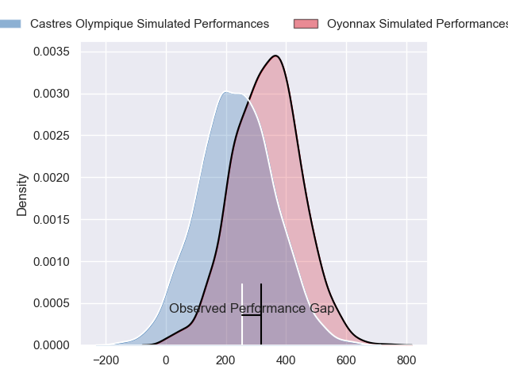
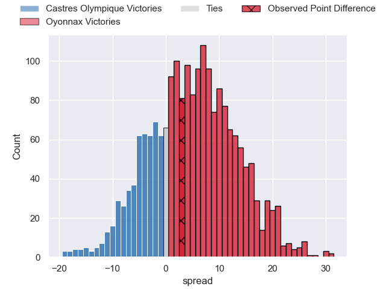
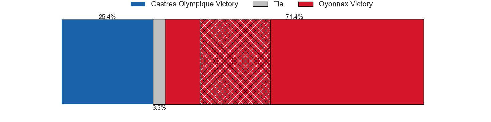

---  
layout: page  
title: Castres Olympique at Oyonnax; 19-22  
date: 2024-04-27 18:00:00 -0500  
categories: "Top 14 Orange 2023" match review  
---
# Castres Olympique at Oyonnax; 19-22

# Club Level Predictions

The first set of predictions treats a club as the smallest object, as the club develops its members, organizes a gameplan, and deploys its players as needed for each match. This club model has a prediction of 0.516, which translates to predicting Oyonnax to win by 0.5.

Our Over/Under is 46.5 - and combined with the spread above, we have a predicted scoreline of 23 to 24

Each club has a rating and a rating deviation (similar to a Glicko rating), and expected performances can be generated. This allows for simulated matches and spreads like the ones below.
## Projected Performances - Club Model

## Projected Spreads - Club Model

## Projected Results - Club Model

# Player Level Predictions - Version 2

Treating teams instead as an entity made up of the currently active players, I have ratings for each player in an altogether different system. These can be combined to form team ratings once teamsheets are announced, weighting starters a bit higher than the reserves. After the match is played, players can be weighted by their minutes on the field, allowing for an accurate measure of the team's composition. With these compiled team ratings, we can make predictions, measure inaccuracy, and update the individual player ratings.
## Prediction without Player Minutes: Oyonnax by 3.8

Castres Olympique by 3.9 on a neutral pitch

## Projected Performances - Player Model

## Projected Spreads - Player Model

## Projected Results - Player Model

|   Away Minutes | Away Player          |   Away Percentile |   Number |   Home Percentile | Home Player        |   Home Minutes |
|---------------:|:---------------------|------------------:|---------:|------------------:|:-------------------|---------------:|
|             49 | Antoine Tichit       |             85.99 |        1 |             46.72 | Antoine Abraham    |             45 |
|             62 | Loris Zarantonello   |             38.65 |        2 |             24.54 | Benjamin Geledan   |             70 |
|             80 | Levan Chilachava     |             80.22 |        3 |             13.42 | Christopher Vaotoa |             67 |
|             80 | Leone Nakarawa       |             94.05 |        4 |             96    | Phoenix Battye     |             80 |
|             63 | Florent Vanverberghe |             67.35 |        5 |             64.32 | Hugo Fabregue      |             54 |
|             74 | Mathieu Babillot     |             30.11 |        6 |             41.82 | Kevin Lebreton     |             80 |
|             56 | Baptiste Delaporte   |             78.14 |        7 |             59.62 | Rory Grice         |             60 |
|             80 | Yann Peysson         |             73.4  |        8 |              4.6  | Loic Godener       |             74 |
|             63 | Jeremy Fernandez     |             25.74 |        9 |              7.23 | Vasil Lobzhanidze  |             13 |
|             80 | Louis Le Brun        |             71.54 |       10 |             85.9  | Domingo Miotti     |             80 |
|             65 | Filipo Nakosi        |             82.34 |       11 |             33.45 | Enzo Reybier       |             80 |
|             80 | Adrea Cocagi         |             86.05 |       12 |             59.28 | Lucas Mensa        |             45 |
|             71 | Adrien Seguret       |             18.43 |       13 |             12.2  | Chris Farrell      |             80 |
|             70 | Nathanael Hulleu     |             79.88 |       14 |              8.77 | Gavin Stark        |             67 |
|             80 | Julien Dumora        |             78.89 |       15 |              6.78 | Justin Bouraux     |             64 |
|             18 | Pierre Colonna       |             22.49 |       16 |            nan    | Julien Ratajczak   |             23 |
|             31 | Quentin Walcker      |             74.93 |       17 |             83.06 | Tommy Raynaud      |             35 |
|             17 | Ryno Pieterse        |             63.35 |       18 |             54.73 | Ewan Johnson       |             26 |
|              6 | Abraham Papali'i     |             37.85 |       19 |              7.52 | Victor Lebas       |             26 |
|             32 | Santiago Arata       |             64.04 |       20 |             92.98 | Jonathan Ruru      |             67 |
|              9 | Vilimoni Botitu      |             44.91 |       21 |             74.1  | Theo Millet        |             35 |
|             10 | Josaia Raisuqe       |             76.49 |       22 |            nan    | Maxime Salles      |             16 |
|             24 | Henry Thomas         |             45.64 |       23 |             38    | Thibault Berthaud  |             13 |

