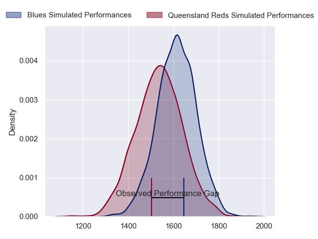
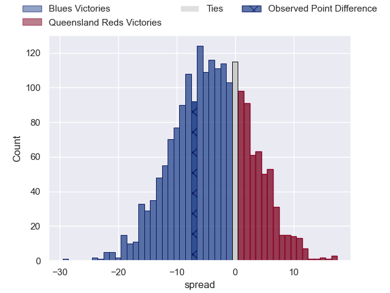
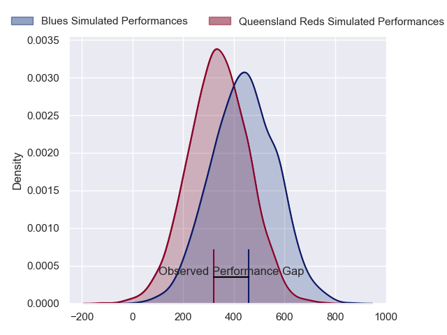
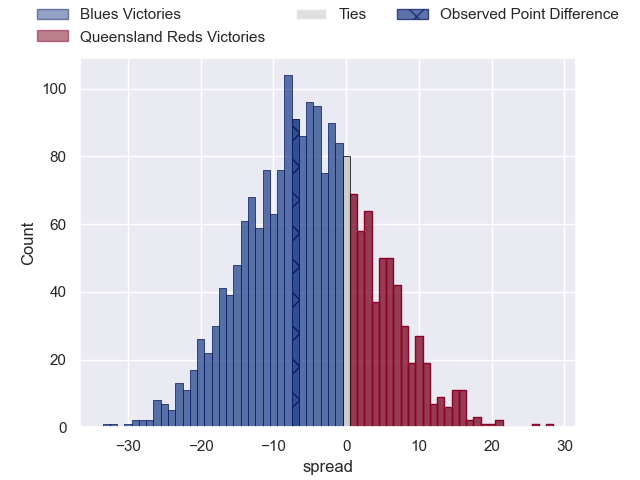

---  
layout: page  
title: Blues at Queensland Reds; 41-34  
date: 2024-04-27 18:00:00 -0500  
categories: "Super Rugby Pacific 2024" match review  
---
# Blues at Queensland Reds; 41-34

# Club Level Predictions

The first set of predictions treats a club as the smallest object, as the club develops its members, organizes a gameplan, and deploys its players as needed for each match. This club model has a prediction of 0.39, which translates to predicting Blues to win by 4.0.

Our Over/Under is 50.5 - and combined with the spread above, we have a predicted scoreline of 27 to 23

Each club has a rating and a rating deviation (similar to a Glicko rating), and expected performances can be generated. This allows for simulated matches and spreads like the ones below.
## Projected Performances - Club Model

## Projected Spreads - Club Model

## Projected Results - Club Model

# Player Level Predictions - Version 2

Treating teams instead as an entity made up of the currently active players, I have ratings for each player in an altogether different system. These can be combined to form team ratings once teamsheets are announced, weighting starters a bit higher than the reserves. After the match is played, players can be weighted by their minutes on the field, allowing for an accurate measure of the team's composition. With these compiled team ratings, we can make predictions, measure inaccuracy, and update the individual player ratings.
## Prediction without Player Minutes: Blues by 4.1

Blues by 8.8 on a neutral pitch

## Projected Performances - Player Model

## Projected Spreads - Player Model

## Projected Results - Player Model

|   Away Minutes | Away Player        |   Away Percentile |   Number |   Home Percentile | Home Player          |   Home Minutes |
|---------------:|:-------------------|------------------:|---------:|------------------:|:---------------------|---------------:|
|             51 | Ofa Tu'ungafasi    |             99.02 |        1 |             56.81 | Alex Hodgman         |             44 |
|             51 | Soane Vikena       |             84.25 |        2 |             74.64 | Matt Faessler        |             77 |
|             62 | Angus Ta'avao      |             95.89 |        3 |             94.03 | Jeff Toomaga-Allen   |             54 |
|             83 | Patrick Tuipulotu  |             95.02 |        4 |             45.87 | Ryan Smith           |             83 |
|             62 | Sam Darry          |             39.68 |        5 |             92.23 | Angus Blyth          |             74 |
|             71 | Anton Segner       |             68.1  |        6 |             97.01 | Liam Wright          |             83 |
|             83 | Dalton Papalii     |             99.04 |        7 |             47.55 | John Bryant          |             70 |
|             83 | Hoskins Sotutu     |             95.65 |        8 |             66.5  | Harry Wilson         |             83 |
|             66 | Taufa Funaki       |             31.06 |        9 |             64.68 | Kalani Thomas        |             49 |
|             83 | Harry Plummer      |             91.64 |       10 |             76.76 | Tom Lynagh           |             52 |
|             83 | AJ Lam             |             71.61 |       11 |             50.53 | Tim Ryan             |             83 |
|             51 | Bryce Heem         |             98.38 |       12 |             72.85 | Hunter Paisami       |             83 |
|             83 | Rieko Ioane        |             87.17 |       13 |             37.86 | Josh Flook           |             70 |
|             83 | Mark Tele'a        |             78.48 |       14 |             45.73 | Suliasi Vunivalu     |             83 |
|             83 | Cole Forbes        |             71.86 |       15 |             69.6  | Jock Campbell        |             83 |
|             32 | Kurt Eklund        |             88.75 |       16 |            nan    | Josh Nasser          |              6 |
|             32 | Josh Fusitu'a      |             50.05 |       17 |             66.31 | Peni Ravai Kovekalou |             39 |
|             21 | Marcel Renata      |             77.47 |       18 |             68.85 | Sef Fa'agase         |             29 |
|             21 | Laghlan McWhannell |             96.12 |       19 |             42.48 | Connor Vest          |              9 |
|             12 | James Thompson     |            nan    |       20 |            nan    | Joe Brial            |             13 |
|             17 | Sam Nock           |             71.49 |       21 |            nan    | Louis Werchon        |             34 |
|              0 | Corey Evans        |             74.47 |       22 |             18.54 | Lawson Creighton     |             31 |
|             32 | Caleb Clarke       |             64.56 |       23 |            nan    | Floyd Aubrey         |             13 |

