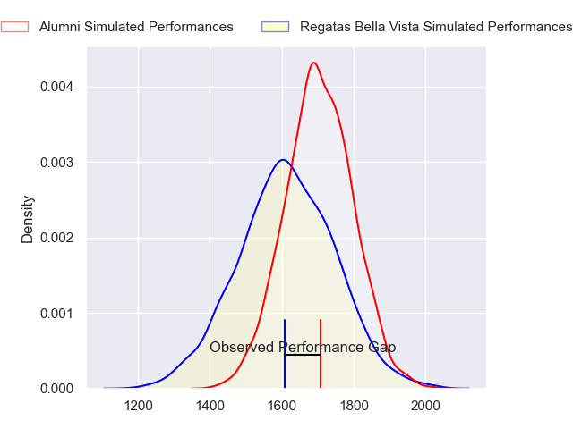
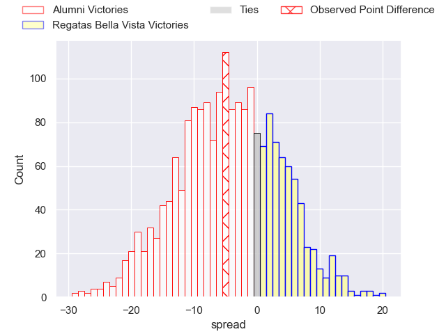
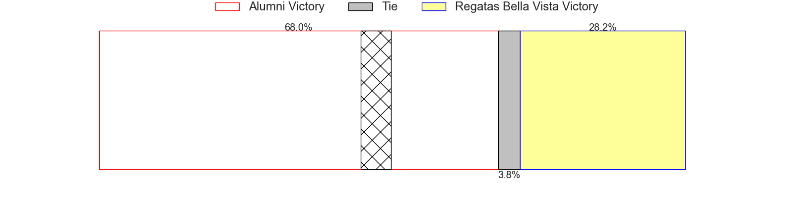
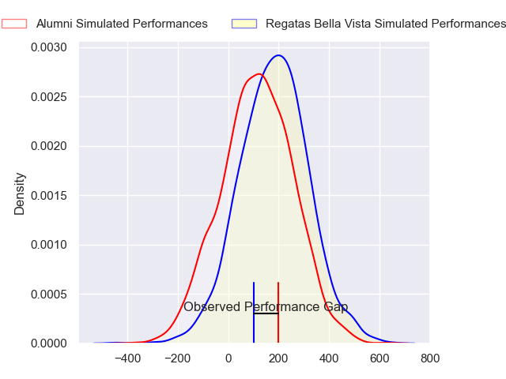
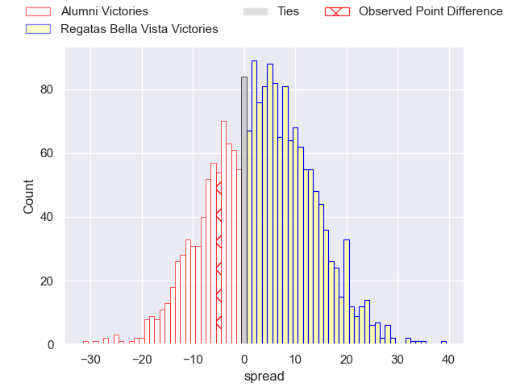
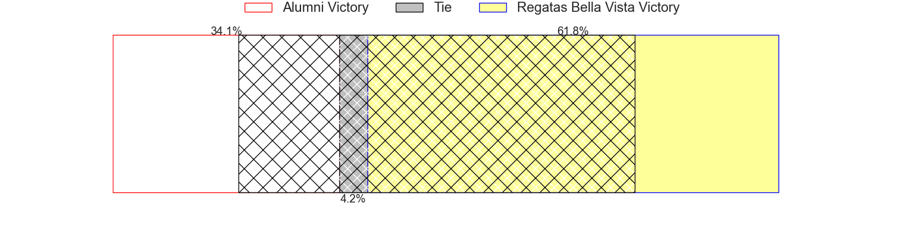

---  
layout: page  
title: Alumni at Regatas Bella Vista; 18-13  
date: 2024-04-27 18:00:00 -0500  
categories: "URBA Top 12 2024" match review  
---
# Alumni at Regatas Bella Vista; 18-13

# Club Level Predictions

The first set of predictions treats a club as the smallest object, as the club develops its members, organizes a gameplan, and deploys its players as needed for each match. This club model has a prediction of 0.389, which translates to predicting Alumni to win by 4.1.

Our Over/Under is 41.5 - and combined with the spread above, we have a predicted scoreline of 23 to 19

Each club has a rating and a rating deviation (similar to a Glicko rating), and expected performances can be generated. This allows for simulated matches and spreads like the ones below.
## Projected Performances - Club Model

## Projected Spreads - Club Model

## Projected Results - Club Model

# Player Level Predictions - Version 2

Treating teams instead as an entity made up of the currently active players, I have ratings for each player in an altogether different system. These can be combined to form team ratings once teamsheets are announced, weighting starters a bit higher than the reserves. After the match is played, players can be weighted by their minutes on the field, allowing for an accurate measure of the team's composition. With these compiled team ratings, we can make predictions, measure inaccuracy, and update the individual player ratings.
## Prediction without Player Minutes: Regatas Bella Vista by 3.6

Alumni by 0.0 on a neutral pitch

## Projected Performances - Player Model

## Projected Spreads - Player Model

## Projected Results - Player Model

|   Away Minutes | Away Player                |   Away Percentile |   Number |   Home Percentile | Home Player          |   Home Minutes |
|---------------:|:---------------------------|------------------:|---------:|------------------:|:---------------------|---------------:|
|             82 | Federico Lucca             |             76.59 |        1 |             33.1  | Tomas Barbaccia      |             82 |
|             82 | Tomas Bivort               |             75.26 |        2 |             42.74 | Pedro Colinas        |             82 |
|             82 | Ezequiel Oliva             |             60.53 |        3 |             47.7  | Esteban Sciandro     |             82 |
|             82 | Manuel Mora                |             71.72 |        4 |             45.51 | Valentin Sanguinetti |             82 |
|             82 | Santiago Alduncin          |             67.6  |        5 |             43.81 | Tomas Sanguinetti    |             82 |
|             82 | Ignacio Cubilla            |             69.41 |        6 |             21.27 | Lucas Gobet          |             82 |
|             82 | Juan Anderson              |             70.13 |        7 |             46    | Francisco Ploder     |             82 |
|             82 | Tobias Moyano              |             66.24 |        8 |             34.53 | Felipe Camerlinckx   |             82 |
|             82 | Tomas Passerotti           |             69.15 |        9 |             35.32 | Marcos Joseph        |             82 |
|             82 | Joaquin Luzzi              |             65.8  |       10 |             35.25 | Justo Camerlinckx    |             82 |
|             82 | Luca Sabato                |             69.71 |       11 |             35.85 | Enrique Camerlinckx  |             82 |
|             82 | Franco Battezzati          |             65.88 |       12 |             20.8  | Ramiro Moadeb        |             82 |
|             82 | Alejo Chavez               |             67    |       13 |             32.63 | Alejo Barrera        |             82 |
|             82 | Ramon Fuentes              |             71.58 |       14 |             35.85 | Francisco Pisani     |             82 |
|             82 | Tomas Corneille            |             61.06 |       15 |             29.9  | Cruz Camerlinckx     |             82 |
|              0 | Maximo Castillo            |            nan    |       16 |             54.48 | Marcos Ferro         |              0 |
|              0 | Maximo Lamelas             |            nan    |       17 |            nan    | Mateo Trimarco       |              0 |
|              0 | Nicolas Frene              |            nan    |       18 |            nan    | Facundo Calderoto    |              0 |
|              0 | Federico Canovas           |            nan    |       19 |            nan    | Beltran Landivar     |              0 |
|              0 | Juan Cruz Alvarinas        |            nan    |       20 |            nan    | Felipe Galli         |              0 |
|              0 | Santiago Ambroa            |            nan    |       21 |            nan    | Juan Sourrouille     |              0 |
|              0 | Santiago Gonzalez Iglesias |             52.01 |       22 |            nan    | Santiago Mendez      |              0 |
|              0 | Cruz Gonzalez              |            nan    |       23 |            nan    | Manuel Lozano Oneto  |              0 |

