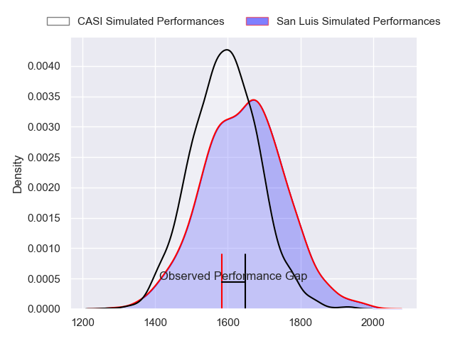
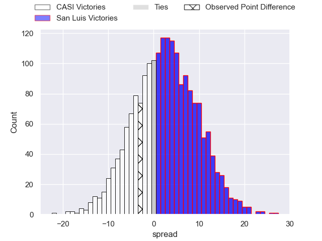
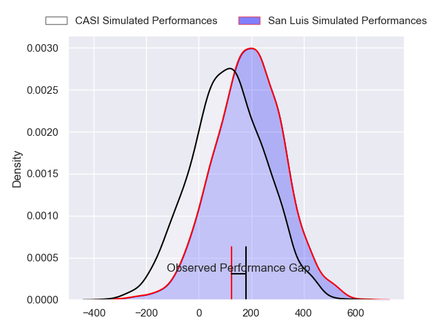
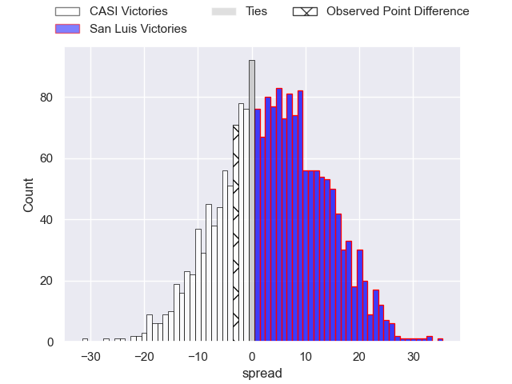
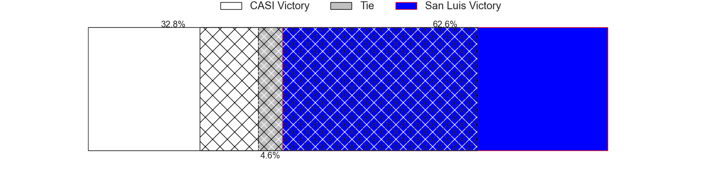

---  
layout: page  
title: CASI at San Luis; 20-17  
date: 2024-04-27 18:00:00 -0500  
categories: "URBA Top 12 2024" match review  
---
# CASI at San Luis; 20-17

# Club Level Predictions

The first set of predictions treats a club as the smallest object, as the club develops its members, organizes a gameplan, and deploys its players as needed for each match. This club model has a prediction of 0.575, which translates to predicting San Luis to win by 2.8.

Our Over/Under is 60.5 - and combined with the spread above, we have a predicted scoreline of 29 to 32

Each club has a rating and a rating deviation (similar to a Glicko rating), and expected performances can be generated. This allows for simulated matches and spreads like the ones below.
## Projected Performances - Club Model

## Projected Spreads - Club Model

## Projected Results - Club Model

# Player Level Predictions - Version 2

Treating teams instead as an entity made up of the currently active players, I have ratings for each player in an altogether different system. These can be combined to form team ratings once teamsheets are announced, weighting starters a bit higher than the reserves. After the match is played, players can be weighted by their minutes on the field, allowing for an accurate measure of the team's composition. With these compiled team ratings, we can make predictions, measure inaccuracy, and update the individual player ratings.
## Prediction without Player Minutes: San Luis by 4.2

CASI by 0.0 on a neutral pitch

## Projected Performances - Player Model

## Projected Spreads - Player Model

## Projected Results - Player Model

|   Away Minutes | Away Player                |   Away Percentile |   Number |   Home Percentile | Home Player                |   Home Minutes |
|---------------:|:---------------------------|------------------:|---------:|------------------:|:---------------------------|---------------:|
|             80 | Facundo Scaiano            |             57.69 |        1 |             22.14 | Alejo Garcia               |             80 |
|             80 | Juan Torres Obeid          |             73.42 |        2 |             30.27 | Franco Cantalupo           |             80 |
|             80 | Juan Ignacio Nieto Sanchez |             75.22 |        3 |             33.79 | Facundo Suarez             |             80 |
|             80 | Salvador Ochoa             |             69.42 |        4 |             30.22 | Ramiro Bruni               |             80 |
|             80 | Leo Mazzini                |             68.69 |        5 |             31.55 | Santiago Canal             |             80 |
|             80 | Eugenio Sartori            |             67.32 |        6 |             28.55 | Franco Gnecco              |             80 |
|             80 | Joaquin Saenz de Miera     |             67.32 |        7 |             26.28 | Facundo Alvarez Amado      |             80 |
|             80 | Luis Briatore              |             65.98 |        8 |             31.46 | Agustin Torello            |             80 |
|             80 | Luca Canzani               |             67.87 |        9 |             30.85 | Martin Aereboe             |             80 |
|             80 | Felipe Hileman             |             62.66 |       10 |             22.98 | Isidro Lazzarini           |             80 |
|             80 | Jeronimo Tumbarello        |             69.88 |       11 |             28.07 | Segundo Galan              |             80 |
|             80 | Bruno Devoto               |             64.57 |       12 |             29.64 | Guillermo Chaves Lucesole  |             80 |
|             80 | Jeronimo Solveyra          |             64.57 |       13 |             28.52 | Benjamin Marban            |             80 |
|             80 | Santiago David             |             69.88 |       14 |             30.06 | Eduardo Ruesta             |             80 |
|             80 | Juan Akemeier              |             65.83 |       15 |             23.87 | Valentino Quattrocchi      |             80 |
|              0 | Facundo Andreotti          |            nan    |       16 |            nan    | Tomas Antonio  Costantino  |              0 |
|              0 | Benjamín Britto            |            nan    |       17 |            nan    | Agustin Fitzsimons Herrera |              0 |
|              0 | Hugo Garcia                |            nan    |       18 |            nan    | Lahuen Argemi              |              0 |
|              0 | Agustin Posleman           |            nan    |       19 |             31.9  | Nahuel Curti               |              0 |
|              0 | Tomas Phelan               |            nan    |       20 |             35.6  | Manuel Gnecco              |              0 |
|              0 | Benjamin Rocca Rivarola    |            nan    |       21 |            nan    | Juan Vaca                  |              0 |
|              0 | Benjamin Belaga            |            nan    |       22 |             43.34 | Felipe Campodonico         |              0 |
|              0 | Tobias Casaurang           |            nan    |       23 |            nan    | Lautaro Grys Arana         |              0 |

