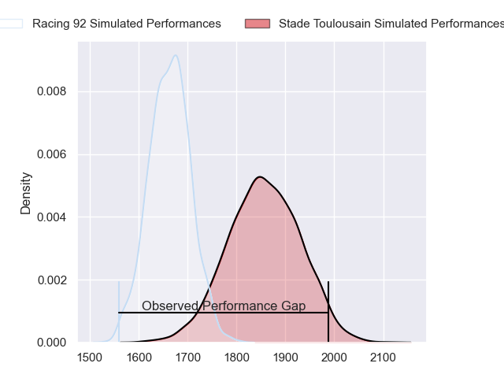
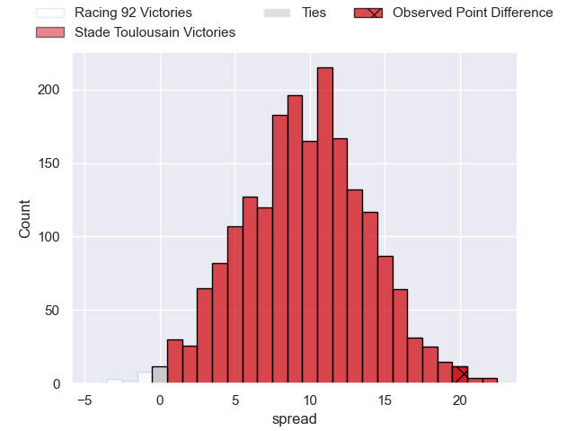
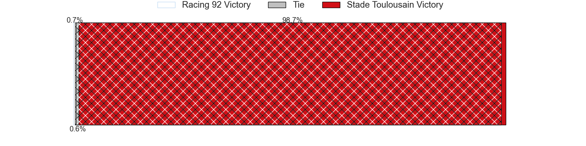
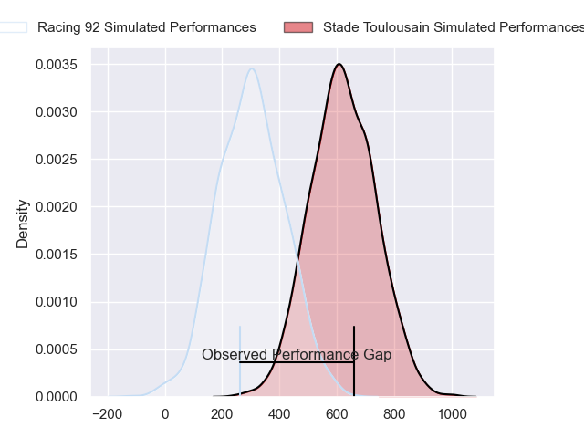
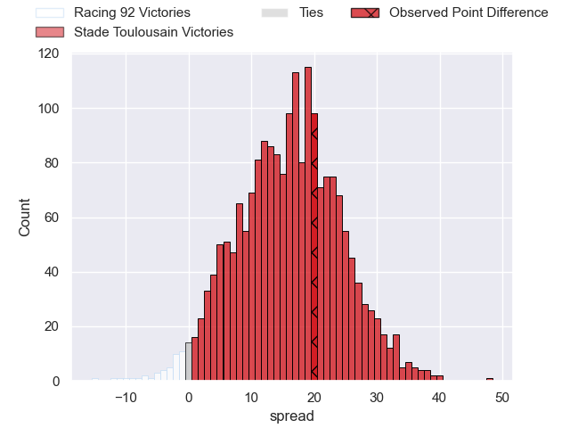
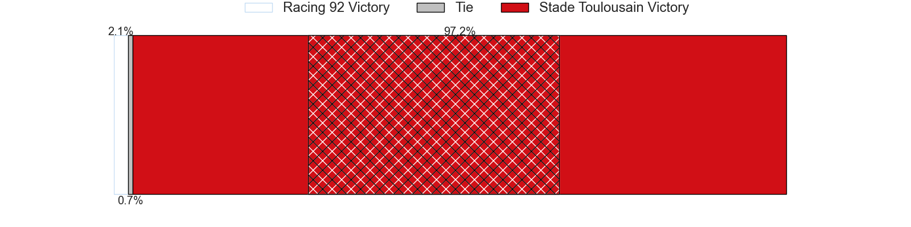

---  
layout: page  
title: Racing 92 at Stade Toulousain; 12-32  
date: 2024-04-27 18:00:00 -0500  
categories: "Top 14 Orange 2023" match review  
---
# Racing 92 at Stade Toulousain; 12-32

# Club Level Predictions

The first set of predictions treats a club as the smallest object, as the club develops its members, organizes a gameplan, and deploys its players as needed for each match. This club model has a prediction of 0.751, which translates to predicting Stade Toulousain to win by 9.7.

Our Over/Under is 42.5 - and combined with the spread above, we have a predicted scoreline of 16 to 26

Each club has a rating and a rating deviation (similar to a Glicko rating), and expected performances can be generated. This allows for simulated matches and spreads like the ones below.
## Projected Performances - Club Model

## Projected Spreads - Club Model

## Projected Results - Club Model

# Player Level Predictions - Version 2

Treating teams instead as an entity made up of the currently active players, I have ratings for each player in an altogether different system. These can be combined to form team ratings once teamsheets are announced, weighting starters a bit higher than the reserves. After the match is played, players can be weighted by their minutes on the field, allowing for an accurate measure of the team's composition. With these compiled team ratings, we can make predictions, measure inaccuracy, and update the individual player ratings.
## Prediction without Player Minutes: Stade Toulousain by 19.1

Stade Toulousain by 11.6 on a neutral pitch

## Projected Performances - Player Model

## Projected Spreads - Player Model

## Projected Results - Player Model

|   Away Minutes | Away Player         |   Away Percentile |   Number |   Home Percentile | Home Player         |   Home Minutes |
|---------------:|:--------------------|------------------:|---------:|------------------:|:--------------------|---------------:|
|             46 | Guram Gogichashvili |             50.72 |        1 |             94.21 | Cyril Baille        |             50 |
|             47 | Janick Tarrit       |             33.13 |        2 |             99    | Julien Marchand     |             53 |
|             47 | Trevor Nyakane      |             76.08 |        3 |             94.6  | Dorian Aldegheri    |             50 |
|             53 | Fabien Sanconnie    |             51.03 |        4 |             90.57 | Thibaud Flament     |             80 |
|             80 | Will Rowlands       |             45.1  |        5 |             82.1  | Emmanuel Meafou     |             64 |
|             80 | Cameron Woki        |             89.99 |        6 |             65.91 | Mathis Castro       |             80 |
|             53 | Baptiste Chouzenoux |             89.63 |        7 |             76.64 | Joshua Brennan      |             45 |
|             12 | Kitione Kamikamica  |             79.05 |        8 |             93.27 | Alexandre Roumat    |             80 |
|             80 | Nolann Le Garrec    |             82.03 |        9 |             45.67 | Paul Graou          |             45 |
|             80 | Antoine Gibert      |             89.61 |       10 |             93.51 | Romain Ntamack      |             80 |
|             65 | Christian Wade      |             94.4  |       11 |             96.8  | Matthis Lebel       |             80 |
|             80 | Gael Fickou         |             96.79 |       12 |             57.48 | Pita Ahki           |             80 |
|             47 | Inia Tabuavou       |             55.25 |       13 |             71.32 | Dimitri Delibes     |             45 |
|             80 | Henry Arundell      |             14.17 |       14 |             99.77 | Blair Kinghorn      |             58 |
|             80 | Tristan Tedder      |             61.07 |       15 |             96.18 | Thomas Ramos        |             80 |
|             68 | Jordan Joseph       |             70.32 |       16 |             17.68 | Santiago Chocobares |             35 |
|             34 | Eddy Ben Arous      |             96.72 |       17 |             99.58 | Antoine Dupont      |             35 |
|             33 | Cedate Gomes Sa     |             64.71 |       18 |             69.65 | Clement Verge       |             35 |
|             33 | Henry Chavancy      |             97.9  |       19 |             77.15 | Joel Merkler        |             30 |
|             33 | Camille Chat        |             92.37 |       20 |             89.3  | David Ainu'u        |             30 |
|             27 | Veikoso Poloniati   |              4.96 |       21 |             91.57 | Peato Mauvaka       |             27 |
|             27 | Maxime Baudonne     |             51.85 |       22 |             97.94 | Juan Cruz Mallia    |             22 |
|             15 | Juan Imhoff         |             99.09 |       23 |             78.6  | Piula Faasalele     |             16 |

