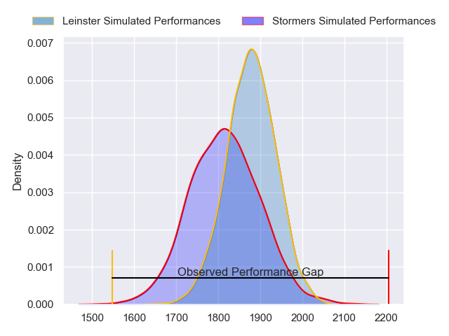
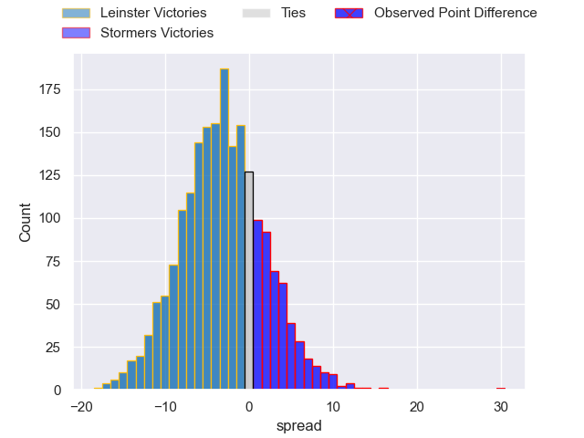
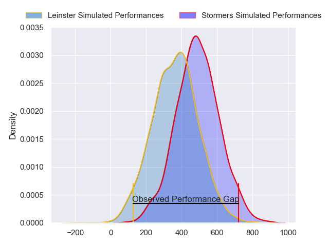
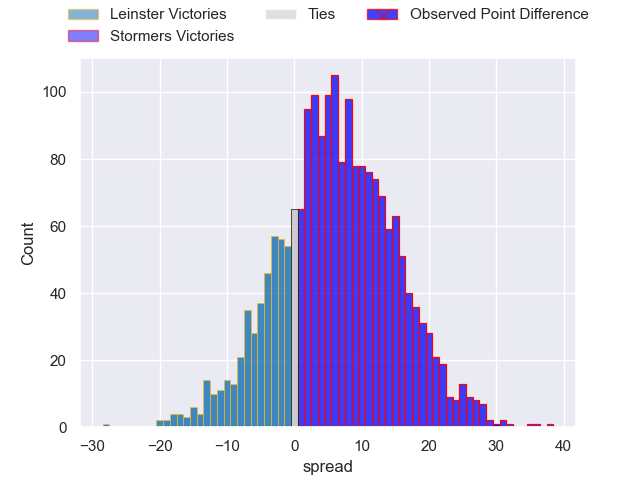
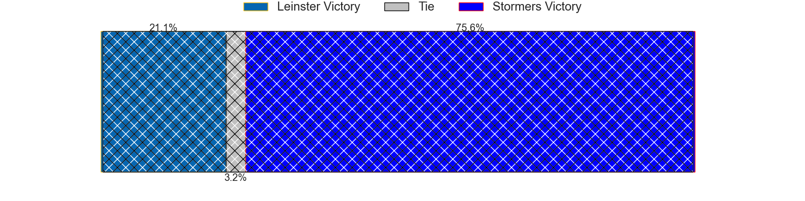

---  
layout: page  
title: Leinster at Stormers; 12-42  
date: 2024-04-27 18:00:00 -0500  
categories: "United Rugby Championship 2023" match review  
---
# Leinster at Stormers; 12-42

# Club Level Predictions

The first set of predictions treats a club as the smallest object, as the club develops its members, organizes a gameplan, and deploys its players as needed for each match. This club model has a prediction of 0.41, which translates to predicting Leinster to win by 3.2.

Our Over/Under is 68.5 - and combined with the spread above, we have a predicted scoreline of 36 to 33

Each club has a rating and a rating deviation (similar to a Glicko rating), and expected performances can be generated. This allows for simulated matches and spreads like the ones below.
## Projected Performances - Club Model

## Projected Spreads - Club Model

## Projected Results - Club Model

# Player Level Predictions - Version 2

Treating teams instead as an entity made up of the currently active players, I have ratings for each player in an altogether different system. These can be combined to form team ratings once teamsheets are announced, weighting starters a bit higher than the reserves. After the match is played, players can be weighted by their minutes on the field, allowing for an accurate measure of the team's composition. With these compiled team ratings, we can make predictions, measure inaccuracy, and update the individual player ratings.
## Prediction without Player Minutes: Stormers by 6.5

Stormers by 1.9 on a neutral pitch

## Projected Performances - Player Model

## Projected Spreads - Player Model

## Projected Results - Player Model

|   Away Minutes | Away Player          |   Away Percentile |   Number |   Home Percentile | Home Player          |   Home Minutes |
|---------------:|:---------------------|------------------:|---------:|------------------:|:---------------------|---------------:|
|             47 | Michael Milne        |             65.52 |        1 |             99.9  | Brok Harris          |             59 |
|             56 | John McKee           |             63.6  |        2 |             64.42 | Joseph Dweba         |             57 |
|             44 | Michael Ala'alatoa   |             93.83 |        3 |             81.39 | Neethling Fouche     |             59 |
|             80 | Brian Deeny          |             49.27 |        4 |             66.75 | Salmaan Moerat       |             80 |
|             56 | Jason Jenkins        |             67.72 |        5 |             76.21 | Ruben van Heerden    |             72 |
|             44 | Rhys Ruddock         |             99.52 |        6 |             38.23 | Marcel Theunissen    |             67 |
|             74 | Scott Penny          |             79.21 |        7 |             50.78 | Ben-Jason Dixon      |             69 |
|             80 | Max Deegan           |             87.98 |        8 |             79.28 | Evan Roos            |             80 |
|             73 | Cormac Foley         |             51.28 |        9 |             91.06 | Herschel Jantjies    |             72 |
|             80 | Sam Prendergast      |             30.29 |       10 |             74.93 | Manie Libbok         |             80 |
|             80 | Rob Russell          |             66.67 |       11 |             90.29 | Ben Loader           |             80 |
|             67 | Charlie Ngatai       |             88.04 |       12 |             95.27 | Damian Willemse      |             80 |
|             80 | Ben Brownlee         |             26.65 |       13 |             86.92 | Daniel du Plessis    |             61 |
|             80 | Liam Turner          |             40.58 |       14 |             64.8  | Suleiman Hartzenberg |             80 |
|             80 | Henry McErlean       |             31.91 |       15 |             97.49 | Warrick Gelant       |             80 |
|             24 | Gus McCarthy         |            nan    |       16 |             64.62 | Andre-Hugo Venter    |             23 |
|             33 | Ed Byrne             |             90.99 |       17 |            nan    | Kwenzo Blose         |             21 |
|             36 | Thomas Clarkson      |             77.96 |       18 |             82.27 | Frans Malherbe       |             21 |
|             24 | Conor O'Tighearnaigh |            nan    |       19 |            nan    | Connor Evans         |              8 |
|              6 | Diarmuid Mangan      |             30.94 |       20 |             78.02 | Willie Engelbrecht   |             11 |
|              7 | Fintan Gunne         |            nan    |       21 |             92.47 | Hacjivah Dayimani    |             13 |
|             13 | Charlie Tector       |            nan    |       22 |             19.15 | Stefan Ungerer       |              8 |
|             36 | Martin Moloney       |            nan    |       23 |             78.08 | Wandisile Simelane   |             19 |

